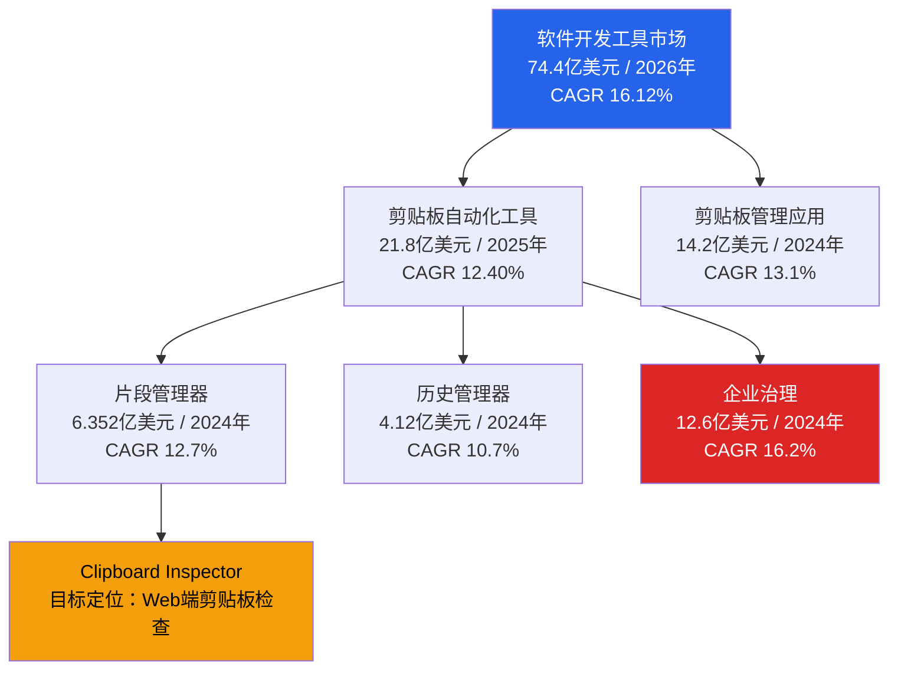
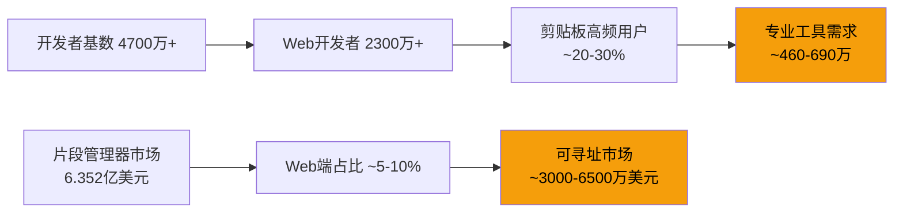

# 1.1 全球剪贴板工具市场概览

## 市场规模总览

剪贴板工具并非单一市场，而是由自动化、管理、片段存储、历史记录和企业治理等多个细分赛道组成的生态。不同研究机构从各自角度切入，得出的数据有所差异，但指向同一个趋势：这个市场正在以两位数年复合增长率快速扩张。

| 细分市场 | 基准年份与规模 | 预测年份与规模 | CAGR | 数据来源 |
|---|---|---|---|---|
| 剪贴板自动化工具 | 2025年 21.8亿美元 | 2035年 70.2亿美元 | 12.40% | Market.us |
| 剪贴板管理应用 | 2024年 14.2亿美元 | 2033年 41.1亿美元 | 13.1% | Dataintelo |
| 剪贴板片段管理器 | 2024年 6.352亿美元 | 2033年 18.667亿美元 | 12.7% | Dataintelo |
| 剪贴板历史管理器 | 2024年 4.12亿美元 | 2033年 10.2亿美元 | 10.7% | MarketIntelo |
| 企业剪贴板治理 | 2024年 12.6亿美元 | 2033年 48.7亿美元 | 16.2% | Growth Market Reports |
| 软件开发工具（父级） | 2026年 74.4亿美元 | 2031年 157.2亿美元 | 16.12% | Mordor Intelligence |

这些细分市场之间存在大量重叠。一个企业采购剪贴板治理方案时，通常也包含了片段管理和历史记录功能。因此，简单加总会高估整体规模。综合来看，剪贴板工具的独立可寻址市场大约在 **40-60亿美元** 区间（2024-2025年基准），并将在2033-2035年间增长至 **150-200亿美元**。

值得注意的是，软件开发工具市场作为剪贴板工具的父级市场，其增速（CAGR 16.12%）甚至高于大多数剪贴板细分赛道。这意味着剪贴板工具正在受益于一个更广泛的开发者工具投资周期。

## 市场结构

## 各细分市场对比

从增长率来看，各赛道的增速排序清晰：

| 排名 | 细分市场 | CAGR | 特征 |
|---|---|---|---|
| 1 | 企业剪贴板治理 | 16.2% | 增速最快，受合规驱动 |
| 2 | 剪贴板管理应用 | 13.1% | 用户基数大，增长稳健 |
| 3 | 剪贴板片段管理器 | 12.7% | 开发者群体渗透率高 |
| 4 | 剪贴板自动化工具 | 12.40% | 涵盖范围最广 |
| 5 | 剪贴板历史管理器 | 10.7% | 基础功能，增速相对平缓 |

企业治理以 16.2% 的 CAGR 位居首位。这反映了数据安全法规（GDPR、CCPA、HIPAA）对剪贴板场景的渗透。在企业环境中，剪贴板是敏感数据泄露的高频通道，治理需求正从"可有可无"变为"必须满足"。

片段管理器（CAGR 12.7%）是 Clipboard Inspector 最直接的赛道。开发者在日常工作中频繁复用代码片段、API 响应模板和配置内容，这类工具的核心价值在于"找到、组织、快速插入"。Clipboard Inspector 的检查功能恰好补全了这个链条中"理解剪贴板里到底有什么"这一环。

## 区域分布

| 区域 | 市场份额 | CAGR | 特征 |
|---|---|---|---|
| 北美 | ~34% | ~11% | 成熟市场，企业采用率高 |
| 亚太 | ~25% | ~20.85% | 增速最快，开发者人口激增 |
| 欧洲 | ~20% | ~12% | 受合规驱动明显 |
| 其他 | ~21% | ~14% | 新兴市场，潜力大 |

北美占据约三分之一的市场份额。这得益于成熟的企业 IT 采购流程和高密度的开发者群体。美国市场在安全合规和开发者生产力工具方面的投入尤为集中。

亚太地区是增长引擎。20.85% 的 CAGR 远高于其他区域，主要推动力来自印度和中国不断扩大的开发者人口。SlashData 的数据显示，亚洲已拥有全球最大的开发者群体基数。

欧洲市场虽然增速中等，但 GDPR 等法规对剪贴板治理提出了强制性要求，这在企业级产品中创造了刚需。

## 开发者人口与工具使用

目标用户的基础盘足够大：

| 指标 | 数据 | 来源 |
|---|---|---|
| 全球活跃开发者 | 4700万+ | SlashData, 2025 |
| Web 开发者 | 2300万+ | SlashData |
| 定期使用 AI 工具的开发者占比 | 85% | JetBrains 2025 开发者调查 |

几个关键观察：

**开发者基数持续膨胀。** 4700万活跃开发者意味着剪贴板是每天被调用数以亿次计的基础交互。即使只有一小部分转化为专业工具用户，对应的付费市场也相当可观。

**Web 开发者是最大的子群体。** 超过 2300万 Web 开发者直接与浏览器剪贴板 API 交互。Clipboard Inspector 作为纯 Web 工具，天然对齐了这个群体。前端开发中处理富文本粘贴、拖放上传、跨应用复制代码片段等场景，都需要对剪贴板数据结构有清晰理解。

**AI 工具的高渗透率改变了剪贴板的角色。** 85% 的开发者定期使用 AI 工具意味着剪贴板已经成为"人类-AI上下文管道"的核心组件。开发者从 IDE 复制代码到 ChatGPT，从 AI 助手复制生成结果到编辑器，这个循环每天都在发生。在这个过程中，剪贴板内容的格式、编码和结构直接影响 AI 交互的质量。

## 对 Clipboard Inspector 的市场机会评估

综合以上数据，可以从三个维度评估市场机会：

**赛道选择。** Clipboard Inspector 最贴近片段管理器赛道（6.352亿美元，CAGR 12.7%），同时涉及历史管理和开发者工具的交叉区域。这不是最大的细分市场，但增速健康且竞争格局尚未固化。桌面端有成熟玩家（如 Paste、Maccy、Ditto），但浏览器原生的剪贴板检查工具几乎是空白。

**用户基础。** 2300万+ Web 开发者是直接可触达的受众。前端和全栈工程师在日常开发中频繁处理剪贴板事件（paste、drop、copy），他们对剪贴板数据格式的理解有明确需求。测试工程师在验证跨浏览器行为一致性时，也需要可靠的检查工具。

**时机窗口。** 几个趋势正在叠加：AI 代码助手让剪贴板流量激增，Web Clipboard API 持续演进（Async Clipboard API、跨域隔离支持），企业对剪贴板安全的关注度上升。这些因素共同创造了一个"需求正在形成但供给尚不充分"的窗口期。

从市场定位来看，Clipboard Inspector 面对的是一个增速在 12-16% 区间、年规模数亿美元的机会。作为 Web 原生工具，它的差异化在于零安装、即时可用、与浏览器剪贴板 API 深度对齐。这种定位在当前市场中几乎没有直接竞品，是进入市场的合理切入点。
