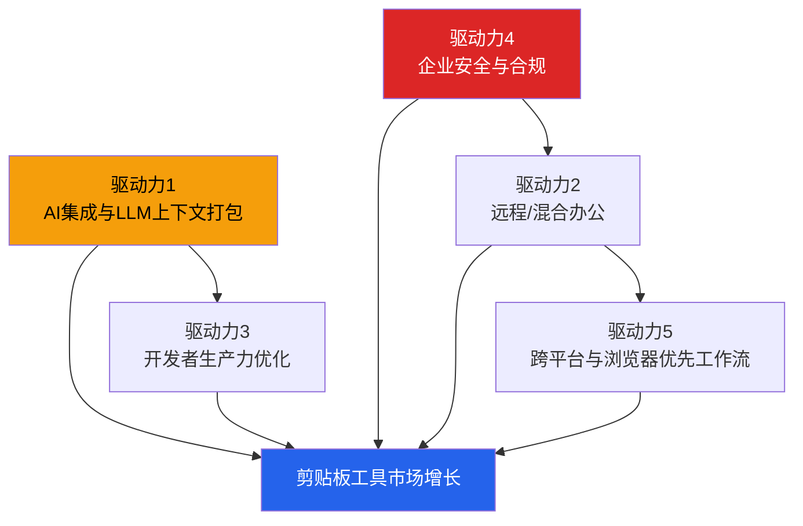

# 1.2 细分市场与增长驱动力

## 细分市场拆解

剪贴板工具市场可以从三个维度拆分：平台、部署模式和终端用户。

### 按平台划分

| 平台 | 市场份额 | 趋势 | 代表产品 |
|---|---|---|---|
| Windows | 最大 | 稳定，企业用户为主 | Ditto, ClipClip |
| macOS | 第二 | 增长中，付费意愿高 | Paste, CopyClip, Maccy |
| Linux | 较小但增长中 | 开发者群体驱动 | CopyQ, Diodon |
| 浏览器端 | 新兴 | 最快增长，AI驱动 | Clipboard Inspector |

Windows 依然是最大的平台市场，这与其在企业环境中的主导地位一致。macOS 用户虽然数量较少，但付费意愿显著更高。Paste（macOS/iOS 平台）的成功证明了这一点，其订阅制模式在 Apple 生态中运转良好。

浏览器端是新兴平台。随着 Web 应用承担越来越多的工作负载（VS Code Web、Figma、Google Docs），浏览器剪贴板 API 的使用频率大幅提升。这个平台目前几乎没有专门的原生工具。

### 按部署模式划分

| 模式 | 市场占比 | 特征 |
|---|---|---|
| 云部署/SaaS | 59.1% | 主流趋势，便于团队协作和数据同步 |
| 本地部署 | 40.9% | 安全敏感场景，离线需求 |

来源：Mordor Intelligence 软件开发工具市场报告。云部署已占近六成份额，这反映了开发者工具整体向 SaaS 迁移的趋势。对于剪贴板工具，云部署意味着跨设备同步、团队片段库和集中式治理。

### 按终端用户划分

| 用户类型 | 特征 | 需求重点 |
|---|---|---|
| 个人开发者 | 价格敏感，重视效率 | 片段复用、快速搜索、轻量 |
| 企业开发团队 | 预算充足，重视协作与安全 | 团队共享、权限管理、审计日志 |
| 测试/QA 工程师 | 关注准确性 | 数据格式验证、跨浏览器一致性 |
| 技术写作者 | 内容搬运频繁 | 富文本处理、格式转换 |
| 非技术知识工作者 | 使用频率高但无付费习惯 | 简单易用、免费为主 |

## 五大增长驱动力

### 驱动力1：AI 集成与 LLM 上下文打包

这是当前最强劲的增长引擎。

JetBrains 2025 年开发者生态调查报告显示，85% 的开发者定期使用 AI 工具。这意味着剪贴板不再仅仅是"复制粘贴"的临时缓冲区，而是人和 AI 之间传递上下文的核心管道。开发者从 IDE 复制代码到 ChatGPT，把 AI 生成的结果粘贴回编辑器，这个过程每天重复数十次。

剪贴板中的内容质量直接影响 AI 交互效果。格式错误、隐藏字符、编码问题都会让 AI 理解出现偏差。开发者在提交 prompt 之前，需要确认剪贴板里到底是什么。这就是 Clipboard Inspector 的核心使用场景。

资本市场也在验证这个方向。Pieces 是一家将剪贴板与 AI 深度集成的开发者工具公司，已获得 2610 万美元融资（来源：TechCrunch）。它的产品定位是"开发者上下文管理器"，核心功能之一就是智能捕获和整理解释剪贴板中的代码片段。

### 驱动力2：远程/混合办公

远程办公改变了剪贴板的使用模式。

在办公室，面对面交流可以快速解决"把那段代码发给我"这类需求。远程团队只能依赖数字化工具。剪贴板成为高频的跨应用信息搬运通道，但原生的操作系统剪贴板只能保存一条记录，缺乏管理和检索能力。

行业数据显示，团队在部署专业剪贴板工具后，上下文切换频率从平均 4.7 次/小时降至 1.9 次/小时。这个数字背后是实实在在的生产力提升。开发者不需要反复在 IDE、浏览器、文档之间来回切换，剪贴板历史和片段库让他们一次找到所需内容。

远程办公还催生了团队共享剪贴板的需求。代码片段、API 响应模板、常用配置，这些信息需要在团队成员间高效流转。云端同步的剪贴板工具填补了这个空白。

### 驱动力3：开发者生产力优化

开发工具市场整体 CAGR 达 16.12%（Mordor Intelligence），是剪贴板工具的父级市场。企业对开发者效率的投资正在加速。

GitHub Copilot 是这个趋势的标志性产品。2025 年其收入达到 4 亿美元，同比增长 248%（来源：GitHub 官方数据）。企业愿意为"让开发者更快"买单，这个逻辑同样适用于剪贴板工具。如果一个工具能让开发者每天节省 15 分钟的上下文切换时间，按美国开发者平均时薪计算，年度 ROI 相当可观。

剪贴板工具在开发者生产力工具链中的定位是"粘合层"。它不替代 IDE 或 AI 助手，但优化了这些工具之间的信息流动。这种定位的好处是与主流工具互补而非竞争，容易被纳入现有工作流。

### 驱动力4：企业安全与合规

企业剪贴板治理是所有细分市场中增长最快的（CAGR 16.2%，Growth Market Reports），这不是巧合。

剪贴板是企业数据泄露的隐形通道。员工可以从 CRM 复制客户名单到个人邮箱，从源代码仓库复制密钥到聊天工具，从财务系统复制报表到未加密的文档。这些行为大部分不触发传统安全工具的告警。

随着 GDPR、CCPA、HIPAA 等法规的执行力度加强，企业被迫正视剪贴板安全。隐私保护剪贴板市场在 2024 年已达 18.2 亿美元（来源：Growth Market Reports）。企业级功能包括：

- 剪贴板活动审计日志
- 敏感数据检测和阻断
- 剪贴板数据自动清理策略
- 跨应用复制行为的 DLP 策略

对于 Clipboard Inspector，企业安全需求既是挑战也是机会。检查和可视化剪贴板内容的能力，是构建安全功能的基础。理解"剪贴板里有什么"是实施任何治理策略的第一步。

### 驱动力5：跨平台与浏览器优先工作流

云部署占开发工具市场份额的 59.1%（Mordor Intelligence），反映了工具向浏览器迁移的大趋势。

这个趋势的技术基础已经成熟。Web Clipboard API（包括同步和异步接口）得到了所有主流浏览器的支持。Async Clipboard API 让 Web 应用可以在用户授权下读写剪贴板，打破了过去"剪贴板是操作系统特权"的边界。

同时，越来越多的开发工作直接在浏览器中完成。VS Code Web、GitHub Codespaces、CodeSandbox、StackBlitz 等工具让浏览器成为完整的开发环境。在这些场景中，桌面端剪贴板工具无法触及 Web 应用内部的剪贴板行为，只有浏览器原生工具才能提供完整的可见性。

跨设备同步需求也在推动云原生剪贴板工具。开发者在工作电脑上复制的内容，需要在手机或家用电脑上继续使用。这要求剪贴板数据存储在云端，而浏览器是实现跨平台同步成本最低的入口。

## 平台市场份额与趋势

综合各数据来源，平台层面的格局可以概括为：

**Windows：存量最大，增长平稳。** 企业环境仍然是 Windows 的大本营，Group Policy 管理剪贴板权限的能力是其他平台难以匹配的。

**macOS：高端市场，付费能力强。** Apple 生态中的剪贴板工具（如 Paste）已经验证了订阅模式的可行性。macOS 用户的 ARPU（每用户平均收入）显著高于其他平台。

**Linux：小众但忠实。** Linux 桌面用户基数不大，但其中开发者的比例极高。开源剪贴板工具（如 CopyQ）在这个群体中有良好口碑。

**浏览器端：从零开始，增速最快。** 没有历史包袱，可以直接面向 Web 开发者。技术门槛较低（无需安装），分发成本低（URL 即产品）。Clipboard Inspector 选择这个平台切入，符合"最小阻力路径"原则。

## 增长驱动力对 Clipboard Inspector 的启示

五个驱动力中，对 Clipboard Inspector 影响最直接的是 AI 集成和浏览器优先工作流。两者叠加，创造了一个具体的产品定位：在浏览器中检查和准备要发送给 AI 的剪贴板内容。

企业安全是中长期机会。当产品积累了足够的用户和数据格式识别能力后，可以向企业级功能延伸，比如敏感数据检测、剪贴板活动审计等。

远程办公和开发者生产力是持续性的背景趋势，它们确保了整体市场的基本面健康，但不会直接决定单个产品的差异化方向。
