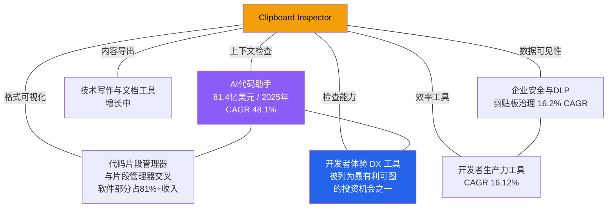

# 1.3 相邻市场与跨界机会

## 相邻市场全景

剪贴板工具不是孤立存在的。它处于开发者工具、AI 辅助、内容管理和安全合规的交汇地带。理解相邻市场的规模和增长，有助于识别产品延伸方向和合作机会。

## 四个关键相邻市场

### AI 代码助手

这是与剪贴板工具关联度最高的相邻市场。

2025 年规模 81.4 亿美元，预计 2032 年达到 1270.5 亿美元，CAGR 48.1%（来源：Grand View Research / Precedence Research）。这个增速在所有技术子行业中名列前茅。

剪贴板是人机交互的核心接口。开发者把代码复制到 AI 助手，把生成结果粘贴回来。在这个过程中，剪贴板内容的格式、完整性和编码直接影响 AI 输出质量。Clipboard Inspector 的检查功能在这个链条中扮演"质量关卡"的角色：确保发送给 AI 的上下文是正确的，确保 AI 返回的内容格式是可用的。

GitHub Copilot、Cursor、Windsurf 等 AI 编码工具都在推动"上下文理解"能力的进化。剪贴板作为最直接的上下文来源之一，其价值会随着 AI 工具的普及而持续上升。

### 代码片段管理器

片段管理器与剪贴板片段管理器在功能上高度重叠。

软件部分贡献了这个市场 81% 以上的收入（来源：Dataintelo）。这意味着代码片段、文本模板和配置片段是核心使用场景，而非图像或文件管理。

Clipboard Inspector 与片段管理器的关系是互补而非竞争。片段管理器解决"存储和检索"的问题，Clipboard Inspector 解决"理解和验证"的问题。两者可以形成完整的工作流：先用 Inspector 检查剪贴板内容，确认无误后存入片段管理器。或者反过来，从片段管理器复制内容后，用 Inspector 确认格式正确再粘贴到目标应用。

### 技术写作与文档工具

技术写作者的日常工作中，大量时间花在内容的搬运和格式转换上。从代码编辑器复制代码块到文档，从浏览器复制 API 文档到知识库，从设计工具复制标注到规格文档。这些场景都涉及剪贴板内容的格式处理。

这个市场虽然不像 AI 代码助手那样爆发式增长，但用户群体稳定，付费意愿合理。Markdown 导出功能（Clipboard Inspector 已具备）是连接技术写作场景的天然桥梁。

### 开发者体验（DX）工具

DX 工具被多家投资研究机构列为最有利可图的投资机会之一。这个品类涵盖开发者门户、文档平台、内部工具链和效率优化工具。

剪贴板检查属于 DX 工具中"降低调试摩擦"的类别。当开发者遇到"粘贴后格式不对"、"拖放后数据丢失"这类问题时，定位根因往往需要理解剪贴板底层的 MIME 类型结构和数据编码。Clipboard Inspector 把这些底层细节可视化，直接降低了调试成本。

## Clipboard Inspector 在市场生态中的定位

从生态图可以看出，Clipboard Inspector 位于多个市场的交叉点，但并不完全属于任何一个。

这个位置的特点是：

**覆盖面广但深度有限。** 与 AI 助手的关联是"检查上下文"，与片段管理器的关联是"验证格式"，与安全工具的关联是"可视化数据"。每个方向都是一个入口，但产品核心始终是"检查和理解剪贴板内容"。

**合作机会多于竞争。** 在大多数场景中，Clipboard Inspector 是其他工具的补充。片段管理器、AI 助手和文档工具都不会把"剪贴板检查"作为核心功能来开发，但它们的用户都需要这个能力。

**数据格式的专业知识是护城河。** 剪贴板数据的 MIME 类型解析、编码检测、格式转换，这些是相对小众但高价值的领域。积累的格式知识和边缘案例处理能力，会随着时间推移形成技术壁垒。

## TAM/SAM/SOM 估算

基于前面的市场数据，可以构建一个自上而下的估算：

| 层级 | 定义 | 估算 | 依据 |
|---|---|---|---|
| TAM（总可寻址市场） | 全球剪贴板工具市场 | 40-60亿美元 | 剔除重叠后的各细分市场加总 |
| SAM（可服务市场） | Web 端剪贴板工具 + 开发者用户 | 3-8亿美元 | 片段管理器的 Web 端份额 + 浏览器开发者工具的剪贴板部分 |
| SOM（可获取市场） | Web 端剪贴板检查工具 | 3000-6500万美元 | SAM 的 5-10%，参考同类工具的渗透率 |

SOM 的估算逻辑如下：

剪贴板片段管理器市场 2024 年 6.352 亿美元（Dataintelo），Web 端工具约占该市场的 5-10%。考虑到浏览器端剪贴板工具的新兴属性，取保守估计的 5-10% 是合理的。这得出约 3200-6500 万美元的可获取市场。

CAGR 方面，结合片段管理器（12.7%）和企业治理（16.2%）的增速，Web 端剪贴板检查工具的 CAGR 估算在 **12-16%** 区间。到 2033 年，SOM 可能扩展至 **8000-20000万美元**。

这个规模对于独立开发者或小团队来说是一个足够大的市场。它大到值得认真投入，又不至于吸引大公司的主力资源。这个"甜蜜区间"给了 Clipboard Inspector 建立品牌和用户基础的时间窗口。

关键假设和风险：

- 假设 Web Clipboard API 继续得到浏览器厂商的支持和扩展。如果 API 演进停滞，Web 端工具的增长将受限。
- 假设 AI 驱动的剪贴板使用量持续增长。如果 AI 工具内置了更完善的上下文管理能力，独立检查工具的差异化可能被削弱。
- 假设浏览器端的开发者工具市场保持碎片化格局。如果某个大型平台（如 GitHub / VS Code）内置了同等功能，市场格局将被重塑。

后续章节将在竞品分析和产品路线图中进一步讨论这些风险和应对策略。
