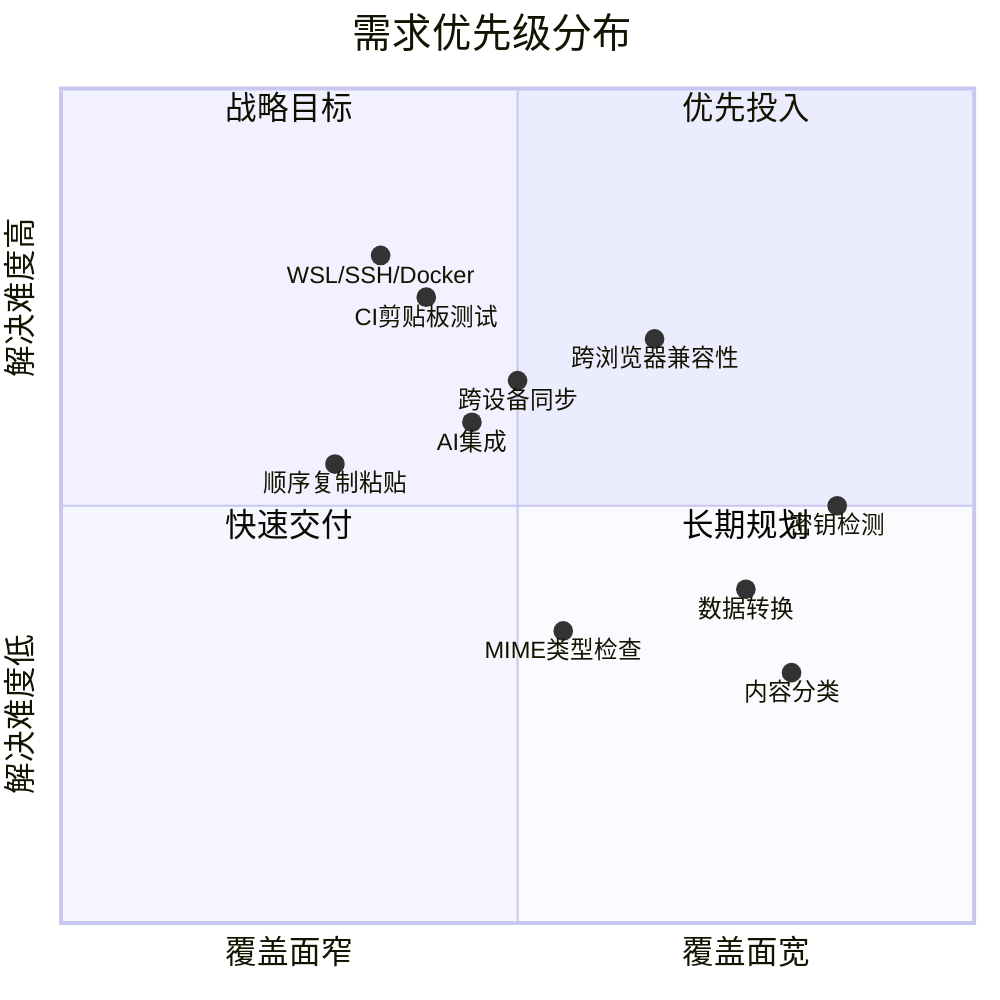
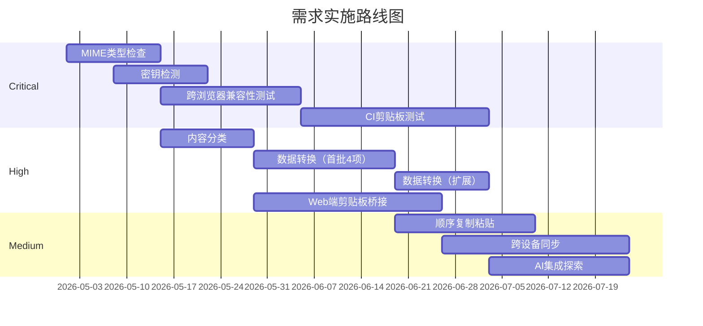

# 2.3 用户需求优先级

基于七大痛点的分析结果，将用户需求按严重度、覆盖面和解决难度三个维度排列，形成以下优先级矩阵。

## 需求优先级矩阵

| 需求 | 严重度 | 目标用户 | 现有解决方案 | 差距 |
|------|--------|----------|------------|------|
| MIME类型检查 | Critical | 前端开发者 | clipboardinspector.com（基础） | 无跨浏览器比较，无历史 |
| 跨浏览器兼容性测试 | Critical | Web开发者，QA | 无（手动测试） | 需系统性兼容测试工具 |
| CI中剪贴板测试 | Critical | QA工程师 | Playwright插件（hacky） | 无统一剪贴板测试工具 |
| 密钥检测/隔离 | Critical | 所有开发者 | CopyQ（基础），ClipGate（新） | 大多数工具完全忽略 |
| WSL/SSH/Docker剪贴板 | High | DevOps | wsl-screenshot-cli（niche） | 无通用剪贴板桥接 |
| 内容分类 | High | 所有开发者 | Clipboard Commander（部分） | 需Web端，零安装 |
| 数据转换 | High | 所有开发者 | 各种独立工具 | 无统一剪贴板到转换流程 |
| 顺序复制/粘贴 | Medium | 高级用户 | CopyQ, Ditto（笨拙） | 无直观实现 |
| 跨设备同步 | Medium | 远程工作者 | Pastr, cloud tools | 云同步隐私担忧 |
| AI集成 | Medium | AI先行开发者 | Clippy, Clipboard Commander | 新兴需求，早期阶段 |

## 优先级分布

## 分级说明

### Critical 级别：立即投入

四项 Critical 需求覆盖了前端开发者和 QA 工程师的核心工作场景，这两类用户合计占目标受众的 50%。它们共同指向一个核心命题：**让剪贴板中的数据变得可见和可控**。

MIME 类型检查是最基础的能力，也是所有其他功能的基石。如果用户看不到剪贴板里有什么，后续的转换、检测、比较都无从谈起。它的解决难度相对最低，因为不需要跨环境协作，一个 Web 页面就能完成核心功能。

跨浏览器兼容性测试建立在 MIME 检查之上。当用户能在一个浏览器中看到剪贴板内容后，下一步就是想知道"其他浏览器看到的是否一样"。这个需求的技术挑战在于需要在不同浏览器引擎中采集数据并汇总对比。

CI 中的剪贴板测试是 Critical 中难度最高的一项。它不只涉及浏览器，还需要和测试框架集成，在 headless 环境中模拟剪贴板操作。建议作为第二阶段目标，先在交互式 Web 端验证方案可行性，再向测试框架扩展。

密钥检测虽然技术实现不复杂（正则匹配常见密钥格式），但它的价值很高。开发者普遍缺乏这个意识，工具主动提供检测能力，能直接避免安全事故。可以和 MIME 类型检查同期开发，作为增值功能。

### High 级别：第二梯队

三项 High 级别需求覆盖了更广泛的用户群体，但要么解决难度较高，要么需求的紧迫性略低。

内容分类（自动识别剪贴板中的数据类型）是数据转换的前置条件，解决难度适中，用户体验收益明显。建议和 MIME 类型检查合并设计，粘贴后同时展示 MIME 层面和数据内容层面的分类结果。

数据转换是覆盖面最广的 High 级需求。技术上没有太大挑战，但要做好需要覆盖足够多的转换类型，而且每种转换的交互要直觉化。建议分批上线，先支持 JSON 格式化、富文本转纯文本、Base64 编解码、URL 编解码四项高频操作，再逐步扩展。

WSL/SSH/Docker 剪贴板桥接的技术难度最高，涉及多个操作系统层面的适配。Web 端方案可以作为一个轻量的切入点：用户在两个环境中分别打开同一个 Web 页面，通过 WebSocket 同步剪贴板内容。这不需要安装任何本地软件。

### Medium 级别：长期观察

三项 Medium 级别需求代表的是增值方向，不影响核心功能的价值交付，但可以作为差异化竞争的储备。

顺序复制/粘贴（提前排队多个复制内容，按顺序粘贴）是高级用户的效率工具。实现上需要在剪贴板监听和队列管理之间做好平衡，避免干扰正常的复制粘贴操作。

跨设备同步的需求确实存在，但隐私担忧是核心障碍。端到端加密是必须的，但这增加了技术复杂度。建议先做本地存储（IndexedDB），同步功能作为可选的付费特性。

AI 集成是当前最热门的方向，但需求还在早期阶段。开发者对"AI 帮我处理剪贴板内容"的期望还没有收敛到具体的功能点。建议保持关注，在用户反馈中寻找明确的 AI 使用场景，而不是为了 AI 而 AI。

## 实施路径建议

路线图的核心思路是：先建基础设施（可见性），再做增值功能（转换和检测），最后探索差异化方向（同步和 AI）。每一阶段的功能都建立在上一阶段的基础上，避免返工。
