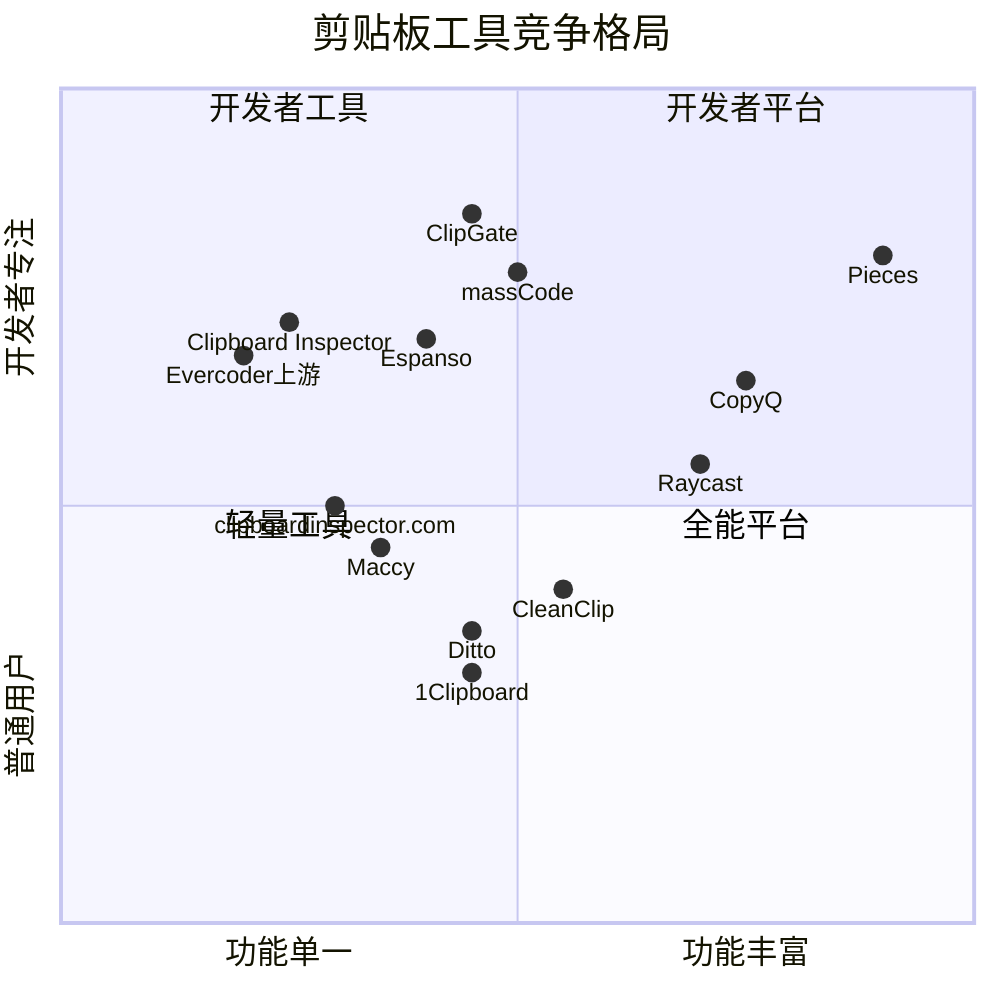

# 3.1 竞品格局总览

剪贴板工具生态经过二十多年演化，已经从系统自带的"复制粘贴"功能发展出一个庞大的独立品类。要理解Clipboard Inspector的竞争环境，不能只看同类工具，必须把视野拉宽到整个剪贴板相关的产品矩阵。

## 六大类别划分

根据产品定位和技术路线，我们将竞品划分为六个类别。每个类别解决的核心问题不同，用户群体也有明显差异。

### 类别一：桌面剪贴板管理器

这是规模最大、用户最熟悉的类别。产品形态是常驻系统托盘或菜单栏的桌面应用，核心功能是记录剪贴板历史，让用户回溯和复用之前复制过的内容。

| 工具 | GitHub Stars | 平台 | 许可证 | 语言 | 定价 |
|------|------|------|------|------|------|
| Maccy | 19,422 [^1] | macOS | MIT | Swift | 免费 / App Store $9.99 |
| CopyQ | 11,594 [^2] | 跨平台 | GPLv3 | C++ | 免费 |
| Ditto | 6,230 [^3] | Windows | GPLv3 | C | 免费 |
| CleanClip | N/A | macOS/iOS | Proprietary | Swift | 免费 / $19.99-$59.99 |
| Raycast Clipboard History | N/A | macOS | Proprietary | TypeScript | 免费 / Pro $8/月 |
| QuickBoard | <100 | macOS | MIT | Swift | 免费 |

这类工具的共同特征：关注"历史管理"而非"内容检查"。它们解决的问题是"我之前复制了什么"，而不是"我复制的内容在技术层面上长什么样"。这意味着它们和Clipboard Inspector的用户场景有交集，但核心价值主张不同。

Maccy是这个类别的标杆产品，接近两万stars说明了市场对轻量剪贴板管理的巨大需求。CopyQ则以脚本引擎取胜，允许用户用JavaScript编写自动化流程。Ditto虽然在Windows平台称霸多年，但界面老旧，开发节奏缓慢。CleanClip尝试用"粘贴队列"等创新功能走freemium路线。Raycast的优势在于零额外安装成本，但对非Raycast用户毫无意义。

### 类别二：Web端剪贴板检查工具

这是Clipboard Inspector直接所在的类别，也是竞品最少的类别。

| 工具 | 形态 | 开源 | 状态 |
|------|------|------|------|
| Evercoder/clipboard-inspector | Web页面 | MIT | 维护缓慢，年更一次 |
| clipboardinspector.com | Web页面 | 否 | 活跃，可能是商业产品 |
| clipboard.js | JS库 | MIT | 已停止维护 |

总共只有三个产品。Evercoder上游仓库（286 stars [^4]）是这个品类的开创者，但维护频率极低，一年更新一次。clipboardinspector.com是基于上游的改进版，加入了历史记录和清除功能，但没有开源。clipboard.js曾经提供剪贴板操作的基础库，但已停止维护。

这个类别的核心事实：**几乎没有人在做Web端剪贴板检查**。这对我们既是好消息（品类空白），也是坏消息（市场验证不足）。

### 类别三：代码片段管理器

| 工具 | GitHub Stars | 平台 | 定价 |
|------|------|------|------|
| massCode | 5,900+ [^5] | 跨平台 | 免费（开源） |
| SnippetsLab | N/A | macOS | $14.99 |
| Espanso | 9,500+ [^6] | 跨平台 | 免费（开源） |

代码片段管理器和剪贴板工具的用户群体高度重叠，但解决问题的方向相反。剪贴板工具是"被动记录"，代码片段管理器是"主动组织"。Espanso比较特殊，它是一个文本展开工具，通过快捷键自动替换缩写为完整代码片段。

这类产品对Clipboard Inspector的威胁有限，因为它们关注的是代码的长期存储和检索，而不是剪贴板内容的即时技术检查。

### 类别四：浏览器扩展

| 工具 | 平台 | 核心功能 |
|------|------|------|
| Copycat | Chrome/Firefox | 复制内容为多种格式 |
| Copy as Markdown | Chrome | 将页面内容复制为Markdown |
| Clipnext | Chrome | 剪贴板历史增强 |
| Advanced Clipboard Organizer | Chrome | 多剪贴板管理 |

浏览器扩展的优势在于与Web环境天然集成。用户在浏览网页时可以直接管理剪贴板，不需要切换到独立应用。但这些扩展受限于浏览器安全沙箱，无法访问完整的MIME类型信息，也看不到底层的数据传输过程。

### 类别五：跨设备剪贴板工具

| 工具 | 同步方式 | 平台覆盖 |
|------|------|------|
| Apple Universal Clipboard | iCloud/蓝牙 | Apple生态 |
| Ditto LAN Sync | 局域网 | Windows |
| 1Clipboard | Google Drive | 跨平台 |

跨设备同步解决的是"在设备A复制，在设备B粘贴"的场景。Apple Universal Clipboard对macOS/iOS用户来说已经够用，形成了事实标准。1Clipboard尝试用Google Drive作为中转实现跨平台同步，但体验不如Apple原生方案流畅。

这类工具和Clipboard Inspector的关系较为疏远，它们关注传输层，我们关注检查层。

### 类别六：AI集成剪贴板工具

这是2024-2026年涌现的最新类别，也是值得密切关注的类别。

| 工具 | 融资/定价 | 核心AI能力 |
|------|------|------|
| Pieces for Developers | $26.1M融资 [^7]，免费/$18.99/月 | LTM-2长期记忆引擎，GPT-5/Claude集成 |
| ClipGate | 免费开源（2026.4推出） | 13种类型自动分类，MCP server，密钥检测 |

Pieces不把自己定位为剪贴板工具，而是一个"开发者知识管理平台"，剪贴板只是它的数据入口之一。它拿到了大量融资，说明资本市场看好"剪贴板+AI"的方向。

ClipGate是2026年4月刚推出的开源工具，采用CLI形态。它的核心理念是"剪贴板数据有类型和含义"，能自动将内容分为command、error、path、JSON、URL、secret、diff、hash等13种类型。这和Clipboard Inspector"检查剪贴板内容"的思路在哲学上非常接近，只是实现路径不同。

## 竞品格局矩阵

下图从两个维度展示竞品定位：横轴为功能丰富度（从单一功能到全能平台），纵轴为开发者专注度（从普通用户到专业开发者）。

从矩阵可以看出，Clipboard Inspector处于"开发者工具"象限的左下角，功能单一但开发者专注度高。要提升竞争力，需要向右移动（增加功能），同时保持开发者调性。ClipGate是最接近我们的竞争者，已经向右迈出了一步。Pieces则占据了"开发者平台"象限的右上方，是最终形态的参考。

## 关键观察

三个值得注意的结构性趋势：

第一，**剪贴板管理已经商品化**。Maccy、Ditto、CopyQ都是免费开源的，基本功能（历史记录、搜索、快速粘贴）已经没有差异化空间。新进入者不能靠"又一个剪贴板管理器"获得用户。

第二，**AI正在重新定义剪贴板**。Pieces和ClipGate代表了两条路线：Pieces是从上往下，用AI平台吸收剪贴板数据；ClipGate是从下往上，从剪贴板数据中提取AI可用的结构化信息。两条路线都指向同一个方向：剪贴板不再只是临时存储，而是数据管道。

第三，**Web端检查是空白地带**。所有桌面工具都不做MIME类型检查，所有Web工具都只做了最基础的检查。上游仓库维护缓慢，这个空白持续存在。Clipboard Inspector如果能把这个空白填好，就能建立自己的品类。

---

[^1]: Maccy GitHub stars数据，来源：github.com/p0deje/Maccy，统计时间2026年4月
[^2]: CopyQ GitHub stars数据，来源：github.com/hluk/CopyQ，统计时间2026年4月
[^3]: Ditto GitHub stars数据，来源：github.com/sabrogden/Ditto，统计时间2026年4月
[^4]: Evercoder/clipboard-inspector GitHub stars数据，来源：github.com/nicktomlin/clipboard-inspector，统计时间2026年4月
[^5]: massCode GitHub stars数据，来源：github.com/massCodeIO/massCode，统计时间2026年4月
[^6]: Espanso GitHub stars数据，来源：github.com/espanso/espanso，统计时间2026年4月
[^7]: Pieces融资数据，来源：Crunchbase，piecesfordevelopers.com
