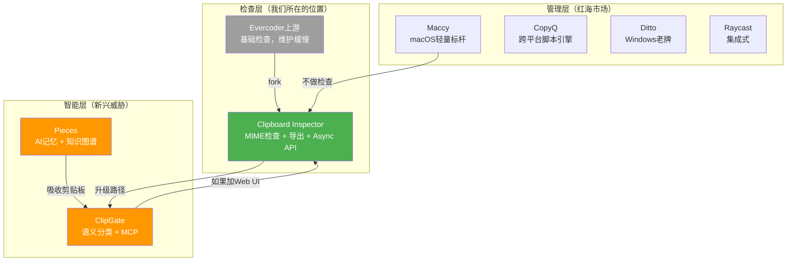

# 3.4 竞争矩阵与差异化定位

前面三个章节分别扫描了竞品格局、分析了桌面端主力产品、研究了Web端和AI工具。现在把所有信息拉到一张表里，看清Clipboard Inspector的位置和差距。

## 竞争特性矩阵

这是整个竞品分析的核心输出。表格中"我们"指Clipboard Inspector当前版本，其余列为主要竞品的当前能力。

| 特性 | 我们 | Evercoder上游 | CopyQ | Maccy | Ditto | Pieces | ClipGate | massCode |
|------|:---:|:---:|:---:|:---:|:---:|:---:|:---:|:---:|
| MIME类型检查 | ✅ | ✅ | ❌ | ❌ | ❌ | ❌ | ❌ | ❌ |
| 粘贴事件检查 | ✅ | ✅ | ❌ | ❌ | ❌ | ❌ | ❌ | ❌ |
| 拖放检查 | ✅ | ✅ | ❌ | ❌ | ❌ | ❌ | ❌ | ❌ |
| Async Clipboard API | ✅ | ❌ | ❌ | ❌ | ❌ | ❌ | ❌ | ❌ |
| Markdown导出 | ✅ | ❌ | ❌ | ❌ | ❌ | ❌ | ❌ | ✅ |
| ZIP导出 | ✅ | ❌ | ❌ | ❌ | ❌ | ❌ | ❌ | ❌ |
| 剪贴板历史 | ❌ | ❌ | ✅ | ✅ | ✅ | ✅ | ✅ | ❌ |
| 脚本支持 | ❌ | ❌ | ✅ | ❌ | ❌ | ❌ | ✅ | ❌ |
| AI集成 | ❌ | ❌ | ❌ | ❌ | ❌ | ✅ | ✅ | ❌ |
| 密钥检测 | ❌ | ❌ | ❌ | ❌ | ❌ | ❌ | ✅ | ❌ |
| 内容类型分类 | ❌ | ❌ | ❌ | ❌ | ❌ | ✅ | ✅ | ❌ |
| Web端 | ✅ | ✅ | ❌ | ❌ | ❌ | ❌ | ❌ | ❌ |
| 跨平台 | ✅ | ✅ | ✅ | ❌ | ❌ | ✅ | ✅ | ✅ |
| 浏览器扩展 | ❌ | ❌ | ❌ | ❌ | ❌ | ✅ | ❌ | ❌ |
| MCP Server | ❌ | ❌ | ❌ | ❌ | ❌ | ✅ | ✅ | ❌ |

**读表方式**：横着看可以看到每个工具的能力边界，竖着看可以看到某个特性在市场中的普及程度。

**核心发现**：在16个特性中，Clipboard Inspector独占2个（Async Clipboard API支持、ZIP导出），与Evercoder上游共享3个（MIME检查、粘贴事件检查、拖放检查）。但我们在另外8个特性上是空白，其中不少是用户期望的基础能力。

## 我们的独特定位

竞争矩阵揭示了一个关键事实：有些东西只有我们在做，而且没有人在追赶。

### 1. Web端剪贴板MIME检查

只有Clipboard Inspector和Evercoder上游提供这个能力。上游286 stars，3个贡献者，一年更新一次。实际上，这个市场等于只有我们一个活跃玩家。

Maccy做了19年，收获了近两万stars，但不做MIME检查。CopyQ的脚本引擎能看到MIME列表，但没有结构化展示。桌面工具关注的是"管理"，不是"检查"。Web端MIME检查是一个被忽视的品类。

### 2. Async Clipboard API测试

Async Clipboard API是浏览器提供的现代剪贴板操作接口，支持异步读写、Promise回调、更细粒度的权限控制。没有任何其他工具支持这个API的检查和测试。

对于前端开发者来说，这是一个实用的调试场景：在实现复制功能时，用Clipboard Inspector验证Async Clipboard API是否正确返回了预期的MIME类型和数据。这和传统的`navigator.clipboard.read()`测试不同，我们提供的是可视化的检查界面。

### 3. 结构化导出（Markdown + ZIP）

将剪贴板检查结果导出为Markdown文档或ZIP压缩包，这个能力是唯一的。上游收到了用户的导出请求（Issue #15），但没有实现。其他工具要么不支持导出，要么只支持纯文本导出。

结构化导出的价值在QA测试场景中尤为突出。测试员检查完剪贴板内容后，可以直接生成包含所有MIME类型、数据内容、检查时间戳的Markdown报告，附在bug report中。ZIP导出则适合包含二进制数据（如图片）的检查结果。

### 4. QA测试员场景

这是未被开发的用户场景。桌面剪贴板管理器面向的是普通用户和开发者，Pieces面向AI辅助开发者，ClipGate面向CLI用户。没有人专门为QA测试员设计剪贴板检查工作流。

QA测试员在测试Web应用的复制粘贴功能时，需要回答这些问题：复制操作是否正确写入了剪贴板？写入了几种MIME类型？HTML格式和纯文本格式是否都正确？拖放操作是否携带了正确的数据？这些问题只有剪贴板检查工具能回答。

## 关键差距需要填补

独特定位不等于安全。竞争对手在多个维度上领先，以下差距如果长期不填补，会影响产品的竞争力。

| 差距 | 优先级 | 竞争威胁 | 说明 |
|------|--------|----------|------|
| 剪贴板历史 | Critical | Maccy、CopyQ、Raycast都有 | 用户检查完一条内容后，无法回溯之前的检查结果 |
| AI就绪导出 | Critical | ClipGate的`cg pack`已做 | 缺少将检查结果格式化为AI可消费的上下文的能力 |
| 密钥检测 | High | ClipGate隔离密钥 | 剪贴板是密钥泄露的高风险渠道，检测能力是安全刚需 |
| 内容类型分类 | High | ClipGate自动分类13种 | 用户不应该需要自己判断剪贴板内容的类型 |
| 浏览器扩展 | Medium | Pieces + Clipnext已有 | 每次检查都要打开专门页面，摩擦太大 |
| MCP Server | Emerging | ClipGate已有MCP | AI工具集成是增长最快的使用场景 |

**"Critical"意味着什么**：剪贴板历史是用户最基本的期望。Maccy、CopyQ、Ditto这些免费工具都有，如果我们没有，用户会在比较后放弃。AI就绪导出则是增长型差距，填上就能打开AI辅助开发者的市场。

## 差异化定位图

图中展示了三个层次。管理层是红海，检查层是蓝海（但很小），智能层是未来。

绿色节点是我们当前的位置，橙色节点是威胁最大的竞争者，灰色节点是正在衰退的上游。

从检查层到智能层的升级路径是清晰可行的。Clipboard Inspector的MIME检查能力加上内容类型分类、AI就绪导出和MCP Server，就能在保持检查核心的同时触及智能层。这不是要做另一个Pieces，而是在检查这个利基市场中做"有智能的检查器"。

## 最大竞争威胁评估

### Critical威胁：ClipGate

ClipGate是最直接的竞争威胁。它理解剪贴板数据有类型和含义，这个理念和我们的"检查"理念在哲学上一致。只是实现路径不同：我们走Web可视化，它走CLI。

威胁场景：ClipGate如果在未来6-12个月内添加Web UI和原始MIME类型查看功能，就会成为直接竞争对手。到那时，它不仅有我们的检查能力，还有语义分类、密钥检测、MCP集成等我们没有的功能。

应对策略：加快内容类型分类和AI就绪导出功能的开发。在ClipGate补齐Web UI之前，建立Web端剪贴板检查的用户心智。

### Moderate威胁：Pieces

Pieces不直接竞争，但它的存在改变了用户的期望。当开发者习惯了Pieces的"剪贴板自动进入AI记忆"体验后，可能会觉得"手动打开网页检查剪贴板"是一种退步。

威胁场景：Pieces如果在其Chrome扩展中添加MIME类型检查功能（技术上可行），就能覆盖我们的核心场景。它不需要专门做检查器，只需要在现有产品中加一个面板。

应对策略：保持轻量和专注。Pieces是一个重型平台，不会为了一个小功能点优化体验。我们在检查场景上的专注度是不可替代的差异化。

### Moderate威胁：Raycast

Raycast的威胁不是功能上的，而是入口上的。大量macOS开发者已经通过Raycast管理剪贴板历史。如果Raycast在Clipboard History扩展中添加基本的MIME类型查看功能（技术上不难），就会在我们的核心用户群中切走一部分。

威胁场景：Raycast有资源和用户基数，如果某天在剪贴板历史条目上添加一个"查看详情"按钮，展示MIME类型列表，就覆盖了80%的检查场景。

应对策略：做Raycast做不到的事。Async Clipboard API测试、结构化导出、拖放检查、跨平台Web访问，这些都是Raycast扩展架构无法实现的。

## 总结

Clipboard Inspector站在一个有利的位置：检查层几乎没有竞争，管理层是红海我们不碰，智能层是我们未来的方向。

短期内，核心策略是"把检查做到极致"。让每一个需要检查剪贴板的用户都找不到第二个选择。中期，补齐剪贴板历史和内容类型分类。长期，建立AI就绪的导出和MCP集成能力，在智能层建立壁垒。

时间窗口是6-12个月。ClipGate正在快速迭代，Pieces在持续融资扩张，上游虽然缓慢但还活着。现在不动，这个窗口就会关闭。
