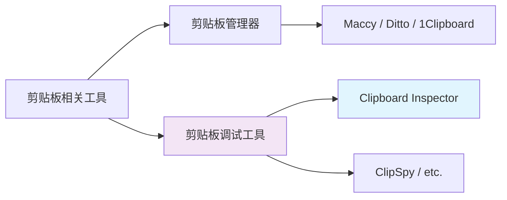

# 5.1 产品愿景与定位

## 产品定位

Clipboard Inspector 是"剪贴板的 DevTools"。

浏览器 DevTools 让开发者看到网页的内部结构、网络请求、JavaScript 执行状态。Clipboard Inspector 做同样的事，只不过对象是剪贴板。它让开发者看到剪贴板里到底有什么：哪些 MIME 类型并存，每种格式的原始内容是什么，跨浏览器有什么差异，是否包含不该出现的敏感信息。

这不是一个通用剪贴板管理器。市面上已经有很多了（Maccy、Ditto、1Clipboard），它们解决的是"管理和复用剪贴板历史"的问题。Clipboard Inspector 解决的是"检查和调试剪贴板数据"的问题，这是一个完全不同的利基市场。

## 愿景声明

**成为开发者浏览器中不可缺少的剪贴板调试工具，就像 DevTools 是网页调试不可缺少的工具一样。**

"不可缺少"这个词很重，但不是随便用的。DevTools 之所以不可缺少，是因为它解决了一个没有替代方案的问题。当 CSS 布局出问题、网络请求失败、JavaScript 报错时，你不可能猜出来原因，必须用 DevTools 查看。

剪贴板调试也是同样的情况。当一个 paste 操作失败了，或者粘贴出来的格式不对，开发者很难直接判断问题出在哪里。是复制端没有写入正确的 MIME 类型？是粘贴端没有请求正确的格式？是浏览器的 HTML 消毒移除了关键标签？这些问题只能通过检查剪贴板原始数据来回答。Clipboard Inspector 就是做这件事的。

## 核心差异化

### 1. 唯一的 Web 端 MIME 类型剪贴板检查器

目前没有其他 Web 工具能做到 Clipboard Inspector 做的事。有通用的剪贴板查看器（如 Windows 的 ClipSpy、开源的 Clipdiary），但它们是桌面应用，不能在浏览器中直接使用。有在线的 JSON 格式化器、Base64 解码器、正则测试器，但没有一个工具专门针对剪贴板数据的检查。

这个空白不是因为它不重要，而是因为大多数开发者还没有意识到他们需要这个工具。就像 regex101.com 出现之前，很多人觉得在终端里跑正则就够了。

### 2. "剪贴板调试"这个利基市场完全空白

在 Google 上搜索"clipboard inspector"或"clipboard debugger"或"clipboard MIME viewer"，你找不到任何直接竞争的产品。相关的搜索结果要么是浏览器扩展（功能非常有限），要么是桌面剪贴板管理器（定位完全不同），要么是 Stack Overflow 上的问答。

空白市场是一把双刃剑。一方面，没有竞争意味着我们可以定义品类；另一方面，这也意味着用户可能没有主动搜索的需求。所以我们不能只靠 SEO 获取流量，需要通过内容营销和社区传播来教育用户。

### 3. 类比 regex101.com 的成功模式

regex101.com 是一个极好的对标案例。它做的事情很简单：提供一个网页，让你测试正则表达式。但就是这个简单的工具，做到了以下成绩：

| 指标 | 数据（2026 年 3 月） |
|------|----------------------|
| 月访问量 | 77.4 万 |
| 估算年收入 | 约 20.5 万美元（广告收入） |
| 全球排名 | 约 29,311 |
| 平均会话时长 | 17 分 20 秒 |
| 流量来源 | 60% 直接访问，30% Google |
| 估算总价值 | 约 102 万美元 |

regex101.com 的成功密码：

**单用途、即时价值**。用户打开页面，粘贴正则和测试字符串，立刻看到匹配结果。没有注册、没有安装、没有学习成本。

**深度而非广度**。它没有试图成为一个通用正则编辑器、代码编辑器或开发平台。它只做一件事：测试正则。但这件事做得非常深，包括捕获组高亮、匹配解释、代码生成。

**用户粘性极高**。17 分钟的平均会话时长说明用户不是看一眼就走，而是真正在用这个工具工作。60% 的直接访问说明大量用户把它加到了书签。

Clipboard Inspector 可以复制这个模式。打开页面，粘贴内容，立刻看到所有 MIME 类型和原始数据。没有注册、没有安装。深度而非广度，专注于剪贴板检查这一件事。

## 定位声明

对于需要调试 Web 应用中剪贴板交互的前端开发者和 QA 工程师，Clipboard Inspector 是一个浏览器端的剪贴板检查工具，它提供实时的 MIME 类型检查、结构化数据导出和跨浏览器兼容性分析。与通用剪贴板管理器不同，我们专注于剪贴板数据的深度检查和调试。

## 目标用户画像

### 主要用户：前端开发者

他们在开发涉及复制粘贴功能的 Web 应用（富文本编辑器、拖拽上传、代码片段分享等）时，需要验证剪贴板交互是否按预期工作。目前他们的调试方式是在 DevTools Console 里写临时代码，效率低且不直观。

### 次要用户：QA 工程师

他们在测试 Web 应用时，需要验证跨浏览器、跨设备的剪贴板行为一致性。他们需要一个标准化的检查工具，而不是在每个浏览器里用不同的方式手动检查。

### 潜在用户：安全工程师

他们需要检测剪贴板中是否意外包含了敏感信息（API Key、JWT、证书等）。Clipboard Inspector 的密钥检测功能可以直接服务这个场景。

## 品类定义策略

我们不是在已有的品类里竞争，而是在创建一个新品类："剪贴板调试工具"。

这个品类定位意味着我们的竞争对手不是 Maccy 或 Ditto（它们解决不同的问题），而是开发者目前使用的临时替代方案（DevTools Console 里的临时代码、手动测试、猜测）。替换这些临时方案的过程就是我们的市场教育任务。
