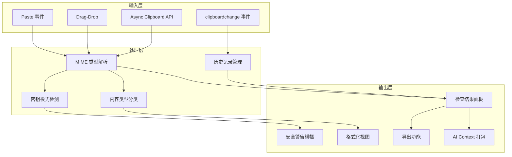

# 5.2 MVP 定义

MVP（最小可行产品）不是做得少，而是用最少的开发量验证最核心的假设。Clipboard Inspector 已经有了一个可用的基础版本（粘贴/拖放检查、Markdown/ZIP 导出），MVP 阶段的目标是在此基础上添加最能验证核心假设的功能，获取早期用户反馈。

## MVP 目标

在现有功能基础上，用 1-2 个月时间添加 4 个核心功能，达到以下目的：

1. 验证开发者是否愿意使用 Web 工具调试剪贴板（通过流量数据验证）
2. 验证密钥检测功能是否能带来用户留存（通过使用频率验证）
3. 验证 AI 就绪导出功能是否有真实需求（通过转化率验证）

## 核心假设与验证方法

| # | 假设 | 验证指标 | 成功标准 |
|---|------|----------|----------|
| H1 | 开发者愿意使用 Web 工具调试剪贴板 | 月活用户数 | 500+ MAU |
| H2 | 密钥检测功能能带来用户留存 | 检测触发次数 + 回访率 | 100+ 次检测/月，20%+ 周留存 |
| H3 | AI 就绪导出有真实需求 | 导出按钮点击率 | 5%+ 的会话触发导出 |

三个假设中，H1 最关键。如果开发者根本不愿意用 Web 工具调试剪贴板，后续假设都没有意义。

## MVP 功能清单

### Phase 1：1-2 个月

#### P0 - 必须有

这些功能构成了 MVP 的完整价值主张，缺少任何一个都会影响核心假设的验证。

**已有功能（保留）**：

- [x] 粘贴/拖放/Async Clipboard API 三种检查方式
- [x] MIME 类型列表展示
- [x] 各格式原始内容查看
- [x] Markdown 导出
- [x] ZIP 导出（含图片等二进制数据）

**新增功能**：

**1. 密钥/Token 自动检测与高亮警告**

当剪贴板内容匹配已知的密钥模式时，自动显示醒目的安全警告。这是 MVP 中最有差异化价值的功能。

检测范围：
- AWS Access Key ID / Secret Access Key
- GitHub Token（`ghp_`, `gho_`, `ghu_`, `ghs_`）
- JWT（`eyJ...`）
- Bearer Token
- Private Key（`-----BEGIN...`）
- Slack Token（`xoxb-`, `xoxp-`）
- Stripe Key（`sk_live_`, `sk_test_`）
- 通用 API Key 模式

UI 表现：
- 顶部横幅警告，显示检测到的密钥类型和数量
- 剪贴板内容中匹配到的部分高亮显示
- 提供"立即清除剪贴板"按钮
- 不记录或上传任何检测到的密钥内容

技术方案：纯正则匹配，零依赖，零 ML，零网络请求。所有检测在客户端完成。

**2. 内容类型自动分类**

粘贴内容后，自动识别内容类型并在 UI 中反映：
- JSON：切换到 JSON 格式化视图
- HTML：提供原始/渲染双视图
- URL：解析并显示 URL 组件
- Base64：提供解码视图
- JWT：提供解码后的 Header/Payload/Signature 视图
- 代码：尝试识别语言并提供语法高亮
- 纯文本：默认视图

技术方案：分层规则匹配，不需要 ML。先检查结构化格式（JSON/XML/HTML），再检查编码格式（Base64/URL-encoded），最后检查编程语言关键字。

**3. 剪贴板历史**

基于 `clipboardchange` 事件（Chrome/Edge 142+），记录最近 20 条剪贴板历史。

功能范围：
- 记录时间戳、内容类型、内容摘要
- 点击历史条目查看完整内容
- 历史数据存储在 IndexedDB 中，页面关闭后保留
- 显示浏览器兼容性提示（仅 Chrome/Edge 142+ 支持）
- 提供"清除历史"功能

降级方案：在不支持 `clipboardchange` 事件的浏览器中，显示提示："剪贴板历史功能需要 Chrome 142+ 或 Edge 142+。你可以继续使用粘贴检查功能。"

**4. "Copy as AI Context" 一键打包**

将当前剪贴板检查结果打包为结构化的 AI 友好格式，方便用户粘贴到 ChatGPT、Claude 等 AI 助手中提问。

输出格式：
```
## 剪贴板检查结果

### 基本信息
- 检查时间: 2026-04-25 10:30:00
- MIME 类型数: 3
- 检测到的类型: text/plain, text/html, image/png

### 内容详情

#### text/plain
[原始文本内容]

#### text/html
[原始 HTML 内容]

#### image/png
[图片信息：尺寸、大小，不含 base64 数据]

### 安全检测
- 未检测到敏感信息

### 内容分类
- 类型: JSON
- 语言: JavaScript
```

这个功能解决的实际痛点：开发者在 AI 助手中描述剪贴板问题时，经常需要手动复制粘贴多个格式的内容。"Copy as AI Context" 一键完成这个打包过程。

#### P1 - 应该有

这些功能提升用户体验，但不是验证核心假设所必需的。在 P0 完成后、时间允许的情况下实现。

- [ ] 跨浏览器兼容性提示：根据用户 UA 显示已知差异
- [ ] JWT 解码查看器：解码 Header、Payload，显示签名信息
- [ ] Base64 编解码：检测 Base64 内容并提供解码视图
- [ ] JSON 格式化/验证：格式化 JSON 内容，标记语法错误
- [ ] URL 编解码：解析 URL 组件（协议、域名、路径、参数）
- [ ] 深色/浅色主题切换

#### P2 - 可以有

这些功能是锦上添花，时间不够可以推迟到后续版本。

- [ ] OCR 文字提取：从剪贴板图片中提取文字（Tesseract.js）
- [ ] 导出对比：两次粘贴的 diff 视图
- [ ] 自定义 MIME 类型高亮规则

## MVP 功能架构



## MVP 成功指标

| 指标 | 目标 | 测量方式 |
|------|------|----------|
| 月活用户（MAU） | 500+ | Google Analytics |
| 周留存率 | 20%+ | Google Analytics |
| 平均会话时长 | 5 分钟+ | Google Analytics |
| GitHub Stars | 100+ | GitHub API |
| 密钥检测触发次数 | 100+/月 | 客户端埋点（匿名计数） |
| AI Context 导出使用率 | 5%+ 会话触发 | 客户端埋点 |
| 剪贴板历史使用率 | 30%+ MAU 使用 | 客户端埋点 |

### 指标解读

**MAU 500+**。对于一个利基开发者工具，500 月活是一个合理的起步目标。regex101.com 在早期阶段也经历了类似的增长曲线。达到 500 MAU 说明产品找到了对的用户群。

**周留存 20%+**。20% 的周留存意味着每周有五分之一的上周用户会再次访问。对于工具类产品，这个数字说明产品解决了重复出现的需求（开发者不止一次需要调试剪贴板）。

**平均会话时长 5 分钟+**。5 分钟足够完成一次完整的剪贴板调试流程。低于这个数字可能说明用户打开后没有找到需要的功能。

**密钥检测 100+/月**。这个数字说明密钥检测功能确实被用户遇到了（而不是一个永远不会触发的功能）。100 次/月意味着平均每天有 3-4 次检测触发。

## MVP 不做的事

明确排除和推迟的功能，同样重要：

- **不做浏览器扩展**。Web 端先验证假设，扩展是平台扩展阶段的事。
- **不做桌面应用**。Tauri 桌面端是 M4 里程碑，不进 MVP。
- **不做用户账户系统**。MVP 阶段不需要注册登录，所有数据本地存储。
- **不做团队协作**。单人工具先做好，团队功能是后续方向。
- **不做付费功能**。MVP 的目标是验证需求，不是变现。

## 技术约束

| 约束 | 说明 |
|------|------|
| 纯 Web 应用 | 不引入 Electron/Tauri 依赖 |
| 无后端 | 静态部署到 GitHub Pages |
| 无用户数据上传 | 所有处理在客户端完成 |
| 剪贴板历史依赖新 API | `clipboardchange` 仅 Chrome/Edge 142+ |
| IndexedDB 存储 | 历史数据本地存储，容量受浏览器限制 |

这些约束确保 MVP 保持轻量，部署简单，不引入运维成本。
