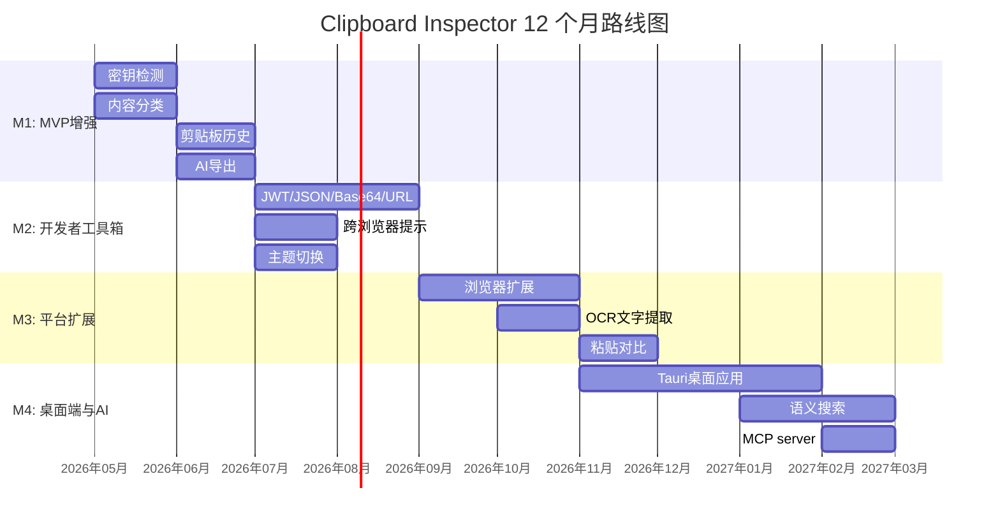
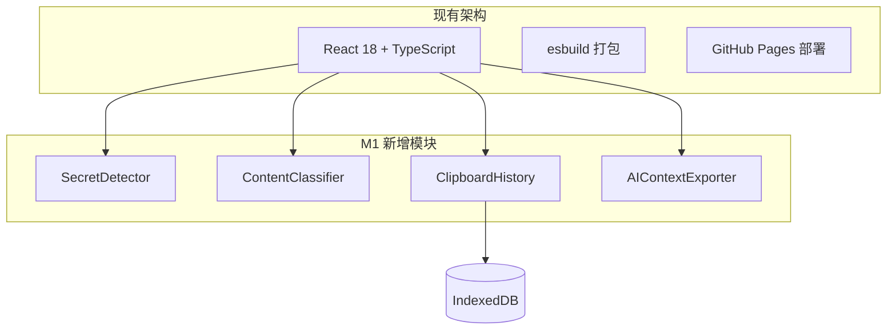
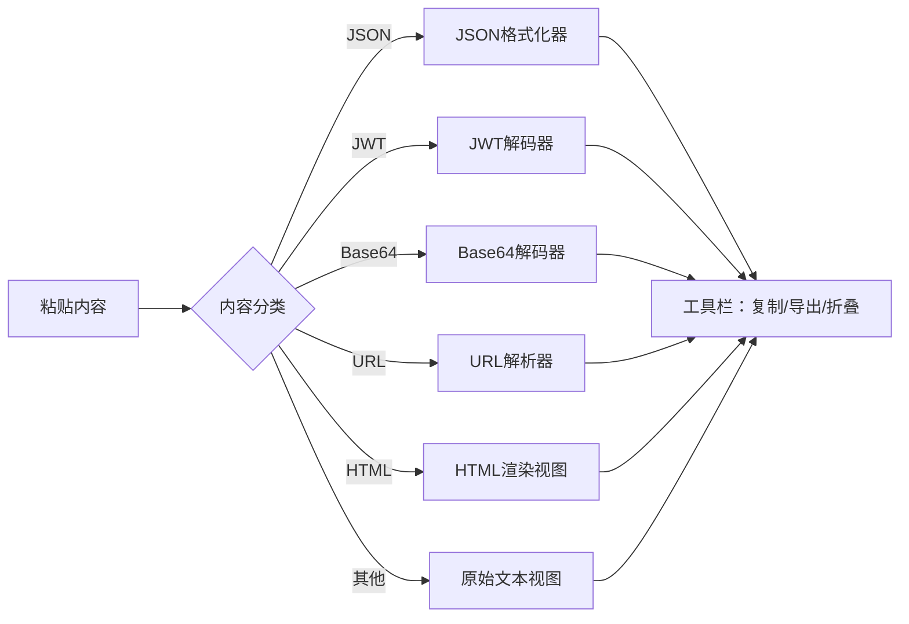
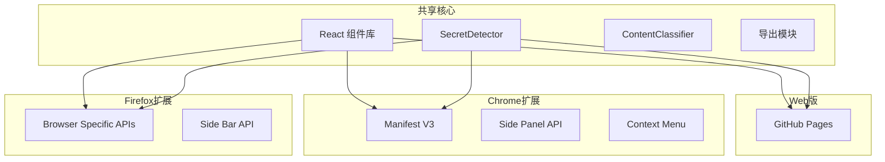
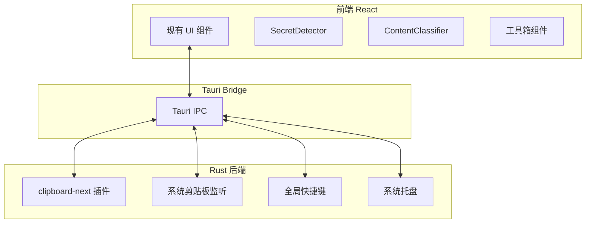
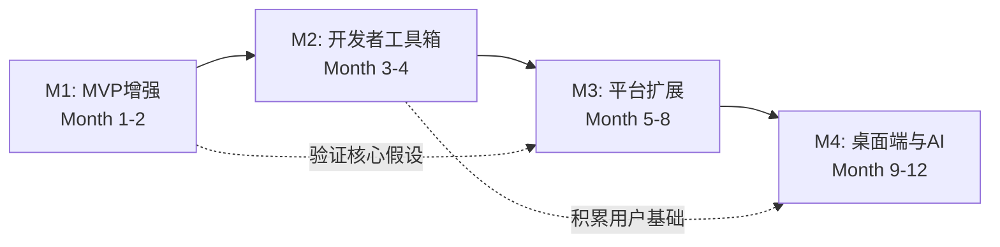

# 5.4 里程碑规划

四个里程碑覆盖 12 个月的开发周期，从 MVP 增强到桌面端和 AI 集成。每个里程碑有明确的功能范围、技术方案、成功指标和风险预案。

## 总体时间线



## M1: MVP 增强（Month 1-2）

### 功能范围

| 功能 | 优先级 | 工作量 | 技术方案 |
|------|--------|--------|----------|
| 密钥/Token 检测与警告 | P0 | 2 人周 | 纯正则匹配，预定义 20+ 种密钥模式 |
| 内容类型自动分类 | P0 | 2 人周 | 分层规则引擎：结构化格式 > 编码格式 > 协议标识 > 语言关键字 |
| 剪贴板历史 | P0 | 3 人周 | `clipboardchange` 事件 + IndexedDB 存储 |
| AI 上下文打包导出 | P0 | 2 人周 | 模板字符串拼装 + `navigator.clipboard.writeText()` |

### 技术方案

M1 阶段全部在现有 Web 应用内完成，不引入新的基础设施依赖。



**SecretDetector**：独立的纯函数模块，输入字符串，输出匹配到的密钥类型和位置。不依赖任何外部库，单元测试覆盖所有模式。

**ContentClassifier**：同样是纯函数模块。输入剪贴板各 MIME 类型的内容，输出分类结果。支持扩展新的分类规则。

**ClipboardHistory**：使用 IndexedDB（通过 idb 包装库）存储历史记录。每条记录包含时间戳、内容摘要、MIME 类型列表。`clipboardchange` 事件触发时自动保存，页面加载时从 IndexedDB 恢复。

**AIContextExporter**：将检查结果按预定义模板格式化，一键复制到剪贴板。不需要额外的 API 调用。

### 成功指标

| 指标 | 目标 |
|------|------|
| GitHub Stars | 100+ |
| 月活用户 | 200+ |
| 密钥检测触发 | 30+/月 |
| AI 导出使用率 | 3%+ 的会话 |
| 零关键 bug | 发布后 72 小时内无 P0 bug |

### 风险与缓解

| 风险 | 概率 | 影响 | 缓解措施 |
|------|------|------|----------|
| `clipboardchange` 浏览器支持不足 | 中 | 高 | 功能降级：显示浏览器兼容性提示，保留手动粘贴入口 |
| 密钥检测误报率高 | 中 | 中 | 允许用户忽略/标记误报，持续调优正则模式 |
| IndexedDB 存储配额不足 | 低 | 低 | 限制历史条数（20 条），提供清除功能 |
| AI 导出格式不符合用户习惯 | 中 | 低 | MVP 后收集反馈，迭代模板格式 |

### 所需资源

- 开发：1 名全栈开发者，2 个月
- 设计：复用现有 UI 风格，新增密钥警告横幅的 UI 设计
- 基础设施：无新增（继续使用 GitHub Pages）

---

## M2: 开发者工具箱（Month 3-4）

### 功能范围

| 功能 | 优先级 | 工作量 | 技术方案 |
|------|--------|--------|----------|
| JWT 解码器 | P1 | 1.5 人周 | Base64 解码 + JSON 解析，纯前端 |
| JSON 格式化/验证 | P1 | 1.5 人周 | 现有库（monaco-editor 或轻量 JSON viewer） |
| Base64 编解码 | P1 | 1 人周 | `atob()` / `btoa()` + 检测逻辑 |
| URL 编解码 | P1 | 1 人周 | URL API + 自定义解析 |
| 跨浏览器兼容性提示 | P1 | 1 人周 | UA 检测 + 已知差异数据库 |
| 深色/浅色主题切换 | P1 | 0.5 人周 | CSS 变量 + `prefers-color-scheme` |

### 技术方案

M2 的重点是完善开发者工具箱，让 Clipboard Inspector 成为处理剪贴板数据的"瑞士军刀"。



每个解码器/格式化器设计为独立的 React 组件，通过内容分类器自动选择合适的组件。用户也可以手动切换查看模式。

**跨浏览器兼容性提示**：内置一个已知差异数据库，包含各浏览器对 `clipboardData.types`、`text/html` 处理、MIME 类型排序等方面的差异。根据用户 UA 自动显示相关提示。

### 成功指标

| 指标 | 目标 |
|------|------|
| 月活用户 | 500+ |
| 平均会话时长 | 5 分钟+ |
| 工具箱功能使用率 | 40%+ 的会话使用至少一个工具箱功能 |
| 周留存率 | 15%+ |

### 风险与缓解

| 风险 | 概率 | 影响 | 缓解措施 |
|------|------|------|----------|
| 工具箱功能过多导致 UI 臃肿 | 中 | 高 | 折叠式设计，默认只显示分类结果，高级工具折叠 |
| JSON 格式化库增加包体积 | 低 | 中 | 使用轻量库或自实现，控制在 50KB 以内 |
| 兼容性提示信息过时 | 低 | 低 | 数据库支持社区贡献，定期更新 |

### 所需资源

- 开发：1 名全栈开发者，2 个月
- 设计：工具箱 UI 交互设计（Tab/折叠/切换方案）
- 基础设施：无新增

---

## M3: 平台扩展（Month 5-8）

### 功能范围

| 功能 | 优先级 | 工作量 | 技术方案 |
|------|--------|--------|----------|
| Chrome 浏览器扩展 | P2 | 3 人周 | Manifest V3，Service Worker + Side Panel API |
| Firefox 浏览器扩展 | P2 | 1 人周 | 复用 Chrome 扩展代码，适配 Firefox API |
| OCR 文字提取 | P2 | 2 人周 | Tesseract.js，Web Worker 中运行 |
| 粘贴对比（diff） | P2 | 2 人周 | diff 算法 + 并排视图 |

### 技术方案

M3 标志着从单页面工具向平台的跨越。

**浏览器扩展**：使用 Chrome Extension Manifest V3 构建。扩展提供两种入口：

1. **Side Panel API**：在浏览器侧边栏中打开 Clipboard Inspector，常驻可用
2. **Context Menu**：右键菜单"检查剪贴板"，快速打开检查面板

扩展与 Web 版共享核心代码（React 组件、分类引擎、检测引擎），通过 monorepo 管理代码共享。



**OCR 文字提取**：集成 Tesseract.js，在 Web Worker 中运行 OCR 推理。首次使用下载英文语言模型（约 2MB），后续从浏览器缓存加载。支持从剪贴板图片（`image/png`、`image/jpeg`）中提取文字。

**粘贴对比**：记录用户每次粘贴的内容（需用户确认），提供并排 diff 视图。用于调试"为什么粘贴结果不同"这类问题。

### 成功指标

| 指标 | 目标 |
|------|------|
| 月活用户 | 2000+ |
| 浏览器扩展安装量 | 500+ |
| OCR 使用率 | 10%+ 的会话 |
| 变现探索启动 | 完成至少 1 种变现方案的原型 |

### 风险与缓解

| 风险 | 概率 | 影响 | 缓解措施 |
|------|------|------|----------|
| Chrome Web Store 审核周期长 | 高 | 中 | 提前提交，准备 developer dashboard |
| Firefox 扩展 API 差异 | 中 | 低 | 使用 WebExtension polyfill 库 |
| Tesseract.js 模型下载影响体验 | 中 | 中 | 后台预加载 + 进度条 + 可选功能开关 |
| 扩展维护成本增加 | 中 | 中 | 最大化代码共享，减少平台特定代码 |

### 所需资源

- 开发：1 名全栈开发者，4 个月
- 设计：浏览器扩展 UI（Side Panel 适配）、diff 视图 UI
- 基础设施：Chrome Web Store 开发者账号（5 美元一次性费用）
- 变现探索：开始研究广告/赞助/Pro 功能方案

---

## M4: 桌面端与 AI 增强（Month 9-12）

### 功能范围

| 功能 | 优先级 | 工作量 | 技术方案 |
|------|--------|--------|----------|
| Tauri 桌面应用 | P2 | 8 人周 | Tauri v2 + React 前端 + Rust 后端 |
| 语义搜索 | P3 | 3 人周 | Transformers.js 嵌入模型 + 余弦相似度 |
| MCP server | P3 | 2 人周 | Node.js/Rust MCP server 实现 |
| 团队共享（原型） | P3 | 4 人周 | 端到端加密 + 分享链接 |

### 技术方案

M4 是最具技术挑战性的里程碑，也是产品从工具走向平台的关键一步。

**Tauri 桌面应用**：复用 Web 版的 React 前端代码，新增 Rust 后端处理系统级剪贴板操作。



桌面端的额外能力：
- 系统级剪贴板监听（不依赖 `clipboardchange` 事件，所有 OS 都可用）
- 全局快捷键（任意应用中唤起检查窗口）
- 系统托盘常驻
- 读写所有 MIME 类型（包括自定义格式）
- 剪贴板历史持久化（文件系统存储，无浏览器配额限制）

**语义搜索**：使用 Transformers.js 的嵌入模型（`all-MiniLM-L6-v2`，约 30MB）将剪贴板历史转为向量。搜索时计算查询向量与历史向量的余弦相似度，返回最相关的结果。

```typescript
// 语义搜索简化架构
const embedder = await pipeline('feature-extraction', 'Xenova/all-MiniLM-L6-v2');
const queryVector = await embedder(searchQuery);
const results = history
  .map(item => ({
    item,
    similarity: cosineSimilarity(queryVector, item.vector)
  }))
  .sort((a, b) => b.similarity - a.similarity)
  .slice(0, 10);
```

**MCP server**：实现 Model Context Protocol server，允许 Claude、Cursor 等 AI 工具直接调用 Clipboard Inspector 的能力。MCP server 提供以下工具：

- `inspect_clipboard`：读取并分析当前剪贴板内容
- `detect_secrets`：检测剪贴板中的敏感信息
- `classify_content`：分类剪贴板内容类型
- `get_history`：获取剪贴板历史

### 成功指标

| 指标 | 目标 |
|------|------|
| 月活用户 | 5000+ |
| 桌面应用下载量 | 1000+ |
| MCP server 使用量 | 50+ 活跃集成 |
| 开始产生收入 | 月收入 > 0 |

### 风险与缓解

| 风险 | 概率 | 影响 | 缓解措施 |
|------|------|------|----------|
| Tauri 学习曲线 | 中 | 中 | 先用 2 周做技术预研，验证核心 API |
| 嵌入模型在桌面端的性能 | 中 | 中 | 使用 WebGPU 加速，降级到 WASM |
| MCP 协议变动 | 中 | 低 | 跟进 MCP 规范更新，保持适配 |
| 跨平台打包问题（Linux） | 中 | 中 | 优先支持 macOS/Windows，Linux 社区版 |

### 所需资源

- 开发：1 名全栈开发者（前端 + Rust），4 个月
- 设计：桌面端 UI 适配（窗口大小、系统托盘、快捷键提示）
- 基础设施：代码签名证书（macOS/Windows），自动更新服务器
- 变现：开始实施变现方案

---

## 里程碑依赖关系



每个里程碑是下一个的前提，但也存在跨阶段的依赖。M1 验证的核心假设（用户是否愿意用 Web 工具调试剪贴板）直接影响 M3（是否值得做浏览器扩展）的决策。M2 积累的用户基础决定了 M4 桌面端的优先级。

## 调整机制

路线图不是固定的。每个里程碑结束后做一次回顾：

1. **指标达标**：按计划推进下一个里程碑
2. **指标未达标**：分析原因，调整功能优先级或时间线
3. **发现新机会**：评估是否值得替换当前计划中的低优先级功能

关键决策点：

- **M1 结束后**：如果 MAU < 100，重新评估产品定位
- **M2 结束后**：如果周留存 < 10%，优先改进核心体验而非扩展平台
- **M3 结束后**：如果扩展安装量 < 100，重新评估桌面端优先级
- **M4 结束后**：如果月收入 = 0，重新评估变现策略
