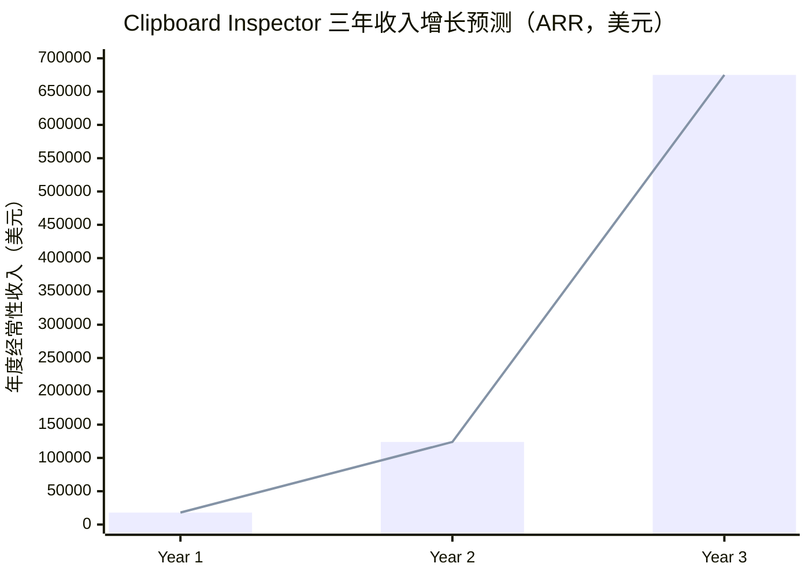
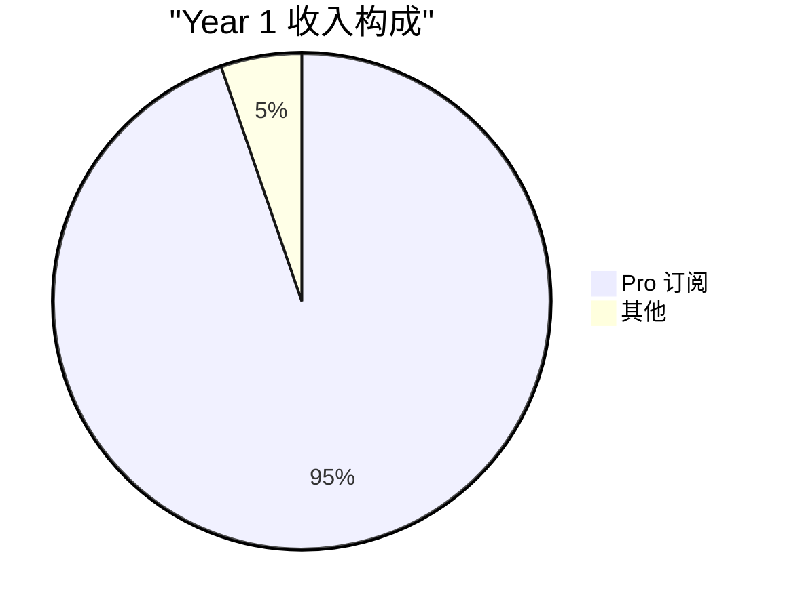
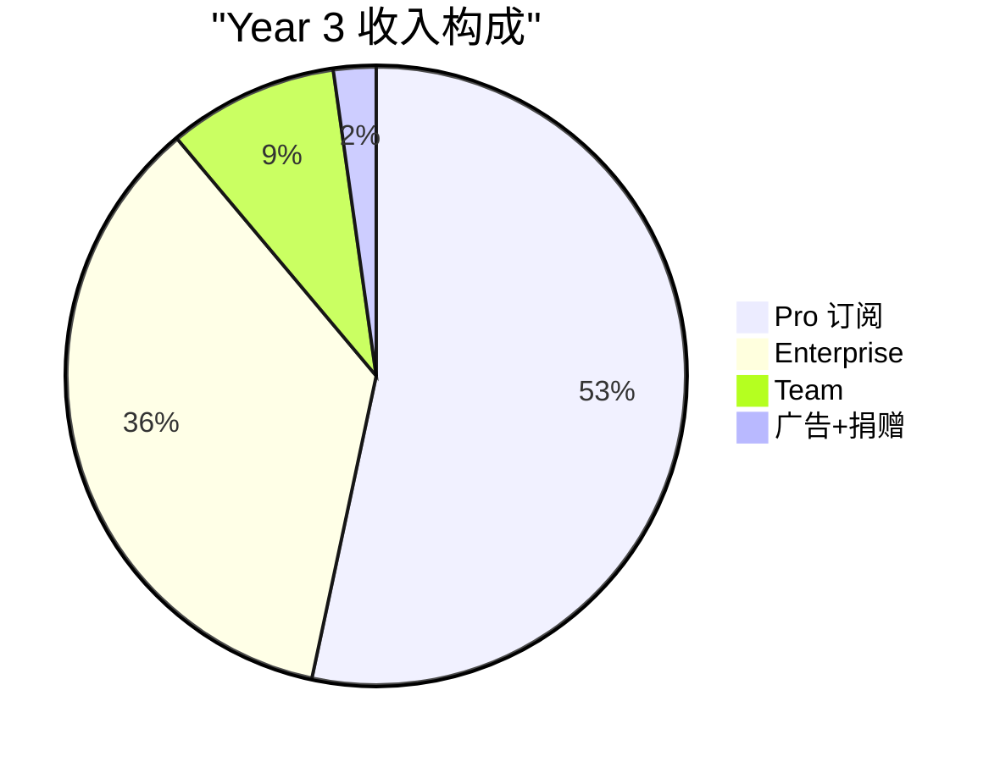

# 6.2 收入模型与增长预测

定价策略回答了"收多少钱"。收入模型要回答的是"从哪里收"和"能收多少"。本节搭建一个多引擎收入模型，按免费增长、Pro 转化、Team 扩展、Enterprise 签约四个阶段做三年滚动预测。

## 收入来源结构

Clipboard Inspector 的收入不会依赖单一来源。五个收入引擎各自承担不同的角色：

**1. 浏览器扩展 Pro 订阅（主要收入，占比约 55-60%）**

这是最核心的收入来源。浏览器扩展天然适配订阅模式：用户安装后持续使用，按月或按年付费。Chrome Web Store、Firefox Add-ons、Edge Add-ons 三个分发渠道覆盖主流浏览器用户。

Pro 订阅的定价锚定在 $5/月（年付 $49），处于开发者工具的"无感付费"区间。假设 3% 的免费用户转化为 Pro 用户（行业基准 2-4%，见 OpenView Partners SaaS Benchmarks），这个引擎的规模取决于免费用户的增长速度。

**2. 桌面应用 Pro（Tauri，占比约 15-20%）**

基于 Tauri 构建的桌面应用面向 macOS 和 Windows 用户，这些人习惯了原生工具的体验和定价模式。桌面端可以同时提供订阅和一次性购买两种选项。参考 Paste 的做法，终身授权定价 $89-99，吸引偏好买断制的用户。

桌面端的另一个价值是解锁了系统级剪贴板访问能力。Web 端受限于浏览器安全策略，只能处理 paste 和 drop 事件中的数据。桌面端可以监听全局剪贴板变化，提供持续的历史记录功能。

**3. Team/Enterprise 许可（高 ARPU，占比约 20-25%）**

Team 和 Enterprise 层的 ARPU 远高于个人 Pro。一个 10 人 QA 团队按 $10/用户/月算就是 $100/月。一个 20 人 Enterprise 合同按 $30/用户/月算是 $600/月，年收入 $7,200。

这部分收入的特点是"少而精"。不需要很多客户，每个客户的 LTV（Life Time Value）足够高。Enterprise 客户的年流失率通常低于 10%，提供了稳定的收入基础。

**4. Web 端广告收入（补充收入，占比约 3-5%）**

参考 regex101.com 的模式：核心工具完全免费，页面展示少量相关性高的广告。regex101 作为一个垂直工具网站，每月访问量在数百万级别，广告收入足以覆盖运营成本。

Clipboard Inspector Web 端的预期 RPM（Revenue Per Mille，每千次展示收入）约为 $0.50。这个数字基于 regex101 的公开数据和开发者工具垂直广告的市场水平。初期收入微薄，但随着免费用户增长到 10 万+，会成为一个可观的补充收入流。

**5. GitHub Sponsors / Open Collective 捐赠（象征性收入）**

开源项目的捐赠收入通常不高，但它的价值不在金额。捐赠是社区认可的信号，也是维护者和用户之间的情感连接。许多开源项目（如 Vitest、esbuild）通过 Sponsors 获得了稳定的月度支持。

## 三年收入预测

以下预测基于一组保守假设。每个假设都附有行业基准作为参考。

### 关键假设

| 参数 | 假设值 | 行业基准 | 来源 |
|------|--------|----------|------|
| 免费到 Pro 转化率 | 3% | 2-4% | OpenView Partners, SaaS Benchmarks |
| Pro 月流失率 | 5% | 3-7% | Linehurst SaaS Metrics |
| Team 席位年增长率 | 10x | 5-15x（早期） | First Round Review |
| Web 端广告 RPM | $0.50 | $0.30-1.00 | regex101 参考估算 |
| Enterprise 平均合同价值 | $24K/年（Year 2），$48K/年（Year 3） | $20-60K | Culta.ai, DevTools Benchmarks |
| 免费用户年增长率 | 5x（Year 1→2），4x（Year 2→3） | 3-7x（PLG 工具） | OpenView, Product-Led Growth Benchmarks |

### 预测数据

| 指标 | Year 1 | Year 2 | Year 3 |
|------|--------|--------|--------|
| 免费用户 | 10,000 | 50,000 | 200,000 |
| Pro 转化用户（3%） | 300 | 1,500 | 6,000 |
| Pro MRR @ $5/月 | $1,500 | $7,500 | $30,000 |
| Pro ARR | $18,000 | $90,000 | $360,000 |
| Team 席位 | 0 | 50 | 500 |
| Team MRR @ $10/用户/月 | $0 | $500 | $5,000 |
| Team ARR | $0 | $6,000 | $60,000 |
| Enterprise 合同 | 0 | 1-2 | 5-10 |
| Enterprise ARR | $0 | $24,000 | $240,000 |
| Web 广告收入/年 | $500 | $2,500 | $10,000 |
| 捐赠/年 | $500 | $2,000 | $5,000 |
| **总 ARR** | **~$18K** | **~$124K** | **~$675K** |

### 收入增长曲线

### 收入构成变化

Year 1 的收入几乎完全来自 Pro 订阅。到 Year 3，Enterprise 合同会成为第二大收入来源，占总收入的约 36%。这种收入结构的演变是健康的：从依赖个人订阅的单一引擎，过渡到多引擎驱动的稳定结构。

## 收入增长的关键杠杆

上述预测不是线性的。几个关键动作会显著影响增长曲线的斜率：

**免费用户基数的增长速度。** 所有收入都建立在免费用户的基础上。如果 SEO 和社区传播做得好，Year 2 的免费用户可能达到 80,000 而不是 50,000，Pro 收入相应提升 60%。

**Pro 到 Team 的升级路径。** 当一个开发者在一个 10 人团队中分享 Clipboard Inspector，如果工具足够好，有可能带动整个团队订阅。Team 升级的转化率是撬动 ARPU 的关键。

**Enterprise 合同的签约速度。** 每个 Enterprise 合同的 ARR 相当于 400 个 Pro 用户。签下一个 Enterprise 客户的投入产出比远高于获取 400 个个人用户。Year 2 能否签下前 1-2 个 Enterprise 合同，是整个模型的转折点。

**AI 功能的差异化程度。** 如果 AI 功能（敏感数据检测、智能格式推断）能显著节省开发者的调试时间，Pro 层的转化率可能从 3% 提升到 5%。这个 2 个百分点的差异在 Year 3 意味着 $120,000 的额外 ARR。

## 路径依赖与风险

收入模型的风险不在单个参数的偏差，而在于路径依赖。如果 Year 1 的免费用户增长低于预期（比如只达到 5,000 而不是 10,000），Year 2 的 Pro 转化基数就不够，Team 和 Enterprise 的获客也会受限。

缓解这个风险的方法是：Year 1 的核心目标不是收入，而是免费用户增长。所有资源优先投入产品体验和 SEO，而不是变现。先把漏斗的开口做大，再优化每个环节的转化率。
