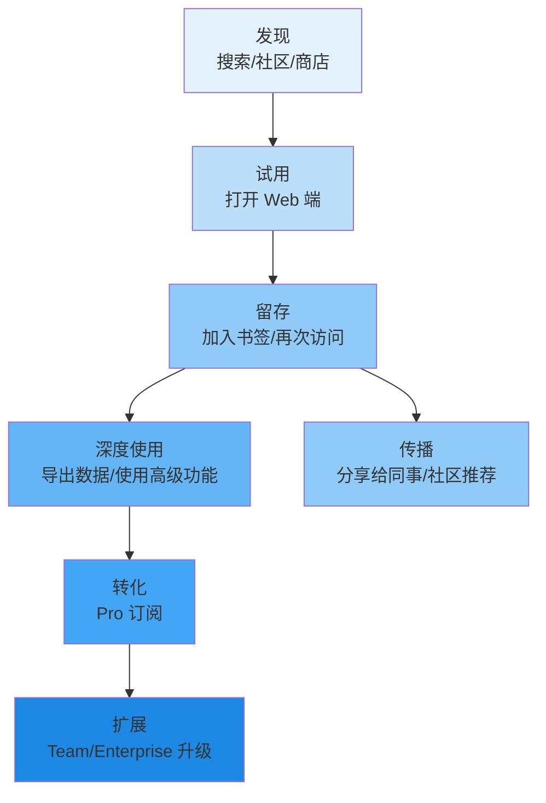

# 6.3 增长策略与获客渠道

有了定价和收入模型，下一个问题是：用户从哪里来？本节按优先级排列五个获客渠道，定义北极星指标和辅助指标，并规划开源社区的增长策略。

## 获客渠道优先级

### 渠道 1：SEO 与内容营销（最高优先级）

SEO 是 Clipboard Inspector 最具杠杆效应的获客渠道。原因很简单：开发者遇到剪贴板问题时，第一反应是搜索。

**目标关键词矩阵：**

| 关键词 | 月搜索量估算 | 竞争度 | 优先级 |
|--------|-------------|--------|--------|
| clipboard inspector | 500-1,000 | 低 | 高 |
| clipboard MIME types | 300-800 | 低 | 高 |
| debug clipboard | 200-500 | 低 | 高 |
| clipboard testing | 300-600 | 中 | 高 |
| clipboard API browser | 500-1,000 | 中 | 中 |
| paste event data | 200-400 | 低 | 中 |
| drag and drop clipboard | 300-500 | 中 | 中 |

> 搜索量基于 Ahrefs/SEMrush 类工具的估算区间。实际数据需在工具部署后通过 Google Search Console 验证。

**内容营销计划：**

- **剪贴板 API 跨浏览器兼容指南**：系统梳理 Chrome、Firefox、Safari、Edge 在 Clipboard API 上的差异，附带可运行的测试用例。这类内容有长尾搜索价值，会被持续引用。
- **Playwright 剪贴板测试教程**：针对测试工程师，讲解如何在 Playwright 中模拟粘贴事件、验证剪贴板数据。Playwright 的 GitHub Issues 中有大量剪贴板相关问题（如 #15860），说明需求真实存在。
- **剪贴板安全风险分析**：讨论剪贴板中的敏感数据泄露风险，结合 OWASP 指南。安全主题的内容在技术社区有高传播性。
- **从 DevTools 到 Clipboard Inspector**：对比手动检查剪贴板数据和使用专用工具的效率差异，突出痛点。

**参考模式：regex101.com。** regex101 的流量结构值得深入研究。根据 SimilarWeb 数据，regex101 每月访问量在 1,500 万到 2,000 万之间，其中约 60% 是直接访问（用户记住网址或使用书签），30% 来自搜索引擎，10% 来自社交媒体和社区引用。这意味着 SEO 帮助它获得了初始用户群，而产品体验足够好，用户会自发记住并回访。

Clipboard Inspector 应该追求同样的路径：通过 SEO 获取第一批用户，用产品体验留住他们，最终形成 60%+ 的直接访问比例。

### 渠道 2：开发者社区传播

开发者社区的传播效果难以精确预测，但单次成功带来的用户量级远超日常 SEO。

**Hacker News：Show HN 发布**

Show HN 是 Hacker News 的项目展示板块。一个成功的 Show HN 帖子可以带来 5,000-20,000 次访问。发布时机和标题很关键：

- 标题格式建议："Show HN: Clipboard Inspector - A web tool to debug clipboard MIME types and data transfer"
- 发布时间：美国东部时间早上 8-10 点（工作日）
- 准备好回答技术问题的评论区互动

**Reddit 精准投放**

不是所有子版块都适合。以下四个是根据用户画像筛选的高价值目标：

| 子版块 | 订阅者 | 相关度 | 投放策略 |
|--------|--------|--------|----------|
| r/webdev | 2.5M+ | 高 | 技术文章，强调跨浏览器兼容问题 |
| r/programming | 5M+ | 中 | 工具推荐，强调开源和实用性 |
| r/QualityAssurance | 50K+ | 高 | 测试场景，强调 Playwright 集成 |
| r/devops | 600K+ | 中 | CI/CD 场景，强调自动化测试 |

> Reddit 子版块数据为 2026 年 4 月估算值。

**Dev.to / Medium 技术文章**

长篇技术文章的生命周期比社区帖子长得多。一篇好的教程可以持续带来搜索流量 6-12 个月。建议每月发布一篇深度技术文章，覆盖剪贴板 API 的不同切面。

**Stack Overflow 策略性回答**

Stack Overflow 上有大量剪贴板相关问题。策略是在回答这些问题的过程中自然引用 Clipboard Inspector 作为调试工具。注意：不能硬推产品，而是"你可以用这个工具来验证你的剪贴板数据"。社区对隐性广告的容忍度很低，但对有用工具推荐的接受度很高。

### 渠道 3：GitHub 生态

Clipboard Inspector 本身是一个 GitHub 项目。充分利用 GitHub 的分发和发现机制，是成本最低的获客渠道。

**README 优化，SEO 友好：**

- 在 README 中包含完整的 keywords 段落
- 添加 Open Graph 元数据，确保分享到社交媒体时有好的预览
- 提供在线 Demo 链接（GitHub Pages），降低试用门槛

**GitHub Topics 标注：**

推荐 Topics：clipboard, developer-tools, web-development, testing, debugging, mime-types, drag-and-drop。这些 Topics 帮助 GitHub 的推荐算法把项目推给相关开发者。

**上游关系维护：**

与 evercoder/clipboard-inspector 保持良性互动。不是竞争关系，而是互补。上游的 README 中已经链接了本 fork。维护这个关系可以为上游的 286 stars 和 30 forks 的关注者提供发现路径。

### 渠道 4：浏览器扩展商店

浏览器扩展商店是发现场景：用户在这些平台上主动搜索工具。

| 商店 | 覆盖用户 | 上架难度 | 时间预估 |
|------|----------|----------|----------|
| Chrome Web Store | 最大 | 低 | 1-3 天审核 |
| Firefox Add-ons | 中等 | 中 | 3-7 天审核 |
| Edge Add-ons | 中等 | 低 | 1-5 天审核 |

上架后的优化包括：关键词丰富的标题和描述、高质量的截图和宣传图、定期更新以保持排名。

### 渠道 5：AI 工具集成

这是一个新兴但高潜力的获客渠道。

**MCP Server（Model Context Protocol）：**

MCP 是 Anthropic 推出的 AI 模型上下文协议，用于让 Claude Code、Cursor 等 AI 工具访问外部数据。Clipboard Inspector 可以提供一个 MCP Server，让 AI 工具在帮助开发者调试剪贴板问题时，自动调用 Clipboard Inspector 的解析能力。

这个渠道的价值在于：它把 Clipboard Inspector 嵌入到开发者已有的工作流中，不需要额外切换工具。当 AI 工具推荐"用 Clipboard Inspector 检查你的剪贴板数据"时，这个推荐的转化率远高于任何广告。

## 增长指标体系

### 北极星指标

**周活跃用户（WAU）** 是 Clipboard Inspector 的北极星指标。

选择 WAU 而不是 DAU 的原因：剪贴板调试是一个中频需求。开发者不会每天使用，但每周可能需要 2-3 次。DAU 会低估产品的实际使用价值。选择 WAU 而不是 MAU 的原因：MAU 的反馈周期太长，不利于快速迭代。

### 辅助指标

| 指标 | 定义 | 目的 |
|------|------|------|
| 平均会话时长 | 从打开工具到离开的时间 | 衡量工具的使用深度 |
| 导出次数 | Markdown + ZIP 导出总量 | 衡量工具的核心价值验证 |
| 密钥检测触发次数 | 敏感数据检测触发量 | 衡量 AI 功能的实用价值 |
| 书签率 | 用户添加到书签的比例 | 衡量产品粘性 |

### 商业指标

| 指标 | 定义 | 目标（Year 1） |
|------|------|----------------|
| 免费到 Pro 转化率 | Pro 用户 / 免费用户 | 3% |
| MRR 增长率 | 月度经常性收入环比增长 | >10%/月 |
| Pro 月流失率 | 每月取消订阅的比例 | <5% |
| CAC（客户获取成本） | 获取一个付费用户的成本 | <$20 |
| LTV（客户生命周期价值） | 付费用户的生命周期收入 | >$100 |

### 增长漏斗

漏斗中每一个环节都有对应的优化动作：

- **发现到试用**：优化 SEO、社区推广、扩展商店关键词
- **试用到留存**：降低首次使用门槛、提升加载速度、优化首次体验
- **留存到深度使用**：引导用户发现高级功能、提供使用场景提示
- **深度使用到转化**：Pro 功能的合理边界设置、转化触点设计
- **转化到扩展**：团队功能的自然引入、Enterprise 销售跟进
- **留存到传播**：简化分享流程、鼓励社区贡献

## 开源策略

开源不是慈善，是获客策略的一部分。Clipboard Inspector 的开源策略遵循"开放核心"（Open Core）模式。

**核心检查工具保持 MIT 开源。** Web 端的基础剪贴板检查功能，包括 MIME 类型解析、数据预览、Markdown/ZIP 导出，始终以 MIT 协议开源。这确保了社区信任和持续贡献。

**Pro 功能使用 BSL 或 Commons Clause。** 浏览器扩展的高级功能（历史记录、智能搜索、跨设备同步）和 Enterprise 功能（SSO、审计日志）使用商业许可证。这些功能不贡献回开源核心，但开源用户不受影响。

**接受社区贡献，建立贡献者社区。** 通过 Good First Issue 标签、贡献者指南、定期的社区互动，吸引外部开发者参与。每一个贡献者都是天然的传播者。

**GitHub Sponsors 支持。** 在 README 和项目页面添加 Sponsors 链接。捐赠收入不是主要目标，但它是社区健康度的一个指标，也能覆盖部分服务器和域名成本。

开源策略的底线是：**开源核心必须足够好，付费功能才是锦上添花。** 如果开源版本不好用，用户不会信任付费版本。如果开源版本太好，付费功能就没有吸引力。这个平衡需要持续调整。
