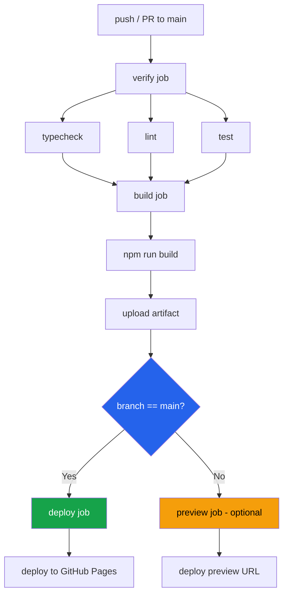
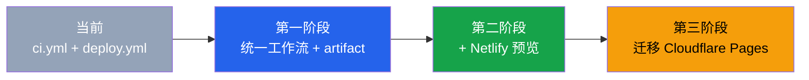

# 7.2 CI/CD 流水线设计

持续集成和持续部署（CI/CD）是一人公司最重要的效率杠杆。每次推送代码后，质量检查和部署应该全自动完成，不需要任何人工干预。Clipboard Inspector 当前有两套独立的工作流，存在重复构建和资源浪费。本节分析现状问题并提出优化方案。

## 现状分析

项目当前使用两个独立的 GitHub Actions 工作流：

**ci.yml** 在每次 push 和 PR 时触发，执行完整的质量检查链：

```
checkout → setup node → npm ci → typecheck → lint → test:run → build
```

**deploy.yml** 在 main 分支推送时触发，执行构建和部署：

```
checkout → setup node → npm ci → build → prepare _site → upload artifact → deploy to Pages
```

| 问题 | 影响 | 严重程度 |
|------|------|---------|
| 构建重复执行 | main 分支每次推送触发两次完整构建（CI + Deploy），浪费 Actions 运行时间 | 中 |
| deploy.yml 不运行测试 | 部署流程只执行 build，不跑 typecheck、lint、test，理论上可能部署带 Bug 的代码 | 高 |
| 并发控制不完整 | deploy.yml 设置了 `cancel-in-progress: false`，快速连续推送会产生部署排队 | 低 |
| 无预览部署 | PR 没有可预览的部署结果，review 者无法直接看到变更效果 | 中 |
| 构建产物未缓存 | 每次 build 从零开始，esbuild 本身快但 npm ci 占据了大部分时间 | 低 |

> 当前工作流文件：`.github/workflows/ci.yml` 和 `.github/workflows/deploy.yml`

其中最值得警惕的是第二个问题：deploy.yml 跳过了测试环节。虽然 ci.yml 会在同一次推送中运行测试，但两者是独立的工作流。如果 ci.yml 因为队列拥堵而延迟执行，deploy.yml 可能已经把一个有问题的构建发布到了生产环境。

## 优化方案：统一工作流

将 ci.yml 和 deploy.yml 合并为一个工作流，通过 job 依赖和条件执行实现"构建一次，按需部署"。

### 推荐工作流架构



这个架构的核心思路是：验证、构建、部署是三个独立的 job，通过 artifact 传递构建产物。验证全部通过才触发构建，main 分支的构建才触发部署。

### 完整工作流定义

```yaml
name: CI/CD

on:
    push:
        branches: [main]
    pull_request:
        branches: [main]

concurrency:
    group: cicd-${{ github.ref }}
    cancel-in-progress: true

permissions:
    contents: read
    pages: write
    id-token: write

jobs:
    verify:
        runs-on: ubuntu-latest
        steps:
            - uses: actions/checkout@v4
            - uses: actions/setup-node@v4
              with:
                  node-version: '20.x'
                  cache: npm
            - run: npm ci
            - run: npm run typecheck
            - run: npm run lint
            - run: npm run test:run

    build:
        needs: verify
        runs-on: ubuntu-latest
        steps:
            - uses: actions/checkout@v4
            - uses: actions/setup-node@v4
              with:
                  node-version: '20.x'
                  cache: npm
            - run: npm ci
            - run: npm run build
            - name: Prepare site directory
              run: |
                  mkdir -p _site
                  cp index.html index.js style.css _site/
            - uses: actions/upload-artifact@v4
              with:
                  name: site
                  path: _site
                  retention-days: 1

    deploy:
        needs: build
        if: github.ref == 'refs/heads/main' && github.event_name == 'push'
        runs-on: ubuntu-latest
        environment:
            name: github-pages
            url: ${{ steps.deployment.outputs.page_url }}
        steps:
            - uses: actions/download-artifact@v4
              with:
                  name: site
                  path: _site
            - uses: actions/upload-pages-artifact@v3
              with:
                  path: _site
            - id: deployment
              uses: actions/deploy-pages@v4
```

### 关键优化点解读

**concurrency: cancel-in-progress: true**

当同一个分支上有新的推送时，自动取消正在运行的工作流。这避免了快速连续推送时的部署冲突和资源浪费。在旧方案中 deploy.yml 设置了 `cancel-in-progress: false`，导致多次推送会排队部署，最终部署的可能不是最新版本。

**job 依赖与条件执行**

```yaml
deploy:
    needs: build
    if: github.ref == 'refs/heads/main' && github.event_name == 'push'
```

deploy job 只在 main 分支的 push 事件时触发。PR 只走 verify 和 build，不部署到生产环境。这确保了只有经过完整验证的代码才会发布。

**artifact 传递构建产物**

build job 将构建产物上传为 artifact，deploy job 下载后发布到 GitHub Pages。这种方式避免了重复构建，也使得未来添加 preview job 变得容易。

## 预览部署方案

PR 预览部署能显著提升 code review 效率。review 者直接点击链接就能看到变更效果，不需要在本地拉取分支和启动开发服务器。

### 方案一：Netlify 预览（推荐）

Netlify 的免费层支持 PR 预览部署，且不与主站冲突。配置方法：

1. 在 Netlify 创建站点，连接 GitHub 仓库
2. 设置构建命令：`npm run build`
3. 发布目录：`_site`
4. 仅启用 PR 预览，关闭 main 分支自动部署

这样 Netlify 只用于 PR 预览，生产部署仍然走 GitHub Pages。Netlify 免费层的 300 分钟构建时间/月足以支撑 PR 预览需求。

### 方案二：Cloudflare Pages 预览

如果后续迁移到 Cloudflare Pages，其内置的预览部署功能（Preview Deployments）会自动为每个 PR 生成预览 URL。这是更集成的方案，但需要先完成平台迁移。

### 方案对比

| 特性 | Netlify 预览 | Cloudflare Pages 预览 |
|------|-------------|---------------------|
| 免费额度 | 300 分钟构建/月 | 500 次构建/月 |
| 配置复杂度 | 中（需维护额外平台配置） | 低（迁移后自动启用） |
| 预览 URL 稳定性 | 稳定，每次 PR 更新同一个 URL | 稳定，每个 commit 有独立 URL |
| 对主站影响 | 无（独立平台） | 无（同平台隔离） |
| 推荐时机 | 现在（零迁移成本） | 迁移 Cloudflare 后 |

## CI/CD 最佳实践清单

将行业最佳实践与项目实际情况结合，梳理为可执行的检查清单：

| 实践 | 当前状态 | 目标状态 | 优先级 |
|------|---------|---------|--------|
| 单一工作流管理 CI 和 CD | 两个独立工作流 | 合并为一个 | 高 |
| 并发控制与取消 | deploy 有但不取消 | 全局 cancel-in-progress | 高 |
| 构建产物复用 | 无（每次重建） | artifact 传递 | 高 |
| PR 预览部署 | 无 | Netlify 预览 | 中 |
| 依赖缓存 | npm cache 已启用 | 保持现状 | 已完成 |
| 构建失败通知 | GitHub 默认邮件 | 可选 Slack/Discord webhook | 低 |
| 部署回滚能力 | 手动 re-deploy | 自动保留最近 N 个 artifact | 低 |
| 安全扫描 | 无 | npm audit 在 CI 中运行 | 低 |
| 构建时间监控 | 无 | 添加 step timing | 低 |
| 矩阵测试 | 单一 Node 20.x | 可选添加 22.x | 低 |

## 工作流演进路线



**第一阶段（立即）：** 合并工作流，实施并发控制和 artifact 传递。工作量约 2 小时，风险低（可以在测试分支验证后切换）。

**第二阶段（1-2 周内）：** 接入 Netlify PR 预览。工作量约 1 小时，需要创建 Netlify 账号并配置 GitHub 集成。

**第三阶段（迁移 Cloudflare 时）：** 工作流适配 Cloudflare Pages 的构建命令和部署 API。Cloudflare 提供了 `wrangler pages deploy` 命令，可以在 GitHub Actions 中直接调用。

每个阶段的改动都是增量式的，不需要推翻重来。这也是为什么第一阶段的统一工作流设计要考虑扩展性：通过 job 依赖和 artifact 传递，后续添加 preview job 或切换部署目标都很方便。
