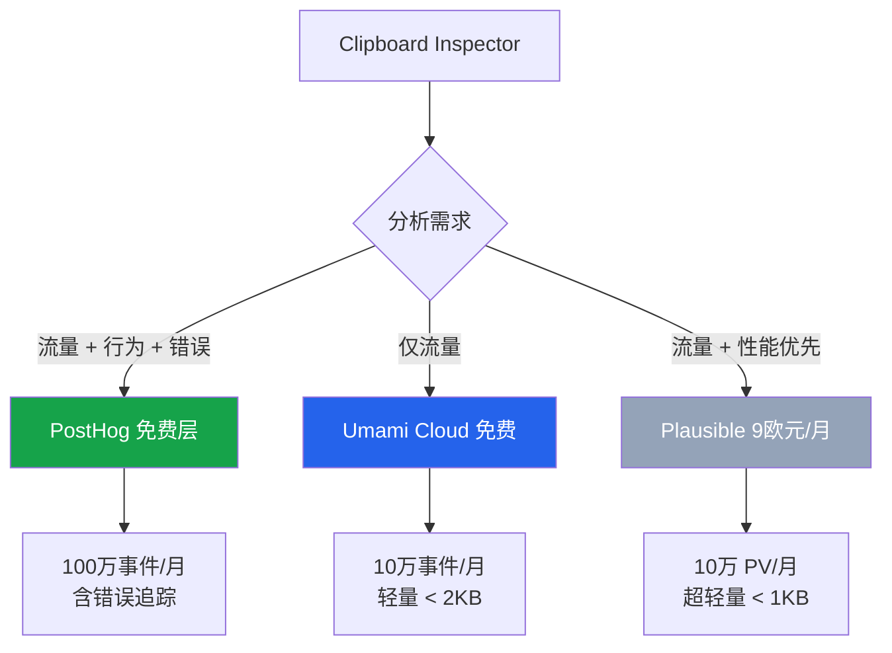
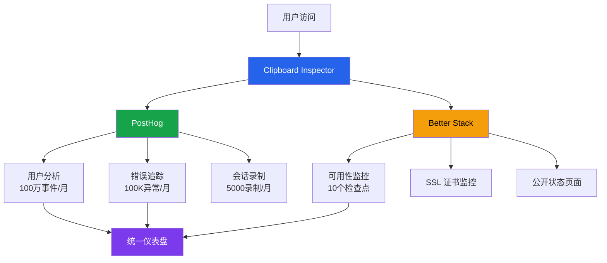

# 7.3 监控、分析与错误追踪

没有监控的系统就像闭着眼睛开车。你不知道有多少用户在访问、他们在哪些功能上遇到问题、哪个浏览器出了兼容性 Bug。对于一人公司来说，监控不是奢侈品，而是最少投入获取最大信息回报的工具。

本节从三个维度规划监控方案：用户行为分析（了解"谁在用、怎么用"）、错误追踪（知道"哪里坏了"）、可用性监控（确保"还在跑"）。所有推荐方案以免费层为起点，按需升级。

## 用户行为分析

### 工具对比

| 指标 | PostHog | Umami | GoatCounter | Plausible |
|------|---------|-------|-------------|-----------|
| 免费额度 | 100 万事件/月 | 10 万事件/月（云）；自部署无限制 | 10 万 PV/月（非商业免费） | 无免费层 |
| 付费起步 | $0（免费层即可） | $9/月（Cloud Pro） | $5/月（商业许可） | 9 欧元/月 |
| 脚本大小 | ~20 KB | < 2 KB | < 2 KB | < 1 KB |
| GDPR 合规 | 需配置 | 默认合规 | 默认合规 | 默认合规 |
| Cookie 需求 | 可选 | 不需要 | 不需要 | 不需要 |
| 会话录制 | 支持 | 不支持 | 不支持 | 不支持 |
| 错误追踪 | 支持（100K 异常/月） | 不支持 | 不支持 | 不支持 |
| 功能标记 | 支持 | 不支持 | 不支持 | 不支持 |
| 自部署 | 支持（Docker） | 支持（Docker） | 支持（单二进制） | 支持（Docker） |
| 数据所有权 | 自部署时完全自有 | 自部署时完全自有 | 完全自有 | 自部署时完全自有 |
| 实时分析 | 支持 | 支持 | 延迟约 1 小时 | 支持 |

> 数据来源：PostHog 定价页（https://posthog.com/pricing），Umami 官网（https://umami.is/pricing），GoatCounter 官网（https://www.goatcounter.com/pricing），Plausible 定价（https://plausible.io/pricing）

### 方案评估

**PostHog 是综合性价比最高的选择。** 100 万事件/月的免费额度在项目早期几乎不可能用完（按每个页面访问 5-10 个事件计算，对应 10-20 万 PV/月）。更关键的是，PostHog 把分析、错误追踪、会话录制打包在一个产品里，避免了集成多个工具的复杂度。

唯一的顾虑是脚本大小。~20 KB 的脚本对性能有可感知的影响。如果性能是首要考量，Umami（< 2 KB）或 Plausible（< 1 KB）是更好的选择。

**Umami 适合纯流量分析场景。** 小巧（< 2 KB）、GDPR 默认合规、不使用 Cookie、自部署完全免费。缺点是不提供错误追踪和会话录制，需要额外工具补充。

**GoatCounter 适合非商业项目。** 对非商业用途完全免费，但商业用途需要 $5/月的许可。功能最基础，只做 PV/UV 统计。

**Plausible 是最轻量的合规方案。** < 1 KB 的脚本几乎零性能开销，GDPR 合规开箱即用。但没有免费层，最低 9 欧元/月。对于还在验证阶段的项目，这笔开支没有必要。

### 推荐方案



**首选：PostHog 免费层。** 一个工具覆盖分析、错误、会话录制三个需求。100 万事件/月的额度足够支撑到日均 3 万 PV 的规模。脚本虽大，但对 Clipboard Inspector 这种工具型页面来说，用户停留时间短，20 KB 的影响有限。

接入方式很简单。在 index.html 中添加 PostHog 的 JavaScript snippet：

```html
<script>
    !function(t,e){var o,n,p,r;e.__SV||(window.posthog=e,e._i=[],e.init=function(i,s,a){function g(t,e){var o=e.split(".");2==o.length&&(t=t[o[0]],e=o[1]),t[e]=function(){t.push([e].concat(Array.prototype.slice.call(arguments,0)))}}(p=t.createElement("script")).type="text/javascript",p.async=!0,p.src=s.api_host+"/static/array.js",(r=t.getElementsByTagName("script")[0]).parentNode.insertBefore(p,r);var u=e;for(void 0!==a?u=e[a]=[]:a="posthog",u.people=u.people||[],u.toString=function(t){var e="posthog";return"posthog"!==a&&(e+="."+a),t||(e+=" (stub)"),e},u.people.toString=function(){return u.toString(1)+".people (stub)"},o="capture identify alias people.set people.set_once set_config register register_once unregister opt_out_capturing has_opted_out_capturing opt_in_capturing reset isFeatureEnabled onFeatureFlags getFeatureFlag getFeatureFlagPayload reloadFeatureFlags group updateEarlyAccessFeatureEnrollment getEarlyAccessFeatures getActiveMatchingSurveys getSurveys".split(" "),n=0;n<o.length;n++)g(u,o[n]);e._i.push([i,s,a])},e.__SV=1)}(document,window.posthog||[]);
    posthog.init('phc_YOUR_API_KEY',{api_host:'https://app.posthog.com'})
</script>
```

## 错误追踪

前端错误追踪能捕获浏览器控制台中的异常，帮助在用户报告之前发现问题。

### 工具对比

| 指标 | Sentry 免费层 | PostHog 错误追踪 | Bugsnag 免费层 |
|------|-------------|----------------|---------------|
| 免费额度 | 5,000 错误事件/月 | 100,000 异常/月 | 无免费层 |
| 付费起步 | $26/月 | 包含在分析免费层中 | $38/月 |
| Source Map 支持 | 支持 | 支持 | 支持 |
| Release 追踪 | 支持 | 支持 | 支持 |
| 告警规则 | 支持 | 支持 | 支持 |
| 集成生态 | 最丰富（GitHub、Slack 等） | 正在扩展 | 丰富 |
| 性能监控 | 支持（50K 事务/月） | 不支持 | 支持 |
| 脚本大小 | ~30 KB（完整 SDK） | 包含在分析脚本中 | ~15 KB |

> 数据来源：Sentry 定价（https://sentry.io/pricing/），PostHog 错误追踪文档（https://posthog.com/docs/error-tracking），Bugsnag 定价（https://www.bugsnag.com/pricing）

### 推荐方案

如果选择了 PostHog 做分析，错误追踪直接用 PostHog 即可，不需要额外引入 Sentry。100,000 异常/月的免费额度远超 Sentry 的 5,000 错误事件/月。

如果追求独立的错误追踪（分析工具选择轻量方案如 Umami），Sentry 免费层是合理选择。5,000 错误/月对于小流量站点够用。

接入 PostHog 错误追踪：

```javascript
posthog.captureException(new Error('Something went wrong'), {
    // 附加上下文
    clipboardEntries: entries.length,
    browserInfo: navigator.userAgent,
});
```

## 可用性监控

可用性监控回答一个简单的问题：站点还能不能访问？对于工具型产品，哪怕 10 分钟的不可用也可能让正在使用的用户流失。

### 工具对比

| 指标 | Better Stack 免费 | UptimeRobot 免费 | Pingdom |
|------|------------------|-----------------|---------|
| 免费监控数 | 10 个 | 50 个 | 无免费层 |
| 检查间隔 | 3 分钟 | 5 分钟 | 1 分钟（付费） |
| 状态页面 | 免费（1 个） | 免费（1 个） | 付费 |
| 告警渠道 | Email、Slack、Webhook | Email、Slack | Email、SMS、Slack |
| HTTP 监控 | 支持 | 支持 | 支持 |
| SSL 证书监控 | 支持 | 支持 | 支持 |
| 付费起步 | $12/月 | $7/月 | $10/月 |

> 数据来源：Better Stack 定价（https://betterstack.com/pricing），UptimeRobot 定价（https://uptimerobot.com/pricing/），Pingdom 定价（https://www.pingdom.com/monitoring/）

### 推荐方案

**Better Stack 免费层。** 10 个监控、3 分钟检查间隔、免费状态页面。检查间隔比 UptimeRobot 的 5 分钟更短，能更快发现故障。免费状态页面可以公开给用户，增加透明度。

配置方法：

1. 创建 Better Stack 账号
2. 添加监控：`https://fudesign2008.github.io/clipboard-inspector/`
3. 设置检查间隔：3 分钟
4. 告警渠道：Email（免费），可选接入 Slack/Discord webhook
5. 启用公开状态页面

## 监控架构总览

将三个监控维度组合起来，形成完整的可观测性架构：



## 成本汇总

| 监控维度 | 工具 | 月成本 | 年成本 | 备注 |
|---------|------|--------|--------|------|
| 用户分析 | PostHog 免费层 | $0 | $0 | 100 万事件/月 |
| 错误追踪 | PostHog 免费层 | $0 | $0 | 包含在分析中 |
| 会话录制 | PostHog 免费层 | $0 | $0 | 5,000 录制/月 |
| 可用性监控 | Better Stack 免费 | $0 | $0 | 10 个监控 |
| **合计** | | **$0/月** | **$0/年** | |

完整的监控方案在免费层内实现。这与"零不必要支出"的运维原则完全对齐。当免费层额度不够时，说明用户规模已经足够支撑付费升级。

## 监控接入优先级

不需要一步到位。按优先级分阶段接入：

| 阶段 | 监控类型 | 工具 | 工作量 | 触发条件 |
|------|---------|------|--------|---------|
| 1 | 用户分析 | PostHog | 1 小时 | 立即 |
| 2 | 可用性监控 | Better Stack | 30 分钟 | 绑定自定义域名后 |
| 3 | 错误追踪 | PostHog | 30 分钟 | 发布 Pro 版本前 |
| 4 | 会话录制 | PostHog | 10 分钟 | 需要理解用户行为时 |

PostHog 的分析接入排在第一位，因为"知道有多少人在用"是最基础的问题。没有这个数据，后续所有的增长决策都是在盲猜。
