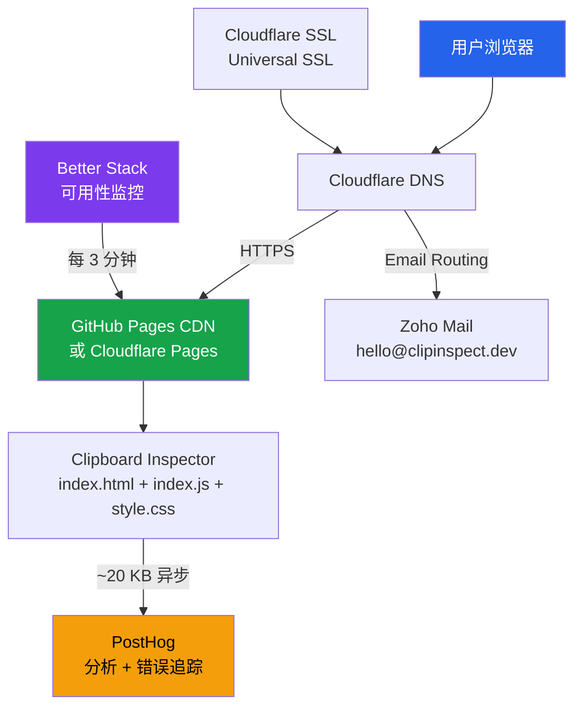

# 7.4 域名、SSL 与性能优化

域名是产品的门面，SSL 是浏览器的准入门槛，性能是用户的留存杠杆。Clipboard Inspector 使用 Clipboard API，该 API 要求页面运行在 HTTPS 环境中。这意味着 SSL 不是可选配置，而是功能前提。本节从域名选择、SSL 配置、邮件方案和性能优化四个方面梳理基础设施的最后一公里。

## 域名选择

### 顶级域名对比

Clipboard Inspector 的核心场景在浏览器中，选择 `.dev` 顶级域名是最自然的匹配。`.dev` 由 Google 管理，强制 HTTPS，与开发工具的定位高度契合。

| 顶级域名 | 年费 | 注册商 | HTTPS 强制 | 可用性 | 品牌适配度 |
|---------|------|--------|-----------|--------|-----------|
| .dev | ~$12/年 | Cloudflare | 是（HSTS preload） | 高（短且直观） | 极高 |
| .app | ~$12/年 | Google Domains | 是 | 中（偏移动端联想） | 中 |
| .com | ~$10-12/年 | 各注册商 | 否 | 高（默认选择） | 中（可能已被注册） |
| .io | ~$35-40/年 | 各注册商 | 否 | 高（科技圈惯例） | 高但昂贵 |
| .tools | ~$25-30/年 | 各注册商 | 否 | 低（认知度低） | 中 |

> 域名价格来自 Cloudflare Registrar（https://www.cloudflare.com/products/registrar/）和 Namecheap 公开定价，2026 年 4 月数据。

推荐 `clipboard-inspector.dev` 或 `clipinspect.dev`。后者更短，适合口头传播和社交媒体分享。域名注册推荐通过 Cloudflare Registrar，理由是 Cloudflare 以成本价出售域名（不加价），且与后续的 DNS 托管和 CDN 服务天然集成。

### DNS 托管

域名注册后，DNS 托管交给 Cloudflare。Cloudflare 的 DNS 解析速度在全球范围内表现优秀，根据 DNSPerf 的持续监测数据，其平均解析时间在 5-10ms 区间，属于第一梯队。

Cloudflare DNS 的免费层功能已经足够：

| 功能 | 免费层 | 付费层 |
|------|--------|--------|
| DNS 查询 | 无限制 | 无限制 |
| DNS 记录数 | 无限制 | 无限制 |
| DNSSEC | 支持 | 支持 |
| CNAME Flattening | 支持 | 支持 |
| 代理模式（橙色云） | 支持 | 支持 |
| WAF | 不支持 | $20/月起 |
| Page Rules | 3 条 | 更多 |

## SSL 配置

HTTPS 对 Clipboard Inspector 不是"安全加分项"，而是功能硬性要求。浏览器的 `navigator.clipboard.read()` 和 `navigator.clipboard.write()`（Async Clipboard API）只在安全上下文（Secure Context）中可用，即页面必须通过 HTTPS 或 localhost 提供服务。

### 各平台 SSL 方案

| 平台 | SSL 提供方 | 证书类型 | 自动续期 | 配置难度 |
|------|-----------|---------|---------|---------|
| GitHub Pages | Let's Encrypt | DV（Domain Validation） | 自动 | 简单 |
| Cloudflare Pages | Cloudflare Universal SSL | DV | 自动 | 简单 |
| Cloudflare（代理模式） | Cloudflare Origin CA | OV（可选） | 自动 | 简单 |

所有主流托管平台都免费提供自动续期的 SSL 证书。使用 Cloudflare 作为 DNS 代理时，还可以获得额外的安全层：Cloudflare 自动过滤恶意流量，提供 DDoS 防护，这些在免费层都包含。

### SSL 配置清单

| 项目 | 操作 | 状态 |
|------|------|------|
| 启用 HTTPS | 托管平台自动提供 | 自动 |
| 强制 HTTPS 重定向 | GitHub Pages 设置中启用 | 需配置 |
| HSTS Header | Cloudflare 自动添加 | 自动 |
| HSTS Preload | 提交至 hstspreload.org | 可选 |
| Mixed Content 检查 | 确保所有资源使用 HTTPS | 需检查 |

> HTTPS 安全最佳实践参考：MDN Web Docs, "Security Contexts"（https://developer.mozilla.org/en-US/docs/Web/Security/Secure_Contexts）

## 邮件方案

专业邮件地址（如 `hello@clipboard-inspector.dev`）能提升品牌可信度。有几个免费或低成本选项：

| 方案 | 月费 | 功能 | 限制 |
|------|------|------|------|
| Cloudflare Email Routing | $0 | 转发到个人邮箱 | 仅转发，不能发送 |
| Zoho Mail Free | $0 | 1 个用户，5 GB | 需要 DNS 验证 |
| Zoho Mail Starter | $1/月（$12/年） | 1 个用户，50 GB | 最经济的完整方案 |
| Google Workspace | $7.2/月 | 完整 G Suite | 对一人公司过于昂贵 |
| Fastmail | $5/月 | 独立邮件服务 | 无日历集成 |

> 邮件方案定价来自各服务商官网，2026 年 4 月数据。

**推荐：Cloudflare Email Routing + Zoho Mail Starter。** 先用 Cloudflare 免费转发接收邮件。当需要从专业地址发送邮件时（如回复用户反馈），升级到 Zoho Mail Starter（$12/年）。这个组合比 Google Workspace 便宜 85%以上。

## 性能优化

Clipboard Inspector 当前是一个极简的静态站点（3 个文件），性能基线已经很好。但随着功能增加（分析脚本、字体、图标库），性能退化风险会上升。提前建立性能预算，能在问题出现之前控制住。

### 当前性能基线

| 指标 | 当前值 | 目标值 | 来源 |
|------|--------|--------|------|
| 总传输大小 | ~50-100 KB | < 200 KB | esbuild 压缩输出 |
| 首次内容绘制（FCP） | < 0.5s | < 1.0s | 估算 |
| 最大内容绘制（LCP） | < 0.8s | < 2.0s | 估算 |
| 累积布局偏移（CLS） | ~0 | < 0.1 | 估算 |
| 首次输入延迟（FID） | < 50ms | < 100ms | 估算 |

当前没有接入 Core Web Vitals 监控，以上数值基于纯静态站点的经验估算。接入 PostHog 后可以获得真实用户的性能数据。

### 性能优化策略

**策略一：保持构建产物精简。**

esbuild 的 bundle 输出已经非常高效。需要警惕的是不要引入重量级依赖。

| 操作 | 预期收益 | 实施难度 |
|------|---------|---------|
| 定期审计 bundle 大小 | 防止依赖膨胀 | 低 |
| 使用 esbuild 的 tree-shaking | 移除未使用代码 | 已启用 |
| 图片使用 WebP/AVIF 格式 | 减少 30-50% 图片体积 | 中 |
| SVG 图标内联 | 减少 HTTP 请求数 | 低 |

**策略二：延迟加载非关键资源。**

分析脚本（PostHog ~20 KB）不需要阻塞页面渲染。使用 `async` 或 `defer` 属性延迟加载：

```html
<script async src="https://app.posthog.com/posthog.js"></script>
```

字体加载同样不应阻塞渲染。如果将来引入自定义字体，使用 `font-display: swap` 确保 fallback 字体先显示。

**策略三：利用浏览器缓存。**

GitHub Pages 对静态资源设置默认的 Cache-Control Header。通过在 _site 目录中添加缓存策略，可以优化重复访问的加载速度。

对于 index.html，设置较短的缓存时间（如 10 分钟），确保用户总能获取最新版本。对于 index.js 和 style.css，通过文件名哈希（如 `index.abc123.js`）实现长期缓存和即时更新。

| 资源类型 | 推荐缓存策略 | 最大缓存时间 |
|---------|-------------|------------|
| index.html | no-cache（每次验证） | 10 分钟 |
| index.js | immutable（哈希文件名） | 1 年 |
| style.css | immutable（哈希文件名） | 1 年 |
| 图片/字体 | public, max-age | 1 年 |

> 缓存策略参考：Google Web Fundamentals, "HTTP Caching"（https://web.dev/articles/http-cache）

**策略四：CDN 优化。**

GitHub Pages 使用 Fastly 作为 CDN 后端，全球延迟在 50-150ms 区间。如果迁移到 Cloudflare Pages，300+ 节点的全球分布可以进一步降低延迟，尤其对亚太和欧洲用户。

## 基础设施架构总览

将托管、域名、SSL、监控整合为完整的架构视图：



## 成本模型

按三个增长阶段估算基础设施的年度成本：

### Bootstrap 阶段（0-1,000 用户/月）

| 项目 | 月费 | 年费 | 备注 |
|------|------|------|------|
| 托管（GitHub Pages） | $0 | $0 | 免费 |
| 域名（.dev） | $1 | $12 | Cloudflare Registrar |
| 分析（PostHog 免费层） | $0 | $0 | 100 万事件/月 |
| 监控（Better Stack 免费） | $0 | $0 | 10 个检查点 |
| 邮件（Cloudflare 免费转发） | $0 | $0 | 仅转发 |
| **合计** | **$1/月** | **$12/年** | |

### Professional 阶段（1,000-10,000 用户/月）

| 项目 | 月费 | 年费 | 备注 |
|------|------|------|------|
| 托管（GitHub Pages） | $0 | $0 | 仍在免费层内 |
| 域名 | $1 | $12 | 同上 |
| 分析（PostHog 免费层） | $0 | $0 | 仍在免费层内 |
| 监控（Better Stack 免费） | $0 | $0 | 同上 |
| 邮件（Zoho Mail Starter） | $1 | $12 | 可发送邮件 |
| 错误追踪（Sentry 免费层） | $0 | $0 | 备选方案 |
| 浏览器扩展商店注册 | $0 | $5 | Google 开发者账号（一次性） |
| Apple 开发者账号 | $8 | $99 | 如果发布 Safari 扩展 |
| **合计** | **$11/月** | **$133/年** | 含 Apple 开发者 |

### Growth 阶段（10,000-100,000 用户/月）

| 项目 | 月费 | 年费 | 备注 |
|------|------|------|------|
| 托管（Cloudflare Pages） | $0 | $0 | 迁移后仍免费 |
| 域名 | $1 | $12 | 同上 |
| 分析（PostHog 免费层） | $0 | $0 | 可能接近上限 |
| 监控（Better Stack Teams） | $12 | $144 | 更短检查间隔 |
| 邮件（Zoho Mail Starter） | $1 | $12 | 同上 |
| Cloudflare Workers（API） | $0 | $0 | 10 万请求/天免费 |
| Sentry Teams | $26 | $312 | 如果需要更多错误配额 |
| Plausible（轻量分析备选） | $9 | €108 | 如果替换 PostHog |
| **合计** | **$42/月** | **$530/年** | 不含 Plausible |

> Plausible 定价来源：https://plausible.io/pricing ；Sentry 定价来源：https://sentry.io/pricing/ ；Better Stack 定价来源：https://betterstack.com/pricing


三个阶段的成本跨度从每年 $12 到 $530。Growth 阶段的 $530/年看起来不少，但此时日均 PV 应该在 5,000-50,000 区间。如果 Pro 版转化率为 2%，月均收入应该在 $400-4,000 区间，远超基础设施成本。基础设施支出始终保持在收入的 10% 以下，这是健康的比例。
