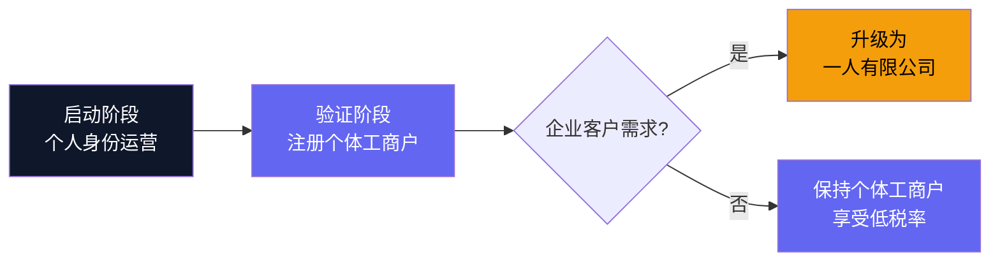

# 8.1 法律与合规

一人公司不代表可以忽略法律。恰恰相反，独立开发者在法律上的容错空间比有法务团队的公司更小：一次合规失误可能直接耗尽个人积蓄。本节从开源协议、隐私政策、服务条款、中国合规要求和商业主体选型五个方面，梳理 Clipboard Inspector 需要覆盖的法律基础。

## 开源协议选择

Clipboard Inspector 当前使用 MIT 协议。需要回答的问题是：MIT 是否仍然是最优选择，是否需要切换到 AGPL 或采用双轨模式？

### 三种主流策略对比

| 策略 | 代表项目 | 核心机制 | 适用场景 |
|------|----------|----------|----------|
| MIT + 企业许可 | GitLab | 核心开源，企业功能闭源 | 社区驱动，需要企业付费 |
| AGPL + 商业授权 | Grafana | 网络条款强制回馈 | SaaS 产品，防止云厂商白嫖 |
| 分裂模型 | Cal.com | 早期开源获客，后期闭源商业化 | 需要快速建立信任后转向盈利 |

> 数据来源：GitLab Licensing 文档、Grafana Licensing 页面、Cal.com 博客

**对 Clipboard Inspector 的分析：**

AGPL 的核心价值在于网络条款（Network Clause）：任何通过网络向用户提供服务的衍生作品必须开源源代码。这对服务器端产品（如 Grafana 的可视化平台）有效，因为竞争对手必须搭建自己的实例来提供服务。

Clipboard Inspector 是纯客户端工具。所有剪贴板数据处理都在浏览器本地完成，不存在服务器端部署的概念。AGPL 的网络条款在这里无法发挥作用：竞争对手可以直接 fork 代码，打包成浏览器扩展分发，无需提供任何网络服务，从而绕过 AGPL 的限制。

> 保持 MIT 协议是正确选择。AGPL 的网络条款对纯客户端工具没有实际保护力，反而会阻碍社区贡献和采用。

后续当 Pro 和 Enterprise 功能开发时，可以采用 GitLab 验证过的模式：核心检查引擎保持 MIT 开源，高级功能使用 BSL（Business Source License）或 Commons Clause 限制商业使用。这种"开源核心 + 企业许可"的模式在开发者工具领域已经非常成熟。

## 隐私政策

剪贴板数据的敏感性远超多数人的认知。一个典型的剪贴板可能同时包含：

| 数据类型 | 示例 | 潜在风险等级 |
|----------|------|-------------|
| 密码 | 复制自密码管理器的临时密码 | 极高 |
| 个人身份信息（PII） | 姓名、地址、身份证号 | 高 |
| 财务信息 | 银行账号、信用卡号、加密货币钱包地址 | 高 |
| API 密钥 | AWS Access Key、Stripe Secret Key | 极高 |
| 医疗信息 | 诊断报告、处方内容 | 高 |
| 商业机密 | 内部文档片段、客户数据 | 中到高 |

### 数据控制者身份分析

根据 GDPR（欧盟通用数据保护条例）和 PIPL（中国个人信息保护法）的定义，数据控制者（Data Controller）是决定数据处理目的和方式的实体。关键判断标准是：是否实际接触并控制了用户数据。

Clipboard Inspector 的所有数据处理都在客户端浏览器中完成。工具不会将剪贴板内容发送到任何外部服务器。这意味着：

- **不是数据控制者。** 工具不收集、不存储、不传输剪贴板内容
- **不是数据处理者。** 没有代替第三方处理数据的动作
- **类似于浏览器 DevTools。** 是用户自主使用的本地工具

这种架构大大简化了合规要求。但仍然需要一份隐私政策，原因有三：第一，用户期望透明度，即使你什么数据都不收集，明确说明这一点能建立信任。第二，如果未来添加任何服务器端功能（如跨设备同步），隐私政策需要预先覆盖这些场景。第三，浏览器扩展商店和 App Store 通常要求提供隐私政策链接。

### 隐私政策工具

| 工具 | 类型 | 费用 | 适用场景 |
|------|------|------|----------|
| PolicyGen | 开源生成器 | 免费 | 快速生成标准隐私政策 |
| OpenPolicy | TypeScript 工具 | 免费 | 可编程、可版本控制的策略管理 |
| iubenda | 在线服务 | $27/年起 | 多语言、多法规自动适配 |

对于起步阶段，PolicyGen 或 OpenPolicy 生成的隐私政策足够使用。核心条款应明确声明：所有数据处理在本地完成，工具不收集任何剪贴板内容。

## 服务条款（ToS）

对剪贴板检查工具而言，服务条款中最关键的条款是责任限制。需要明确声明：

1. **数据处理方式：** 工具在本地处理数据，开发者无法访问用户的剪贴板内容
2. **责任上限：** 因工具使用导致的任何数据泄露或损失，责任上限不超过用户支付的许可费用
3. **免责声明：** 工具按"现状"提供，不对特定用途的适用性做保证
4. **知识产权：** 用户通过工具导出的内容归用户所有，工具不对导出内容主张任何权利

> 一份简洁的 ToS 比一份冗长的法律文档更有效。重点是让用户理解：你处理不了他们的数据，所以也担不了不该担的责任。

## 中国合规要求

### ICP 备案

ICP 备案是中国大陆服务器托管网站的强制性要求。Clipboard Inspector 部署在 GitHub Pages 上，服务器位于海外，**不需要 ICP 备案**。

但需要注意：如果未来切换到国内服务器或使用国内 CDN（如阿里云、腾讯云），备案就是硬性要求。备案流程通常需要 7-20 个工作日，费用为 0 元（服务提供商免费代办）。

### 计算机软件著作权登记

软著登记在中国开发者社区中常被忽视，但它有几个实际用途：

| 用途 | 说明 |
|------|------|
| App Store 上架 | 中国区 App Store 部分品类要求提供软著证明 |
| 商业许可 | 向企业客户授权时，软著是知识产权的正式凭证 |
| 高新技术企业认定 | 如果未来注册公司并申请认定，软著是加分项 |
| 法律保护 | 在侵权纠纷中作为权属初步证据 |

**登记成本：**

| 项目 | 费用 | 时间 |
|------|------|------|
| 官费 | ¥300 | 31 个工作日 |
| 代理费（可选） | ¥300-800 | 可缩短至 15 个工作日 |
| 加急（可选） | ¥500-1500 | 5-10 个工作日 |

软著登记不是启动阶段的优先事项。建议在产品验证完成、准备上架浏览器扩展商店或面向企业客户销售时再办理。

### PIPL 合规

PIPL（《个人信息保护法》）于 2021 年 11 月生效，是中国版的 GDPR。由于 Clipboard Inspector 不收集个人信息，PIPL 的合规要求相对简单：

- 需要提供隐私政策（上面已讨论）
- 如果添加分析工具（如 PostHog），需要确保不收集可识别个人的信息
- 跨境数据传输条款不适用（因为没有数据传输）

> 数据来源：PrivacyEngine, "China's Personal Information Protection Law", 2024

## 商业主体选型

中国开发者在商业化时面临一个绕不开的问题：以什么身份收钱？三种主流选择各有取舍。

### 三种主体对比

| 维度 | 个体工商户 | 个人独资企业 | 一人有限责任公司 |
|------|------------|-------------|----------------|
| 法律地位 | 非法人，自然人经营 | 非法人，自然人经营 | 法人实体 |
| 责任范围 | 无限连带责任 | 无限连带责任 | 有限责任* |
| 注册资本 | 无要求 | 无要求 | 最低 ¥1（认缴制） |
| 注册流程 | 1-3 个工作日 | 1-3 个工作日 | 3-5 个工作日 |
| 年检要求 | 简易年报 | 简易年报 | 完整审计报告 |
| 开票类型 | 普票 | 普票 | 专票 + 普票 |

### 税负对比（基于实际利润）

| 年利润 | 个体工商户 | 个人独资企业 | 一人有限公司 |
|--------|------------|-------------|-------------|
| ¥50,000 | ~4.75% | ~9.5% | ~24% |
| ¥100,000 | ~4.75% | ~9.5% | ~24% |
| ¥200,000 | ~4.9% | ~9.75% | ~24% |
| ¥500,000 | ~5.5% | ~11% | ~25% |

> 税负数据基于 2024-2025 年中国现行税法估算，实际税负因地区政策差异可能有所不同。个体工商户享受小微企业所得税优惠和核定征收政策。

### "有限责任"的陷阱

一人有限公司的有限责任在实践中并不绝对。《公司法》第 63 条规定：一人有限责任公司的股东不能证明公司财产独立于股东自己财产的，应当对公司债务承担连带责任。这被称为"举证责任倒置"。

这意味着一人有限公司的股东需要建立严格的财务分离制度（独立银行账户、规范记账、年度审计），否则有限责任形同虚设。对一人开发者而言，维护这种财务分离的合规成本往往超过了有限责任带来的保护。

### 推荐路径

**阶段一：个人身份运营（月收入 < ¥10,000）。** 产品验证期，不需要注册任何商业主体。可以通过支付宝/微信个人收款码接收捐赠和小额付费，或通过 LemonSqueezy 等海外支付平台收取美元收入。

**阶段二：注册个体工商户（月收入 > ¥10,000）。** 当收入达到需要正规开票的程度时，注册个体工商户。优势是注册简单、税负最低（4.75%）、可以开具增值税普通发票。大多数独立开发者和自由职业者停留在这个阶段就够了。

**阶段三：升级为一有限公司（出现企业客户）。** 当企业客户需要增值税专用发票（用于抵扣进项税）时，才需要升级为公司。此时应该已经有稳定的收入流，足以覆盖公司运营和财务合规的额外成本。

> 不要为了"看起来正式"而过早注册公司。先用个体工商户验证商业模式，等收入能覆盖合规成本时再升级。
