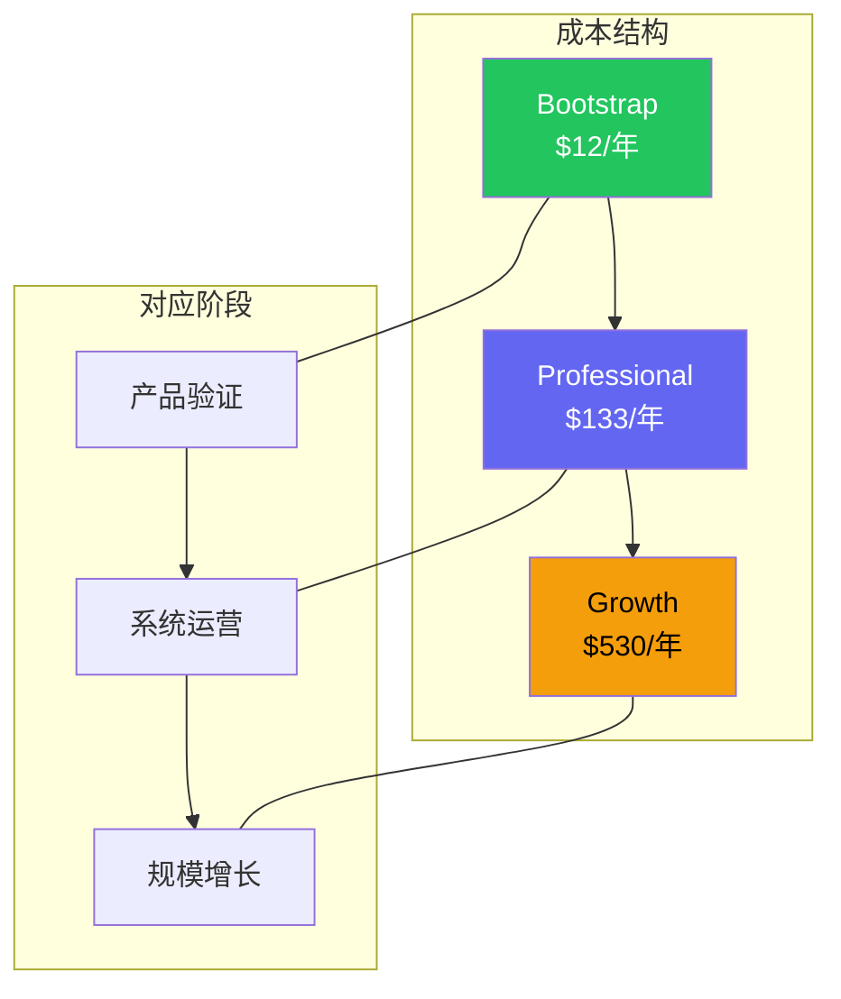

# 8.2 财务规划与成本预算

独立项目的财务死亡通常不是大出血，而是慢性失血。每个月几美元的服务费、一年几百美元的工具订阅，看似不多，但在没有收入的情况下持续消耗，很快就会让项目变成负担。本节从成本控制、收入模型和盈亏平衡三个角度规划 Clipboard Inspector 的财务路线。

## 三级预算方案

一人公司最大的财务优势是：基础设施成本可以压到接近零。Clipboard Inspector 是纯客户端工具，部署在 GitHub Pages 上，不需要服务器、数据库或 CDN 的持续支出。这意味着月度固定成本几乎完全由工具订阅决定。

### Bootstrap 方案：$0/月，$12/年

| 项目 | 月费用 | 年费用 | 说明 |
|------|--------|--------|------|
| 域名 | $0 | $12 | Namecheap 或 Cloudflare Registrar |
| GitHub Pages | $0 | $0 | 免费托管，自带 CDN |
| GitHub Actions CI/CD | $0 | $0 | 公开仓库无限分钟数 |
| 代码编辑器 | $0 | $0 | VS Code 免费版 |
| 支付处理 | $0 | $0 | LemonSqueezy 按交易抽成，无月费 |
| 邮件 | $0 | $0 | Gmail 或 Outlook 免费版 |
| 分析 | $0 | $0 | PostHog 免费层（100万事件/月） |
| **合计** | **$0** | **$12** | |

这个方案适合产品验证阶段。所有核心功能都可以用免费工具完成，唯一的硬性支出是域名。如果你愿意使用 `username.github.io` 的子域名，连这 $12 都可以省掉（但不建议，独立域名是品牌投资）。

### Professional 方案：$11/月，$133/年

| 项目 | 月费用 | 年费用 | 说明 |
|------|--------|--------|------|
| 域名 | $0 | $12 | 同上 |
| GitHub Pages | $0 | $0 | 同上 |
| Cursor Pro | $20 | $240 | AI 辅助编码，显著提升单人产出 |
| 支付处理 | $0 | $0 | LemonSqueezy 按交易抽成 |
| Resend | $0 | $0 | 免费层 100 封/天，足够产品邮件 |
| PostHog | $0 | $0 | 免费层 |
| Linear | $8 | $96 | 项目管理 |
| Notion | $0 | $0 | 个人版免费 |
| Figma | $0 | $0 | 个人版免费（3 个文件） |
| 1Password | $4 | $48 | 密码和密钥管理 |
| n8n | $5 | $60 | 工作流自动化 |
| Typefully | $12.50 | $150 | 社交媒体管理 |
| **合计** | **~$11** | **~$133** | 按实际需要选择性订阅 |

Professional 方案的假设是：产品已经通过验证，开始系统化运营。Cursor 是这个阶段回报率最高的投资，一个 AI 辅助编辑器可以将单人开发效率提升 30-50%。Linear 和 1Password 属于"花钱买省心"的基础设施。

### Growth 方案：$42/月，$530/年

| 项目 | 月费用 | 年费用 | 说明 |
|------|--------|--------|------|
| Professional 全部 | $11 | $133 | 同上 |
| Resend Pro | $20 | $240 | 更高邮件发送量 |
| PostHog Pay-as-you-go | $0-10 | $0-120 | 超出免费层后按量计费 |
| Figma Pro | $15 | $180 | 无限文件，团队协作 |
| **合计** | **~$42** | **~$530** | |

Growth 方案适合月收入超过 $500 的阶段。此时可以开始为超出免费层的服务付费，但月度总成本仍然控制在收入的 10% 以内。



## 税负规划

收入到手之前，税是绕不开的扣减项。在中国，不同商业主体的税负差异巨大，直接影响净收入。

### 不同利润水平的税负对比

| 年利润 | 个体工商户税负 | 个人独资企业税负 | 一人有限公司税负 | 最优选择 |
|--------|---------------|-----------------|-----------------|----------|
| ¥50,000 | ~¥2,375 (4.75%) | ~¥4,750 (9.5%) | ~¥12,000 (24%) | 个体工商户 |
| ¥100,000 | ~¥4,750 (4.75%) | ~¥9,500 (9.5%) | ~¥24,000 (24%) | 个体工商户 |
| ¥200,000 | ~¥9,800 (4.9%) | ~¥19,500 (9.75%) | ~¥48,000 (24%) | 个体工商户 |
| ¥500,000 | ~¥27,500 (5.5%) | ~¥55,000 (11%) | ~¥125,000 (25%) | 个体工商户 |

> 税负计算基于 2024-2025 年中国现行税法。个体工商户享受核定征收优惠，实际税负因地区和行业不同可能有差异。一人有限公司税负包含企业所得税（25%）和分红个税（20%）的综合效应。

差异的核心在于：个体工商户不缴纳企业所得税，只缴纳个人所得税，且通常适用核定征收（按收入的一定比例征收，税率较低）。一人有限公司需要先缴纳 25% 的企业所得税，股东分红时再缴纳 20% 的个人所得税，形成双重征税。

> 年利润 ¥100,000 时，个体工商户比一人有限公司多留 ¥19,250 的净收入。对独立开发者来说，这是实打实的差距。

### 海外收入的税务处理

如果通过 LemonSqueezy 或 Paddle 等海外平台收取美元收入，税务处理需要注意几点：

1. **LemonSqueezy 作为 MoR（Merchant of Record）。** 它代收代缴销售税/VAT，你收到的是税后净收入。简化了跨境税务的复杂度。
2. **中国税务居民需要就全球收入申报纳税。** 海外平台的收入需要折算为人民币并入年度综合所得。
3. **个体工商户可以享受核定征收。** 对跨境收入的税务处理与国内收入基本一致，核定征收政策同样适用。

## 盈亏平衡分析

Clipboard Inspector 的盈亏平衡点极低，这是纯客户端工具的核心财务优势。

### 核心假设

| 参数 | 数值 | 来源 |
|------|------|------|
| 月活跃用户（MAU） | 5,000 | 基于细分市场渗透率估算 |
| Free → Pro 转化率 | 2% | 开发者工具行业平均 1.5-3%（Culta.ai 2026） |
| Pro 月付价格 | $4.99 | 定价策略推荐值 |
| Pro 年付价格 | $49/年 | 折合 $4.08/月 |
| 付费方式分布 | 60% 月付 + 40% 年付 | 行业经验估算 |
| 月度基础设施成本 | $11 | Professional 方案 |
| LemonSqueezy 抽成 | 5% + $0.50/笔 | LemonSqueezy 官方定价 |

### 盈亏平衡计算

```
付费用户数 = 5,000 MAU x 2% 转化率 = 100 Pro 用户
月付费用户 = 100 x 60% = 60 人
年付费用户 = 100 x 40% = 40 人（折合 40/12 ≈ 3.3 月等量）

月收入（税前）= 60 x $4.99 + 40 x ($49/12) ≈ $299.40 + $163.33 ≈ $462.73

扣除 LemonSqueezy 抽成（≈$28）= $434.73

扣除月度成本（$11）= $423.73 净收入
```

5,000 MAU、2% 转化率的情况下，月净收入约 $424（约 ¥3,050）。这足以覆盖 Professional 方案的所有成本，并有盈余用于再投入。

### 不同 MAU 水平的收入预测

| MAU | 付费用户（2%） | 月收入（扣除抽成后） | 月净收入 | 年化净收入 |
|-----|---------------|---------------------|----------|-----------|
| 2,000 | 40 | ~$175 | ~$164 | ~$1,968 |
| 5,000 | 100 | ~$435 | ~$424 | ~$5,088 |
| 10,000 | 200 | ~$870 | ~$859 | ~$10,308 |
| 25,000 | 500 | ~$2,175 | ~$2,164 | ~$25,968 |
| 50,000 | 1,000 | ~$4,350 | ~$4,339 | ~$52,068 |

> 关键洞察：基础设施成本几乎不随用户增长而增加。从 5,000 MAU 增长到 50,000 MAU，月度成本只增加约 $30（超出免费层后的分析费用），而收入增长近 10 倍。这种几乎线性的成本收入比是客户端工具最强大的财务优势。

## 现金流管理原则

一人公司的现金流管理不需要复杂的财务系统，但需要遵循几条原则：

**原则一：收入到账前不花钱。** 不要为"可能"的收入提前订阅付费工具。Bootstrap 方案覆盖所有核心需求，收入稳定后再升级。

**原则二：保留 6 个月运营成本的现金储备。** 按 Professional 方案计算，6 个月储备约 ¥5,000。这笔钱确保在收入波动时不会中断运营。

**原则三：按季度回顾成本。** 每季度检查一次工具订阅，取消不再使用的服务。一人公司没有行政人员帮你管这些，需要自己建立审查习惯。

**原则四：用收入覆盖成本，不用积蓄。** 如果月度收入无法覆盖月度成本，降低成本而不是动用积蓄。这个规则迫使你专注于创收而非消费。
