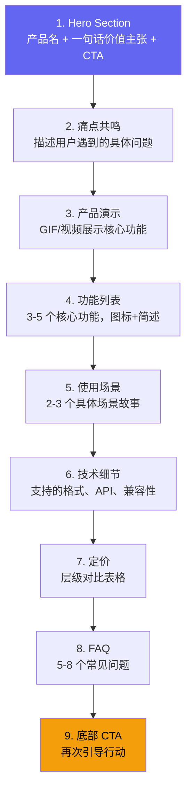

# 8.3 品牌建设与营销执行

一个人做产品，最稀缺的资源不是代码能力，是注意力。好的品牌策略能降低获客成本，让产品在噪音中被发现。本节从命名、视觉、落地页、SEO 和 Build in Public 五个方面构建 Clipboard Inspector 的营销执行框架。

## 命名策略

### 当前名称分析

"Clipboard Inspector" 作为产品名称有明显优势，也有明显短板。

| 维度 | 评价 | 说明 |
|------|------|------|
| 描述性 | 强 | 用户看到名字就知道产品做什么 |
| SEO 价值 | 高 | 包含核心关键词 "clipboard" |
| 记忆度 | 弱 | 两个通用词组合，缺乏辨识度 |
| 商标风险 | 中 | "Clipboard" + "Inspector" 都是通用词汇，难以独占 |
| 域名可用性 | 低 | clipboardinspector.com 已被占用 |

描述性强的名字在 SEO 上有天然优势，但牺牲了品牌辨识度。开发者工具领域存在两种成功路径：描述性命名（如 Visual Studio Code、Postman）和品牌化命名（如 Notion、Figma）。对于独立开发者，描述性命名在冷启动阶段更有利，因为它自带搜索流量。

### 替代方案

| 候选名 | 含义 | 域名可用性 | 特点 |
|--------|------|-----------|------|
| ClipScope | Clipboard + Scope | 可能可用 | 简洁，有工具感 |
| PasteScope | Paste + Scope | 可能可用 | 聚焦粘贴动作 |
| ClipLens | Clipboard + Lens | 可能可用 | 短小，易记 |

**建议策略：** 保持 "Clipboard Inspector" 作为 SEO 标题和产品全称，同时考虑使用一个更简短的品牌名用于社交媒体和口碑传播。类似于 "Visual Studio Code" 在社区中被称为 "VS Code"。这不是启动阶段的优先事项，等产品验证完成后再做决策。

## 视觉识别

### 色彩系统

| 角色 | 色值 | 用途 |
|------|------|------|
| 主色 | Indigo #6366F1 | 品牌色，按钮，强调元素 |
| 深色 | Slate #0F172A | 文字，背景，导航 |
| 强调色 | Amber #F59E0B | CTA，重要提示，数据高亮 |

Indigo 传达专业和可信感，在开发者工具中不多见（避免了蓝色泛滥的问题）。Amber 作为强调色提供视觉跳跃，确保 CTA 按钮在任何背景下都能被注意到。

### Logo

起步阶段的 logo 不需要过度投入。三条路径按成本排序：

| 方式 | 成本 | 时间 | 质量 | 推荐时机 |
|------|------|------|------|----------|
| 自己用 Figma 做 | $0 | 2-4 小时 | 够用 | 启动阶段 |
| Fiverr 外包 | $20-100 | 3-7 天 | 良好 | 产品验证后 |
| 专业设计师 | $500+ | 2-4 周 | 优秀 | 年收入超 $10K 后 |

> Logo 的核心作用是识别，不是艺术。一个简单、清晰的图标比一个复杂的设计更有效。Git 的分支图、Docker 的鲸鱼、React 的原子符号，都遵循"简单即识别"的原则。

## 落地页结构

落地页是转化漏斗的入口。根据 ConversionXL 和 CRO 研究的最佳实践，一个高效的产品落地页应该包含以下九个核心区块：

### Hero Section 设计要点

Hero Section 是用户看到的第一屏，必须在 5 秒内传达"这是什么"和"为什么我需要它"。推荐结构：

**标题（H1）：** 粘贴数据，一目了然

**副标题：** Clipboard Inspector 帮助开发者检查、分析和导出浏览器剪贴板内容。了解你的剪贴板里到底有什么。

**CTA 按钮：** "打开工具"（链接到 GitHub Pages 实例）和 "查看演示"（链接到 GIF 或视频）

### CTA 模式

开发工具的 CTA 应该避免营销话术。开发者对 "立即购买" 或 "免费试用" 有天然的抵触心理。更有效的模式：

| 传统 CTA | 开发者友好 CTA | 原因 |
|----------|---------------|------|
| 免费试用 | 打开工具 | 降低承诺感 |
| 立即购买 | 查看定价 | 非推式，让用户自己决定 |
| 注册账号 | 在 GitHub 上 Star | 先建立关系，再转化 |
| 预约演示 | 查看文档 | 开发者更喜欢自己探索 |

## SEO 策略

剪贴板检查工具的 SEO 优势在于：它解决的是开发者在实际工作中遇到的具体问题，这些搜索需求是真实且持续的。

### 关键词集群

| 关键词 | 月搜索量（估算） | 竞争度 | 内容类型 |
|--------|-----------------|--------|----------|
| clipboard inspector | 500-1000 | 低 | 产品页 |
| inspect clipboard data | 200-500 | 低 | 博客教程 |
| javascript clipboard api | 3000-5000 | 中 | 技术文档 |
| paste event data types | 500-1000 | 低 | 博客教程 |
| clipboard mime types | 200-500 | 低 | 技术参考 |
| drag and drop data transfer | 1000-2000 | 中 | 博客教程 |
| browser clipboard debugging | 100-300 | 低 | 博客教程 |

> 搜索量数据来自 Ahrefs 和 Google Keyword Planner 的公开估算。实际数据需要使用专业 SEO 工具验证。

**策略重点：** 不与大站争夺 "javascript clipboard api" 这样的高竞争关键词，而是聚焦于 "clipboard inspector" 和 "paste event data types" 这类长尾词。这些关键词搜索量低，但意图精准，转化率高。

### 内容发布节奏

| 阶段 | 时间 | 内容 | 目标 |
|------|------|------|------|
| 启动 | 第 1 月 | 产品页 + 1 篇教程 | 建立索引 |
| 增长 | 第 2-3 月 | 每月 2 篇技术博客 | 覆盖关键词集群 |
| 稳定 | 第 4+ 月 | 每月 1 篇 + 更新旧内容 | 维护排名 |

## Build in Public

Build in Public（公开构建）是独立开发者性价比最高的营销方式。它的核心逻辑是：把开发过程变成内容，用真实性换取注意力。

### 成功案例

| 开发者 | 策略 | 结果 |
|--------|------|------|
| Pieter Levels | 在 Twitter 持续分享收入数据和开发进展 | 600K+ 关注者，驱动了 Nomad List、RemoteOK 等产品的免费分发 |
| Marc Lou | 分享 "月入 $55K 的一人创始人" 故事 | 17 个失败项目后，ShipFast（第 18 个）成功，公开叙事本身就是分发渠道 |

> 数据来源：Pieter Levels 的 Twitter 公开资料、Marc Lou 的博客和公开访谈

这些案例的共同点不是"在社交媒体上发帖"，而是"用真实数据讲述一个引人入胜的故事"。Pieter Levels 分享的不是"我做了一个新功能"，而是"这个月收入从 $5,000 涨到 $7,000，这是原因"。Marc Lou 分享的不是"又做了一个产品"，而是"前 17 个产品都失败了，第 18 个终于成功了"。

### 执行框架

**平台选择：** Twitter/X（开发者社区密度最高）和 GitHub（技术信任背书）。不需要覆盖所有平台，两个就够了。

**内容类型与频率：**

| 内容类型 | 频率 | 示例 |
|----------|------|------|
| 开发进展 | 每周 2-3 次 | "今天给 Clipboard Inspector 加了 ZIP 导出功能" |
| 数据分享 | 每月 1 次 | "上线 30 天：1,200 用户，0 到 $200 月收入" |
| 技术教程 | 每月 1-2 篇 | "如何用 Clipboard API 检测粘贴内容的 MIME 类型" |
| 里程碑 | 不定期 | "第一个付费用户!" "GitHub 500 Stars" |
| 失败教训 | 不定期 | "为什么我的第一次定价方案完全错了" |

**衡量标准：** Build in Public 的核心指标不是粉丝数，而是互动率。100 个高互动的关注者比 10,000 个僵尸粉更有价值。关注以下信号：

- 技术帖子被同行转推或引用
- 收到具体的产品反馈或功能建议
- 有人主动在社区（Hacker News、Reddit）提及你的产品

> Build in Public 的本质是把"做产品"本身变成一种内容生产能力。你不需要额外的营销预算，只需要把已经在做的事情有条理地分享出来。
