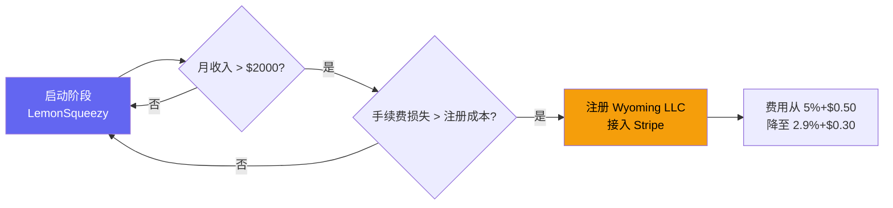

# 8.4 运营工具栈与自动化

工具栈的选择直接影响一人公司的产出效率。选对了工具，一个人可以产出三个人的工作量。选错了，时间全花在工具之间的折腾上。本节从开发、支付、分析、协作和自动化五个维度，推荐经过独立开发者社区验证的最优工具组合。

## 完整工具栈总览

| 类别 | 工具 | 月费用 | 免费层 | 选型理由 |
|------|------|--------|--------|----------|
| 代码编辑器 | Cursor | $20 | 有 | AI 辅助编码，单人产出倍增器 |
| 代码托管 | GitHub | $0 | 有 | CI/CD + Pages + Discussions，一站式 |
| 托管部署 | GitHub Pages | $0 | 有 | 静态站零成本，自带 CDN |
| 支付处理 | LemonSqueezy | 按交易 | 有 | MoR 模式，简化跨境税务 |
| 邮件服务 | Resend | $0 | 100 封/天 | 开发者友好的邮件 API |
| 产品分析 | PostHog | $0 | 100 万事件/月 | 开源，自托管或云托管均可 |
| 项目管理 | Linear | $8 | 有（限功能） | 速度和 UI 优于 Jira/Trello |
| 知识管理 | Notion | $0 | 有 | 文档 + Wiki + 轻量数据库 |
| 社区支持 | GitHub Discussions | $0 | 有 | 与代码仓库集成，零额外成本 |
| 工作流自动化 | n8n | $5 | 自托管免费 | 可视化编排，替代 Zapier |
| 设计 | Figma | $0 | 3 个文件 | UI 设计和原型 |
| 社交媒体 | Typefully | $12.50 | 有（限功能） | Twitter 定时发布和分析 |
| 安全 | 1Password | $4 | 无 | API 密钥和密码集中管理 |

> 费用基于 2026 年 4 月各产品官网公开定价。免费层的限制可能随时间变化。

月度总成本 $11（Professional 方案），年化 $133。这个成本水平在独立开发者工具栈中属于中等偏低。

## 支付方案深度分析

支付是中国独立开发者面临的特殊挑战。Stripe 不支持中国大陆注册，这意味着最主流的全球支付方案无法直接使用。

### 三种可行路径对比

| 维度 | LemonSqueezy | Paddle | Wyoming LLC + Stripe |
|------|-------------|--------|---------------------|
| 注册门槛 | 低（中国身份可注册） | 中（需审核） | 高（需注册美国公司） |
| 费用 | 5% + $0.50/笔 | 5% + $0.50/笔 | 2.9% + $0.30/笔 |
| MoR 服务 | 是（代缴销售税/VAT） | 是（代缴销售税/VAT） | 否（需自行处理税务） |
| 支持货币 | 130+ | 100+ | 135+ |
| 资金到账 | PayPal 或银行转账 | 银行转账 | 银行转账 |
| 启动成本 | $0 | $0 | $500-800（注册费） |
| 适用阶段 | 启动到增长 | 增长 | 规模化 |

### 推荐路径

**为什么选 LemonSqueezy 而不是 Paddle：**

LemonSqueezy 的注册流程对中国开发者更友好。Paddle 虽然功能类似，但审核流程更严格，对没有既有收入的独立项目可能拒绝。此外，LemonSqueezy 的开发者体验更好：REST API 文档清晰，Webhook 配置简单，与静态站点的集成门槛低。

**什么时候升级到 Stripe：**

5% + $0.50 和 2.9% + $0.30 的差异在低交易量时不明显，但随收入增长会变成可观的成本。粗略计算：

- 月收入 $1,000 时，LemonSqueezy 抽成约 $100，Stripe 抽成约 $60，差额 $40/月
- 月收入 $5,000 时，LemonSqueezy 抽成约 $500，Stripe 抽成约 $300，差额 $200/月

当月收入超过 $2,000（差额约 $80/月）时，注册 Wyoming LLC 的投资可以在 6-10 个月内通过节省的手续费收回。

> 不要在启动阶段为支付方案过度设计。LemonSqueezy 零成本启动，足以覆盖验证期的所有需求。等收入证明商业模式成立后再优化费率。

## 分析工具配置

PostHog 是独立开发者的最佳分析选择。它开源、免费层慷慨（100 万事件/月）、功能全面。

### 关键事件追踪

对 Clipboard Inspector 而言，需要追踪的核心事件：

| 事件类别 | 具体事件 | 追踪方式 |
|----------|----------|----------|
| 获取 | 页面访问、来源渠道、搜索关键词 | PostHog 自动追踪 |
| 激活 | 首次粘贴操作、首次导出、功能发现率 | 自定义事件 |
| 留存 | 周回访率、月活跃天数 | PostHog 留存分析 |
| 变现 | Pro 功能点击、付费转化漏斗 | LemonSqueezy Webhook + PostHog |
| 推荐 | 分享按钮点击、社交来源占比 | UTM 参数追踪 |

### 仪表板设计

PostHog 允许创建自定义仪表板。建议配置三个核心仪表板：

**1. 增长仪表板：** 日/周/月活跃用户、新用户占比、主要来源渠道。这个仪表板回答"产品在增长吗"。

**2. 产品仪表板：** 核心功能使用率（粘贴、导出、格式分析）、功能发现漏斗、错误率。这个仪表板回答"产品好用吗"。

**3. 收入仪表板：** MRR（月经常性收入）、付费转化率、付费用户留存率、ARPU。这个仪表板回答"产品能赚钱吗"。

## 协作工具配置

即使是单人项目，也需要协作工具来管理外部关系：用户反馈、社区讨论、Bug 报告。

### GitHub Discussions 作为社区

GitHub Discussions 是独立开发者的最佳社区选择，原因很简单：它与代码仓库天然集成，用户不需要注册新的账号，开发者不需要维护独立的社区平台。

推荐的 Discussion 分类：

| 分类 | 用途 | 示例 |
|------|------|------|
| General | 一般讨论 | "你是怎么发现这个工具的?" |
| Ideas | 功能建议 | "希望能支持 WebRTC 数据格式" |
| Q&A | 使用问题 | "为什么我的浏览器不支持 Async Clipboard API?" |
| Show and Tell | 用户展示 | "我用 Clipboard Inspector 调试了一个复杂的拖放上传" |

### Linear 作为项目中枢

Linear 的价值不在于管理别人的工作，在于管理自己的注意力。一人公司最大的效率杀手不是缺少工具，是缺少优先级。

推荐的 Linear 工作流：

| 队列 | 含义 | 规则 |
|------|------|------|
| Backlog | 所有想法 | 不限数量，定期清理 |
| Todo | 本周计划 | 最多 5 个，超过必须推走 |
| In Progress | 正在做 | 最多 1 个，完成再开下一个 |
| Done | 已完成 | 归档，每周回顾 |

> 一人项目的看板不需要复杂的流转规则。核心约束是 "In Progress 最多 1 个"，这个约束迫使你完成手头的事情再开始下一件。

## 自动化原则

自动化的诱惑在于"把一切自动化"。对一人公司而言，过度自动化是隐形的时间陷阱。

### 核心原则：先手动，再自动化

| 阶段 | 做法 | 何时自动化 |
|------|------|-----------|
| 1. 手动执行 | 亲自做 10-20 次 | 记录每次操作的步骤和时间 |
| 2. 识别模式 | 操作频率是否稳定？每次是否相同？ | 频率稳定 + 步骤固定 |
| 3. 评估 ROI | 自动化需要多少时间开发？能节省多少？ | 节省时间 > 开发时间的 3 倍 |
| 4. 自动化 | 用 n8n 或脚本实现 | 只自动化通过评估的流程 |

### 建议自动化的流程

| 流程 | 工具 | 触发条件 | 节省时间 |
|------|------|----------|----------|
| 新用户欢迎邮件 | n8n + Resend | LemonSqueezy 新订单 Webhook | 5 分钟/用户 |
| 周报数据汇总 | n8n + PostHog API | 每周一 9:00 | 30 分钟/周 |
| GitHub Issue 自动标签 | GitHub Actions | 新 Issue 创建 | 2 分钟/Issue |
| 社交媒体定时发布 | Typefully | 手动排期 | 上下文切换成本 |

### 暂不建议自动化的流程

| 流程 | 原因 | 建议 |
|------|------|------|
| 客户支持 | 早期需要亲自了解用户问题 | 手动回复，积累常见问题后再考虑 |
| 功能优先级排序 | 需要主观判断和上下文理解 | 手动用 Linear 管理 |
| 内容创作 | Build in Public 的核心是真实性 | 手动写，不要用 AI 模板 |
| 定价调整 | 需要综合多个数据源判断 | 手动分析，每季度一次 |

> 自动化的目标是释放时间做只有人能做的事：理解用户、做决策、写代码。如果自动化让你离用户更远了，它就是错的。
