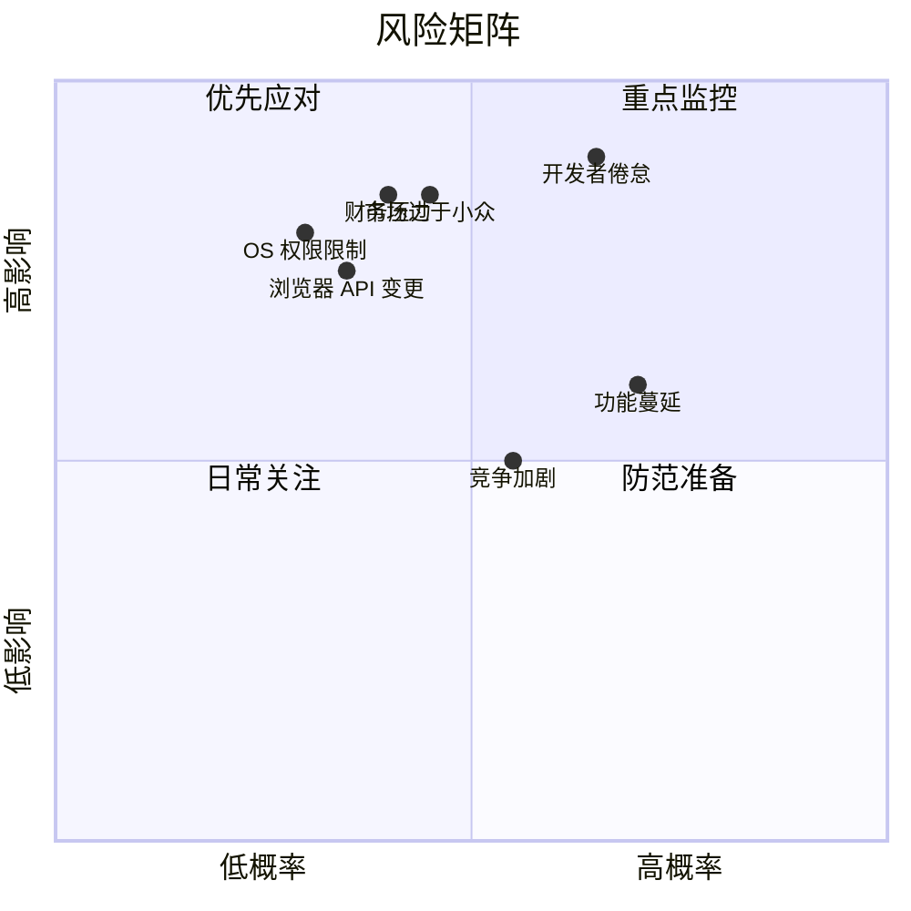

# 8.5 风险分析与应对策略

独立开发是一场概率游戏。你无法消除所有风险，但可以识别它们、量化它们、为最可能发生的风险准备应对方案。本节系统梳理 Clipboard Inspector 面临的七类核心风险，并给出具体的应对措施。

## 独立开发者的失败数据

在分析具体风险之前，先看看独立开发者群体面临的客观现实。

CB Insights 对创业失败原因的分析（覆盖 101 个案例）显示：

| 失败原因 | 占比 | 与独立开发者的关联度 |
|----------|------|---------------------|
| 没有市场需求 | 42% | 最高。独立开发者最容易犯的错误是"我觉得这个功能很酷"而不是"用户需要这个功能" |
| 现金流耗尽 | 82%（含运营问题） | 高。一人公司没有融资缓冲，收入中断即项目终止 |
| 竞争出局 | 19% | 中。差异化足够的产品不易被直接替代 |
| 团队问题 | 23% | 低。一人公司不存在团队协调问题 |
| 定价/成本问题 | 18% | 中。定价过高或过低都会影响转化 |

> 数据来源：CB Insights, "Top 20 Reasons Startups Fail"

另一个数据来自 Indie Hackers 社区的非正式调查：约 90% 的独立项目在 12 个月内停止更新。这个数字听起来悲观，但换个角度看：持续 12 个月的项目就已经是前 10% 了。

## 风险矩阵

按影响程度和发生概率两个维度评估所有已识别风险：

## 七类核心风险与应对

### 风险一：浏览器 Clipboard API 变更

**场景描述：** Chrome 或 Firefox 更新 Clipboard API，修改行为或废弃某些接口，导致工具核心功能失效。

**影响评估：** 高。Clipboard Inspector 的核心价值依赖浏览器 Clipboard API 的行为一致性。API 变更可能导致解析错误、功能缺失或完全失效。

**发生概率：** 中低。Web Clipboard API 已进入 W3C 标准化流程（Clipboard API and events），核心接口趋于稳定。但浏览器厂商的实现细节仍可能调整。

**应对措施：**

| 措施 | 执行方式 | 成本 |
|------|----------|------|
| 监控 API 变更 | 订阅 Chrome Status 和 W3C GitHub 仓库的更新 | 0 |
| 跨浏览器测试 | 建立 BrowserStack 免费层或使用 LambdaTest | $0-15/月 |
| 抽象 API 层 | 将浏览器 API 调用封装在适配器层中，变更时只需修改适配器 | 开发时间 |
| 兼容性文档 | 在文档中明确列出支持的浏览器版本和已知限制 | 0 |

### 风险二：操作系统权限收紧

**场景描述：** macOS、Windows 或 Linux 加强剪贴板访问权限控制，限制网页或应用对剪贴板数据的读取。

**影响评估：** 高。权限收紧会直接影响工具的可用性和用户体验。

**发生概率：** 中低。操作系统厂商确实在加强隐私保护（如 macOS 的剪贴板访问提示），但完全阻止剪贴板访问的可能性很低，因为复制粘贴是基础交互。

**应对措施：**

| 措施 | 执行方式 | 说明 |
|------|----------|------|
| 用户教育 | 在工具中明确说明权限需求 | 权限提示应解释"为什么需要"而非"需要什么" |
| 降级方案 | 权限被拒时提供手动粘贴输入框 | 用户可以直接粘贴内容到文本框 |
| 跟踪政策变化 | 关注各 OS 版本的更新说明 | 提前 3-6 个月做准备 |
| 原生应用路线 | 长期准备桌面应用（Tauri/Electron） | 原生应用有更高的剪贴板权限 |

### 风险三：竞争加剧

**场景描述：** 现有竞品（如浏览器 DevTools）增加类似功能，或新竞争者进入市场。

**影响评估：** 中。差异化足够的产品不容易被直接替代，但价格竞争可能压缩利润空间。

**发生概率：** 中高。剪贴板工具市场正在增长（CAGR 12-16%），增长的市场吸引竞争者。

**应对措施：**

| 措施 | 执行方式 | 说明 |
|------|----------|------|
| 深耕垂直场景 | 专注开发者调试和测试用例 | 做深一个场景比做浅十个场景更有效 |
| 建立社区护城河 | 开源核心 + 活跃社区 | 社区贡献和口碑是竞品难以复制的资产 |
| 快速迭代 | 保持 2 周一个版本的发布节奏 | 速度是独立开发者对抗大团队的唯一武器 |
| 数据网络效应 | 积累 MIME 类型知识库和格式解析规则 | 用户越多，格式识别越准确，产品越好用 |

### 风险四：市场过于小众

**场景描述：** 剪贴板检查工具的实际需求不足以支撑可持续的商业模型。用户用了就走了，没有留存和付费动力。

**影响评估：** 高。如果 TAM 被证伪，所有投入都变成沉没成本。

**发生概率：** 中。全球有 2300万+ Web 开发者，但"愿意为剪贴板检查工具付费"的子集大小不确定。

**应对措施：**

| 措施 | 执行方式 | 成本 |
|------|----------|------|
| 早期验证 | 在写代码之前找到 10 个愿意付费的目标用户 | 0 |
| MVP 限定 | 2 周内发布最小可用版本 | 时间成本 |
| 定期检查 | 每月评估留存和转化数据 | 0 |
| 设定止损线 | 如果 6 个月内 MAU 不足 500，重新评估方向 | 0 |

> 在 10 个目标用户中验证需求，比在 10,000 个随机用户中投放广告有效得多。找到 10 个人说"我愿意为这个功能付 $5/月"比 100 个人说"这个想法不错"更有价值。

### 风险五：开发者倦怠

**场景描述：** 长期独自工作导致动力下降、创造力枯竭，最终放弃项目。

**影响评估：** 极高。90% 的独立项目停止更新，倦怠是首要原因。一人公司没有团队可以轮换，倦怠直接等于项目终止。

**发生概率：** 高。独立开发是一场马拉松，不是短跑。Pieter Levels 在多次访谈中提到，他的成功"花了 10 年以上"。Marc Lou 在 ShipFast 成功之前做了 17 个失败项目。

**应对措施：**

| 措施 | 执行方式 | 说明 |
|------|----------|------|
| 控制节奏 | 每天最多投入 4 小时，周末至少休息 1 天 | 可持续性 > 短期爆发 |
| 设定里程碑 | 每月一个小目标，完成后庆祝 | 正反馈循环对抗倦怠 |
| 社区互动 | 参与 Indie Hackers、Build in Public 社区 | 同行者提供的不仅是建议，还有心理支撑 |
| 保持主线工作 | 如果有全职工作，不要辞职做独立项目 | 收入稳定性降低决策焦虑 |
| 季度休息 | 每 3 个月安排 1 周完全不碰代码 | 距离感有助于恢复创造力和判断力 |

### 风险六：功能蔓延

**场景描述：** 用户反馈、自我想法、市场趋势不断催生新功能需求，产品边界模糊，核心价值被稀释。

**影响评估：** 中。功能蔓延不会立即致命，但会消耗有限的时间和注意力，拖延核心功能的完善速度。

**发生概率：** 高。独立开发者尤其容易受功能蔓延影响，因为没有人帮你做优先级决策。

**应对措施：**

| 措施 | 执行方式 | 说明 |
|------|----------|------|
| 一句话定位 | "帮助开发者检查浏览器剪贴板内容" | 不符合定位的功能一律拒绝 |
| 功能冷冻期 | 新功能建议至少等待 2 周再评估 | 冲动的想法经不起时间的考验 |
| 用户投票 | 在 GitHub Discussions 中用 Reaction 投票 | 让用户帮你排序优先级 |
| 80/20 原则 | 80% 用户使用的 20% 功能优先完善 | 核心功能做到极致比功能全面更重要 |

### 风险七：财务压力

**场景描述：** 项目持续投入时间但没有产生预期收入，个人财务压力导致决策变形或被迫中断。

**影响评估：** 极高。CB Insights 数据显示 82% 的创业失败与现金流问题相关。一人公司没有缓冲资金。

**发生概率：** 中。取决于个人财务状况和对收入增长速度的预期。

**应对措施：**

| 措施 | 执行方式 | 说明 |
|------|----------|------|
| 零成本启动 | 严格遵循 Bootstrap 方案（$12/年） | 确保即使零收入也不构成负担 |
| 保持全职收入 | 在收入稳定之前不辞职 | 生存优先，梦想其次 |
| 设定财务目标 | 月收入达到全职工资的 30% 再考虑全职化 | 这个阈值确保基本生活不受影响 |
| 收入多元化 | 同时运营免费层广告、Pro 订阅、企业许可 | 不依赖单一收入来源 |

## 止损框架

风险分析的目的不是消除恐惧，而是建立明确的决策框架。当以下任一条件触发时，需要认真考虑调整方向或暂停项目：

| 止损信号 | 阈值 | 行动 |
|----------|------|------|
| 6 个月 MAU 不足 500 | 用户验证失败 | 重新评估产品市场匹配 |
| 连续 3 个月无付费用户 | 变现验证失败 | 调整定价或功能定位 |
| 个人财务出现压力 | 主业收入受影响 | 降低投入，回归业余项目模式 |
| 连续 1 个月无代码提交 | 动力枯竭 | 休息 2 周，然后决定继续还是停止 |
| 身体或心理健康受影响 | 任何负面信号 | 立即减少投入，健康优先 |

> 成功的独立开发者有一个共同特征：他们不是没有失败过，而是知道什么时候该转向。Marc Lou 的 17 个失败项目不是浪费，是通向第 18 个成功项目的必经之路。止损不是放弃，是为下一个更好的机会释放资源。
