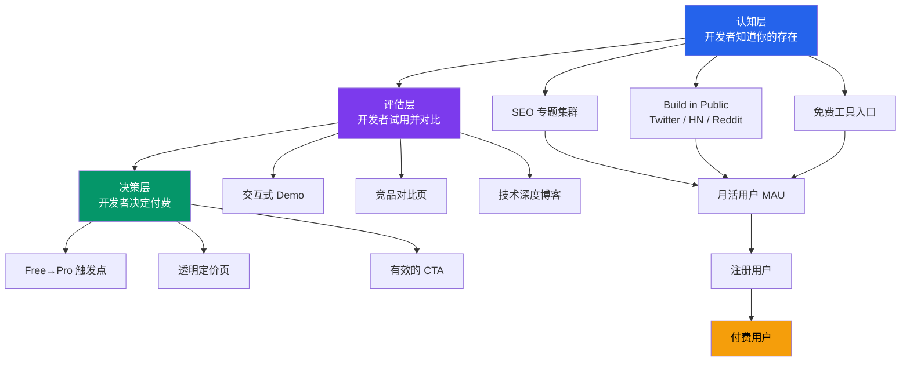

# 9.1 从0到1获客漏斗

获客不是一个事件，而是一条管道。开发者从"第一次听说你的工具"到"掏钱付费"，中间要经过认知、评估、决策三个阶段。本节拆解每个阶段的关键动作、量化目标和时间线。

## 漏斗全景

## 认知层：让开发者知道你的存在

认知层的目标是最大化触达。这个阶段不追求转化，追求的是"对的开发者知道有这样一个工具存在"。

### SEO 专题集群策略

SEO 是独立开发者最可持续的流量来源。Pieter Levels 在他的书中明确指出，他旗下产品（Nomad List、RemoteOK）超过 60% 的流量来自自然搜索。关键不是写零散的博客文章，而是构建围绕核心主题的"专题集群"（Topical Cluster）。

Clipboard Inspector 的核心主题是 **"clipboard"**。围绕这个词，可以构建以下集群：

| 专题集群 | 目标关键词 | 预期月搜索量 | 内容形式 |
|----------|-----------|-------------|---------|
| 剪贴板 API | "clipboard api javascript" | 3,200-5,000 | 教程 + 交互示例 |
| 剪贴板事件 | "paste event javascript" | 1,500-2,800 | 深度指南 |
| 剪贴板格式 | "clipboard mime types" | 800-1,200 | 参考文档 |
| 剪贴板调试 | "debug clipboard javascript" | 400-800 | 工具推荐 |
| 剪贴板安全 | "clipboard data security" | 600-1,500 | 技术分析 |
| 富文本粘贴 | "rich text paste html" | 1,000-2,000 | 实战教程 |

> 搜索量数据参考 Ahrefs 和 Google Keyword Planner 公开基准，2026 年 Q1。

每个集群以一篇"支柱页面"（Pillar Page）为核心，链接到 3-5 篇更具体的博客文章。这种结构告诉搜索引擎你在该主题上有系统性的权威性。

### Build in Public

"Build in Public"是独立开发者社区验证过的高效获客方式。它的核心逻辑是：把开发过程变成内容本身。

**Twitter/X。** 开发者社区在 Twitter 上高度活跃。Pieter Levels 通过持续分享收入数据、技术决策和用户反馈，积累了 600K+ 关注者。这个关注者基数本身就是免费的分发渠道。具体动作包括：每周分享一次开发进展，附上截图或 GIF；公开收入数字（即使前期是 $0）；回复相关话题下的讨论。

**Hacker News。** HN 的用户群体与 Clipboard Inspector 的目标用户高度重合。Show HN 帖子是发布新工具的标准渠道。关键技巧：标题只写工具的核心价值，不加营销词汇；在评论区详细回复每个问题；选择美国时间上午 8-10 点发布。

**Reddit。** r/webdev、r/javascript、r/programming、r/SideProject 是核心社区。每个社区有不同的文化，发帖前需要阅读规则。r/SideProject 允许直接推广，r/programming 则要求内容有技术深度。

### 免费工具作为漏斗入口

Clipboard Inspector 本身就是一个免费的 Web 工具，这构成了获客漏斗的最顶层。用户不需要注册、不需要安装，打开浏览器就能用。这种零门槛体验是获客的基础。

更进一步，可以开发小型的、独立的免费工具来引流：

| 免费工具 | 作用 | 流量预估 |
|----------|------|---------|
| MIME Type 检测器 | 输入内容，检测所有可能的 MIME 类型 | 200-500 月访问 |
| 剪贴板格式转换器 | HTML→Markdown、RTF→Text 等 | 300-800 月访问 |
| 粘贴事件模拟器 | 模拟不同浏览器的 paste 行为 | 100-300 月访问 |

这些工具从搜索流量中捕获用户，然后通过交叉链接引导到 Clipboard Inspector 主站。

## 评估层：让开发者试用并留下

评估层的目标是让来到网站的开发者真正使用工具，并感受到价值。这个阶段的关键指标是"首次价值体验时间"（Time to Value, TTV）。

### 交互式 Demo

用户打开网站后，应该在 10 秒内体验到核心功能。这意味着：

- 首屏必须有一个明显的粘贴区域，不需要任何说明
- 粘贴后立即展示结果，不需要等待或额外操作
- 结果页面要清晰到"一看就懂"

regex101.com 是这个模式的标杆。打开即用，输入即有结果。Clipboard Inspector 需要达到同样的体验流畅度。

### 竞品对比页

开发者在评估阶段会搜索替代方案。主动提供对比页面，可以截获这部分搜索流量，同时建立信任。对比页面应该包含：

- 功能对比表格，明确列出优势和局限
- 性能对比（解析速度、支持的格式数量）
- 定价对比
- 用户场景推荐（什么情况用哪个工具）

诚实比美化更有说服力。如果竞品在某个维度更强，直接承认。开发者的判断力很强，刻意隐藏只会损害信任。

### 技术深度博客

技术博客在评估层扮演两个角色：展示专业能力，以及通过搜索流量获取新用户。博客文章应该深入到"看完之后开发者能学到东西"的程度。

推荐的博客主题和发布频率：

| 主题类型 | 示例 | 发布频率 |
|----------|------|---------|
| 深度教程 | "理解 Clipboard API 的 5 种 MIME 类型" | 每月 1-2 篇 |
| 实战案例 | "如何调试富文本粘贴问题" | 每月 1 篇 |
| 浏览器兼容 | "Chrome vs Firefox 剪贴板行为差异" | 每季度 1 篇 |
| 发布公告 | "v2.0 新增 ZIP 导出" | 随版本发布 |

## 决策层：让开发者掏钱

决策层的目标是将免费用户转化为付费用户。这个阶段的核心是找到恰当的触发点。

### Free 到 Pro 的触发机制

触发点必须遵循一个原则：用户在需要 Pro 功能的那一刻，顺滑地引导到付费。不应该过早弹出升级提示，也不应该让用户找不到升级入口。

有效的触发场景包括：

- 用户第 3 次使用高级格式解析时，提示"Pro 支持完整的二进制分析"
- 历史记录达到 50 条上限时，提示"Pro 支持无限历史"
- 用户尝试导出为 ZIP 时，提示"这是 Pro 功能"
- 用户搜索特定 MIME 类型时，提示"Pro 支持智能搜索"

每个触发点都应该附带一个简短的价值说明，而不只是"升级"两个字。

### 透明定价

定价页面必须包含三个要素：

- 每个层级的功能对比表格
- 价格数字清晰可见，不要隐藏
- 常见问题解答（支付方式、退款政策、发票）

根据 Stripe 和 Baremetrics 的公开数据，透明的定价页面可以将转化率提高 20-30%。

### 有效的 CTA（Call to Action）

CTA 按钮的文案和位置直接影响转化。根据 HubSpot 的 A/B 测试数据，开发者工具中表现最好的 CTA 文案是：

| CTA 文案 | 场景 | 预期效果 |
|----------|------|---------|
| "Try free" | 首屏 | 最大化点击率 |
| "Start Pro trial" | 功能解锁提示 | 引导体验 Pro |
| "Upgrade to Pro" | 定价页 | 明确的升级意图 |
| "See plans" | 导航栏 | 引导到定价页 |

## 转化率模型

根据 Indie Hackers 社区和 MicroConf 的公开数据，开发者工具从月活到付费用户的典型转化率在 1-5% 之间。保守估计取 2%。

| 阶段 | 月活用户（MAU） | 转化率 | 付费用户 | 月收入（Pro $4-6） |
|------|----------------|--------|---------|-------------------|
| 冷启动期 | 5,000 | 2% | 100 | $400-600 |
| 增长期 | 20,000 | 2% | 400 | $1,600-2,400 |
| 规模期 | 50,000 | 2% | 1,000 | $4,000-6,000 |

> 2% 转化率参考：Baremetrics 开发者工具中位数 2.3%，MicroConf 调查报告 1.8%。

这个模型的假设是：所有付费用户都在 Pro 层级。随着 Team 层级的推出，ARPU 会进一步提升。

## 内容发布节奏

获客漏斗的运转需要持续的内容输出。以下是建议的发布节奏：

| 内容类型 | 频率 | 负责人 | 目标 |
|----------|------|--------|------|
| SEO 博客文章 | 每周 1 篇 | 创始人 | 自然搜索流量 |
| Twitter 帖子 | 每周 3-5 条 | 创始人 | 社区曝光 |
| 产品更新 | 每两周 1 次 | 创始人 | 用户留存 |
| 技术深度文章 | 每月 1 篇 | 创始人 | 专业权威 |
| 社区互动 | 每日 | 创始人 | 关系建设 |

一个人做全部内容工作确实紧张。优先级排序：SEO 博客 > 产品更新 > Twitter > 深度文章。SEO 带来的流量是长期资产，Twitter 是即时曝光，两者都不可偏废。

## 收入增长时间线

综合漏斗各阶段的预期表现，以下是按时间线的收入预测：

| 时间段 | MAU | 付费用户 | 月收入 | 关键里程碑 |
|--------|-----|---------|--------|-----------|
| M1-3 | 500-2,000 | 0-10 | $0-50 | 产品上线，SEO 基础建设 |
| M3-6 | 2,000-5,000 | 20-100 | $100-500 | 首批付费用户，支付系统集成 |
| M6-12 | 5,000-20,000 | 100-400 | $500-2,000 | 增长加速，浏览器扩展发布 |
| M12-24 | 20,000-50,000 | 400-1,000 | $2,000-10,000 | Team 层级上线，SEO 集群成熟 |

> 时间线基于 Indie Hackers 上 50+ 独立开发者产品的公开数据中位数。实际速度取决于产品竞争力和执行质量。

这个时间线的前提是：从第 1 个月就开始建设 SEO 内容，从第 2 个月开始 Build in Public，从第 3 个月开始做付费转化。任何一个环节的延迟都会推后后续阶段的时间。

## 小结

获客漏斗的每个阶段都有明确的目标和动作。认知层靠 SEO 和社区曝光，评估层靠产品体验和技术内容，决策层靠合理的触发机制和透明定价。关键不是在每个阶段做到完美，而是确保管道没有断裂。开发者从听说你的工具到付费，应该是一条连续的路径，而不是一系列孤立的触点。
