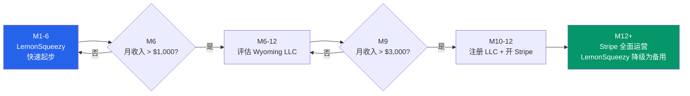
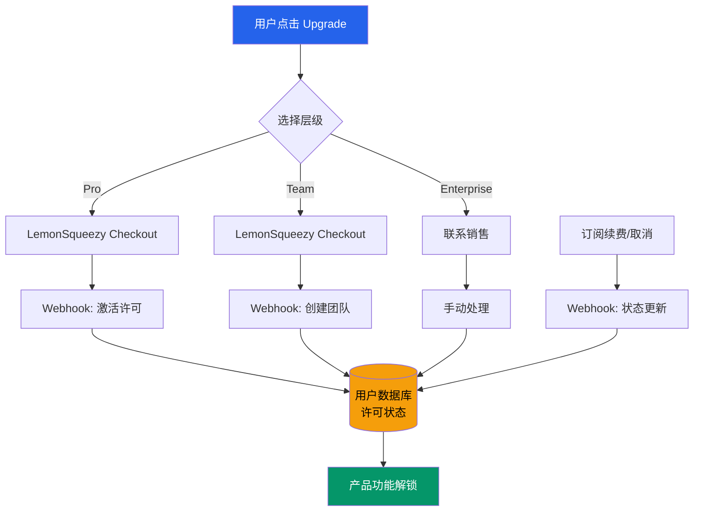

# 9.2 支付与订阅系统集成

支付系统是商业化的基础设施。选错方案，要么手续费吃掉利润，要么合规风险拖垮项目。对于中国大陆的独立开发者来说，选择更受限制，因为 Stripe 直接对中国大陆不可用。本节比较三种可行方案，给出分阶段的实施路径。

## 支付方案对比

中国大陆开发者面临的现实约束：Stripe 不支持中国大陆注册。这意味着全球开发者工具最常用的支付方案，在起跑线上就被排除了。但替代方案并不少。

| 维度 | LemonSqueezy | Paddle | Wyoming LLC + Stripe |
|------|-------------|--------|---------------------|
| 模式 | MoR（Merchant of Record） | MoR | 直接商户 |
| 手续费 | 5% + $0.50/笔 | 5% + $0.50/笔 | 2.9% + $0.30/笔 |
| 公司要求 | 不需要 | 不需要 | 需要注册 Wyoming LLC |
| 开户时间 | 即时 | 1-3 天 | 2-4 周 |
| 中国开发者可用 | 是 | 是 | 是（通过美国实体） |
| 税务处理 | MoR 代扣代缴 | MoR 代扣代缴 | 需自行处理 |
| 订阅管理 | 内置 | 内置 | Stripe Billing |
| 发票支持 | 自动 | 自动 | 需配置 |
| 企业功能 | 有限 | 较完善 | 完善 |
| 最低月费 | 无 | 无 | Stripe 无，但 LLC 有维护成本 |

> 手续费数据来自各平台官网定价页面，2026 年 4 月。

### LemonSqueezy：最快起步

LemonSqueezy 在 2023 年被 Stripe 收购后，基础设施的稳定性有了保障。它作为 MoR（Merchant of Record），代为处理全球税务（VAT、销售税等），这意味着开发者不需要关心各国复杂的税务合规问题。

对于没有公司实体的中国大陆开发者来说，LemonSqueezy 是最直接的起步方案。只需要个人身份验证，即可开始收款。手续费 5% + $0.50/笔看起来比 Stripe 高，但考虑到省去的税务处理成本和公司维护费用，在月收入低于 $3,000 的阶段实际上是更经济的。

LemonSqueezy 的主要局限：企业功能偏弱，不支持 SSO/SAML 等企业级认证，自定义发票格式有限。在 Enterprise 层级可能会有掣肘。

### Paddle：更成熟的 MoR

Paddle 是 MoR 模式的先行者，客户包括 Adobe、Evernote 等大厂。它的功能比 LemonSqueezy 更完善，尤其在企业级场景：支持本地化定价（根据用户地区自动调整价格显示）、内置订阅分析仪表盘、更灵活的发票模板。

手续费与 LemonSqueezy 相同（5% + $0.50/笔），但 Paddle 的审核流程更严格，开户时间也更长（1-3 天 vs 即时）。对于 MVP 阶段来说，速度比功能完善更重要。

### Wyoming LLC + Stripe：长期最优解

注册一家 Wyoming LLC（有限责任公司）是在中国大陆获取 Stripe 账户的成熟路径。Wyoming 被选中的原因：无需州所得税，LLC 年费低（$60/年），不需要美国居民担任注册代理人（Registered Agent 费用约 $100-200/年）。

| 费用项 | 金额 | 说明 |
|--------|------|------|
| LLC 注册费 | $100 | Wyoming Secretary of State 一次性费用 |
| 注册代理人 | $100-200/年 | 合规要求，第三方服务商提供 |
| EIN 申请 | $0 | 免费通过 IRS 在线申请 |
| Wyoming 年费 | $60/年 | Annual Report 费用 |
| Stripe 账户 | $0 | 无月费 |
| 美国银行账户 | $0 | 通过 Mercury 或 Relay 开户 |
| **总启动成本** | **$200-400** | 第一年含代理人 |
| **年维护成本** | **$160-260** | 代理人 + 年费 |

> Wyoming LLC 注册费用参考 Wyoming Secretary of State 官网和多家注册代理人服务商报价。

Stripe 的手续费（2.9% + $0.30/笔）在月收入超过 $3,000 时开始显现优势。以 $5,000 月收入为例：

- LemonSqueezy：$5,000 × 5% + N × $0.50 ≈ $275（假设 100 笔订阅）
- Stripe：$5,000 × 2.9% + 100 × $0.30 ≈ $175

差额 $100/月，足以覆盖 LLC 的年维护成本。

但 LLC 路径的隐性成本在于：需要处理美国税务申报（Form 5472，即使没有美国来源收入也需申报），需要维护美国银行账户的 KYC 合规。这些行政负担在早期可能得不偿失。

## 推荐路径：分阶段迁移

### 第一阶段：M1-6，LemonSqueezy

在产品验证期，速度优先于成本优化。LemonSqueezy 的即时开通、零公司要求、自动税务处理，让它成为 MVP 阶段的理想选择。

这个阶段的目标不是优化支付成本，而是验证有人愿意付费。当月收入稳定在 $500 以上时，再考虑切换方案。

集成步骤：

1. 注册 LemonSqueezy 账户，完成身份验证
2. 创建产品（Pro Monthly、Pro Yearly、Pro Lifetime）
3. 配置 Webhook 接收订阅事件
4. 在产品中集成 License Key 验证
5. 测试完整的购买→激活→续费流程

### 第二阶段：M6-12，评估 Wyoming LLC

当月收入稳定超过 $1,000，且 Enterprise 客户有 SSO/发票等需求时，开始评估 LLC 路径。评估标准：

- 月收入是否稳定在 $2,000+（确保 Stripe 的手续费节省能覆盖 LLC 维护成本）
- 是否有 Enterprise 客户要求企业级支付功能
- 是否需要更灵活的定价实验（Stripe 支持更细粒度的 A/B 测试）

### 第三阶段：M12+，Stripe 全面运营

LLC 注册完成后，逐步将支付流量迁移到 Stripe。迁移策略：

- 新用户走 Stripe
- 现有用户保持 LemonSqueezy 直到订阅到期
- LemonSqueezy 降级为备用支付通道

## 订阅层级设计

基于第六部分的定价策略，支付系统需要支持以下层级：

| 层级 | 价格 | 周期 | 支付方式 | 定位 |
|------|------|------|---------|------|
| Free | $0 | 永久 | 无需支付 | 获客入口 |
| Pro | $4-6/月 | 月付 | 信用卡/PayPal | 个人开发者 |
| Pro | $39-49/年 | 年付 | 信用卡/PayPal | 高 LTV 用户 |
| Pro | $89-99 | 终身 | 信用卡/PayPal | 一次性购买偏好者 |
| Team | $8-12/用户/月 | 月付 | 信用卡 | QA/开发团队 |
| Enterprise | $20-45/用户/月 | 年付 | 发票/PO | 企业客户 |

Free 层不需要支付系统。Pro 层是支付系统的主要负载。Team 层需要按席位计费和统一账单功能。Enterprise 层通常需要发票和采购订单流程，这在 LemonSqueezy 和 Stripe 中都可以通过自定义实现。

## 支付流程架构

### 关键实现细节

**License Key 机制。** 浏览器扩展和桌面应用需要一个离线可用的许可验证机制。推荐方案：购买后生成唯一 License Key，用户在扩展中输入，扩展通过 API 验证后缓存许可状态。离线验证使用 JWT，有效期 7 天，到期后需要重新联网验证。

**Webhook 处理。** LemonSqueezy 和 Stripe 都通过 Webhook 通知订阅状态变更。必须处理的 Webhook 事件：

- `subscription_created`：新订阅创建
- `subscription_updated`：订阅升级/降级
- `subscription_cancelled`：订阅取消
- `subscription_expired`：订阅到期
- `payment_failed`：支付失败（触发提醒）

每个 Webhook 都需要幂等处理，防止重复通知导致的数据错误。

**支付失败恢复。** 根据Stripe 的公开数据，开发者工具的月度流失率（Churn Rate）中位数是 3-5%。其中约 30% 是"被动流失"，即支付失败导致的非自愿取消。实现"挽救邮件"（Dunning Email）可以在支付失败后自动提醒用户更新支付方式，通常能挽回 20-40% 的被动流失。

## 税务与合规

MoR 模式（LemonSqueezy、Paddle）的最大优势是税务简化。平台代为收取和缴纳全球 VAT/GST/销售税，开发者只需要按照平台提供的收入数据申报个人所得税。

切换到 Stripe 直接收款后，税务责任回到开发者自身：

| 场景 | 税务处理 |
|------|---------|
| 中国大陆个人所得税 | 按实际收入申报，LLC 收入可合并申报 |
| Wyoming LLC 年报 | 每年提交 Annual Report（$60），无州所得税 |
| IRS Form 5472 | 外资持股 25% 以上的 LLC 必须申报 |
| 全球 VAT/GST | 需要通过 Stripe Tax 或第三方服务处理 |

> 税务信息仅供参考，具体操作请咨询税务专业人士。Wyoming LLC 的税务义务参考 IRS Publication 5472 和 Wyoming Secretary of State 指南。

## 小结

支付系统的选择不是一锤子买卖。M1-6 用 LemonSqueezy 快速起步，验证付费意愿。M6-12 根据收入规模评估 Wyoming LLC + Stripe 的切换时机。关键是不要在早期纠结于手续费差异，$5 的手续费差异不值得花费 2 周时间去优化。先把钱收进来，再考虑怎么少交手续费。
