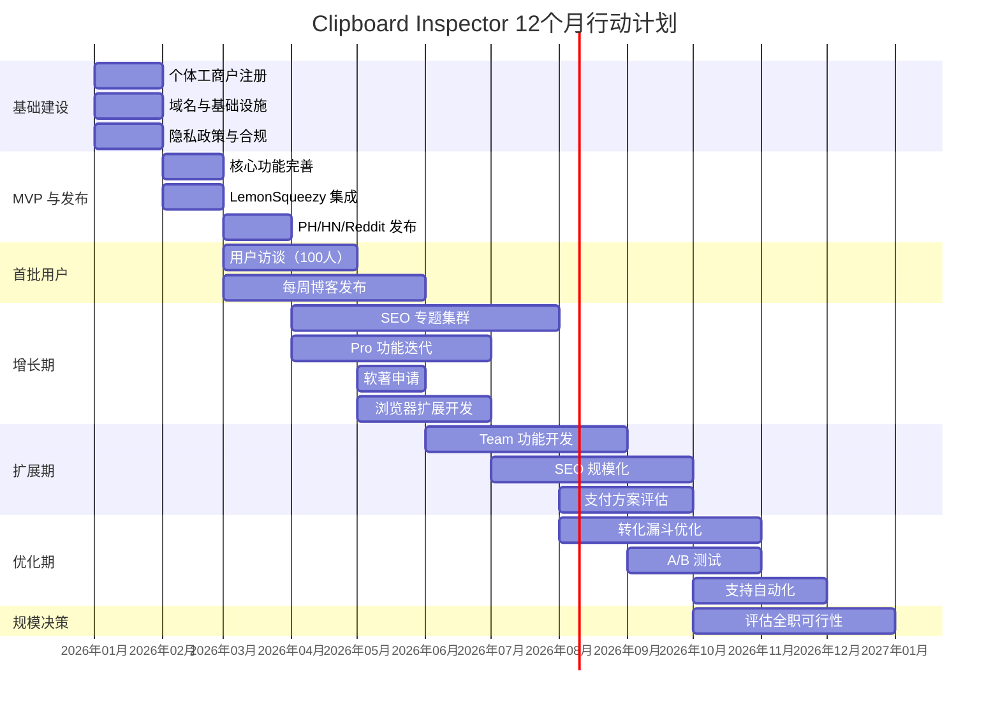

# 9.4 一人公司12个月行动日历

策略再好，没有执行日历就是纸上谈兵。本节把前九个部分的所有分析整合为一份可执行的 12 个月行动计划。每一周该做什么，每一天的时间怎么分配，收入目标是什么，全部量化。

## 总体时间线

## 月度详细计划

### M1-2：基础建设

这两个月的目标是搭建基础设施，让产品从"一个开源项目"变成"一个可商业化的产品"。

| 周次 | 任务 | 具体动作 | 产出 |
|------|------|---------|------|
| W1 | 注册个体工商户 | 到当地市场监督管理局办理，经营范围包含"软件开发" | 营业执照 |
| W2 | 域名与基础设施 | 注册 .dev 域名，配置 PostHog（免费层，100万事件/月），接入 Better Stack（免费层，日志监控） | 基础设施就绪 |
| W3 | 产品着陆页 | 搭建独立的产品着陆页（非 GitHub Pages），包含功能介绍、定价页、隐私政策 | 着陆页上线 |
| W4 | 隐私政策与合规 | 撰写隐私政策（参考 Termly 模板），配置 Cookie 同意弹窗（如果需要） | 合规就绪 |
| W5 | 核心功能完善 | 完善 Web 端的剪贴板检查功能，确保 paste、drag-drop、Async Clipboard API 全部可用 | 功能完整 |
| W6 | 导出功能 | 实现 Markdown 和 ZIP 导出，确保导出内容准确且格式规范 | 导出就绪 |
| W7 | 用户体验优化 | 优化首次使用体验，确保 TTV（Time to Value）<10 秒 | 体验优化 |
| W8 | Beta 测试 | 邀请 5-10 个开发者朋友内测，收集反馈并修复关键问题 | Beta 完成 |

个体工商户的注册通常 3-5 个工作日完成。经营范围建议包含"软件开发""信息技术咨询服务""互联网数据服务"，为后续业务扩展预留空间。

PostHog 的免费层提供每月 100 万事件的额度，对于初期产品绰绰有余。关键是埋点要全面：页面访问、功能使用、导出操作、错误事件，每一个都需要追踪。

### M2-3：MVP 与发布

| 周次 | 任务 | 具体动作 | 产出 |
|------|------|---------|------|
| W9 | LemonSqueezy 集成 | 注册账户，创建 Pro 层级产品，配置 Webhook，实现 License Key 验证 | 支付就绪 |
| W10 | SEO 基础建设 | 发布前 3 篇 SEO 博客文章，提交 sitemap 到 Google Search Console | SEO 启动 |
| W11 | 发布准备 | 准备 Product Hunt 页面（标题、描述、截图、视频），撰写 HN Show HN 帖子草稿 | 发布物料就绪 |
| W12 | Product Hunt 发布 | 选择周二或周三发布，全天在线回复评论 | PH 发布 |
| W13 | HN + Reddit 发布 | 在 Hacker News 发布 Show HN，在 r/webdev、r/SideProject 发帖 | 多渠道曝光 |
| W14 | 发布后跟进 | 整理用户反馈，修复紧急 Bug，回复所有评论 | 首轮反馈闭环 |

Product Hunt 发布的最佳时间是周二或周三。根据 Product Hunt 的算法，工作日中这两天的竞争相对缓和，更容易进入日榜 Top 10。发布当天需要全天在线，快速回复每一条评论。

Show HN 帖子的标题要直白，不要营销词汇。参考格式："Show HN: Clipboard Inspector - A web tool to inspect what's in your clipboard"。

### M3-4：首批用户

| 周次 | 任务 | 具体动作 | 产出 |
|------|------|---------|------|
| W15-16 | 用户访谈 | 与前 50 个用户进行 1v1 交流（邮件或 IM），了解使用场景和痛点 | 访谈记录 |
| W17-18 | 功能迭代 | 根据访谈结果排定优先级，实现 Top 3 功能需求 | 功能迭代 |
| W19-20 | 每周博客 | 建立每周发布一篇 SEO 博客的节奏 | 4 篇博客 |

用户访谈的方法：通过 PostHog 找到活跃用户（使用次数 >5 的），发邮件邀请 15 分钟 IM 聊天。问题清单：

1. 你是在什么场景下发现这个工具的？
2. 你用它解决什么问题？
3. 当前最让你不满意的是什么？
4. 如果要付费，你希望获得什么额外功能？
5. 你会向同事推荐吗？为什么？

前 100 个用户是产品的黄金样本。他们对产品的理解和反馈质量远高于后来的用户，因为他们是在产品还粗糙的时候选择使用的，说明需求是真实的。

### M4-6：增长期

| 周次 | 任务 | 具体动作 | 产出 |
|------|------|---------|------|
| W21-22 | PostHog 分析 | 分析用户行为漏斗，识别流失点，优化核心路径 | 分析报告 |
| W23-24 | Pro 功能开发 | 开发高级格式解析、历史记录、智能搜索等 Pro 功能 | Pro 功能上线 |
| W25 | 软著申请 | 提交软件著作权申请（通过代理机构，费用约 300-500 元） | 软著申请提交 |
| W26-28 | 浏览器扩展 | 开发 Chrome/Firefox 扩展，提交商店审核 | 扩展上架 |

软著申请虽然不是强制性的，但在以下场景有用：上架某些国内应用商店、申请高新技术企业补贴、应对潜在的知识产权纠纷。代理机构的费用在 300-500 元左右，下证周期 2-3 个月。

浏览器扩展是 Pro 层级的核心载体。根据 Chrome Web Store 的数据，扩展的平均安装率是网站月活的 5-15%。假设 M6 的月活为 5,000，扩展安装量预期为 250-750。扩展的付费转化率通常高于 Web 端（因为有更强的功能绑定），预估 3-5%。

### M6-8：扩展期

| 周次 | 任务 | 具体动作 | 产出 |
|------|------|---------|------|
| W29-32 | SEO 规模化 | 发布专题集群文章，目标是累计 15-20 篇 SEO 博客 | SEO 矩阵 |
| W33-34 | Team 功能 | 开发共享片段、团队模板、统一计费等 Team 功能 | Team 层上线 |
| W35-36 | 支付评估 | 评估月收入是否达到 Wyoming LLC 切换阈值 | 评估报告 |

### M8-10：优化期

| 周次 | 任务 | 具体动作 | 产出 |
|------|------|---------|------|
| W37-38 | 转化漏斗优化 | 基于 PostHog 数据，优化 Free→Pro 的触发点和 CTA | 转化率提升 |
| W39-40 | A/B 测试 | 测试定价展示、CTA 文案、功能解锁时机等变量 | 测试结果 |
| W41-44 | 支持自动化 | 搭建 FAQ 知识库，配置常见问题自动回复 | 支持效率提升 |

A/B 测试的优先级排序：

| 测试项 | 预期影响 | 实施难度 | 优先级 |
|--------|---------|---------|--------|
| CTA 文案 | 高 | 低 | P0 |
| 定价展示（月付 vs 年付突出） | 高 | 低 | P0 |
| 功能解锁触发时机 | 中 | 中 | P1 |
| 定价数字（$4 vs $6） | 中 | 低 | P1 |
| 着陆页首屏设计 | 中 | 高 | P2 |

### M10-12：规模决策

| 周次 | 任务 | 具体动作 | 产出 |
|------|------|---------|------|
| W45-48 | 全职评估 | 评估 MRR 是否达到全职门槛，整理全年数据 | 决策依据 |
| W49-52 | 下一年规划 | 制定 Year 2 计划，可能包含：全职投入、招聘第一个员工、Enterprise 功能开发 | Year 2 路线图 |

全职决策的判断标准：如果 MRR 稳定在 $3,000-5,000 以上（持续 3 个月），且增长趋势健康（月环比 >10%），可以考虑全职投入。这个数字的前提是个人月支出在 $2,000 以下。如果支出更高，对应提高门槛。

## 收入目标

| 月份 | MAU 目标 | 付费用户 | Pro 月收入 | Team 月收入 | 总 MRR |
|------|---------|---------|-----------|-----------|--------|
| M3 | 1,000 | 5-10 | $20-60 | $0 | $20-60 |
| M6 | 5,000 | 50-100 | $200-600 | $0 | $200-600 |
| M9 | 15,000 | 150-300 | $600-1,800 | $100-300 | $700-2,100 |
| M12 | 30,000 | 300-600 | $1,200-3,600 | $300-800 | $1,500-4,400 |

> 收入预测基于 2% Free→Pro 转化率（Baremetrics 开发工具中位数），Team 从 M8 开始。实际数字取决于 SEO 效果、产品市场匹配度和竞争环境。

如果 M12 的 MRR 达到 $3,000-5,000 的区间，说明产品已经找到 Product-Market Fit。这个阶段的核心决策不是"怎么增长更快"，而是"是否全职投入"和"是否需要外部资金"。

## 每周时间分配

一人公司的最大约束是时间。每周的工作时间必须有意分配，不能被"最紧急的事"完全占据。

| 工作类别 | 占比 | 每周小时数（按 50 小时计） | 具体内容 |
|----------|------|--------------------------|---------|
| 产品开发 | 40% | 20 小时 | 功能开发、Bug 修复、技术架构 |
| 营销与获客 | 25% | 12.5 小时 | SEO 博客、社区互动、Build in Public |
| 用户支持 | 15% | 7.5 小时 | 回复问题、用户访谈、反馈整理 |
| 运营管理 | 10% | 5 小时 | 支付处理、合规、数据分析 |
| 学习与提升 | 10% | 5 小时 | 技术学习、竞品研究、行业动态 |

这个分配在不同阶段会有调整。M1-2 开发占比可以提高到 60%，M3-6 营销占比需要提高到 30%。关键是有意识地管理时间分配，而不是被动响应。

每周的具体日程建议：

| 时段 | 周一 | 周二 | 周三 | 周四 | 周五 | 周六 |
|------|------|------|------|------|------|------|
| 上午 | 开发 | 开发 | 开发 | 营销（SEO） | 开发 | 运营 + 学习 |
| 下午 | 开发 | 营销（社区） | 开发 | 支持 | 营销（博客） | 机动 |
| 晚上 | 支持 | 机动 | 学习 | 机动 | 支持 | 休息 |

上午留给深度开发工作，因为这是注意力最集中的时段。营销和支持放在下午或晚上，因为这些工作通常是碎片化的。周六留出运营和学习时间，保持对外部环境的感知。

## 关键风险与应对

| 风险 | 概率 | 影响 | 应对措施 |
|------|------|------|---------|
| SEO 效果低于预期 | 中 | 高 | 加大社区运营力度，探索付费获客 |
| 付费转化率 <1% | 中 | 高 | 增加免费工具引流，优化 Pro 功能价值感知 |
| 浏览器扩展审核延迟 | 中 | 低 | 提前准备审核材料，同时维护 Web 端功能 |
| 竞品快速跟进 | 低 | 中 | 加速差异化功能（AI 分析），保持社区信任 |
| 个人精力耗尽 | 中 | 高 | 严格执行周末休息，设置每周"不可压缩的非工作时间" |

最后一条风险最容易被忽视，也最致命。一人公司没有"下班"的概念，工作会无限制地侵占个人时间。应对方法不是"更自律"，而是设置不可协商的边界：每周至少一天完全不碰工作，每天保证 7 小时睡眠，每周至少 3 次运动。这些不是奢侈，是保证长期产出的基础设施。

## 小结

12 个月的行动日历从基础建设开始，经过 MVP 发布、首批用户验证、增长扩展、优化提效，最终到达规模决策点。每个月都有明确的产出目标，每周都有合理的时间分配。关键不是严格按计划执行每一个细节，而是确保大方向不偏移：M1-3 验证有人用，M3-6 验证有人付，M6-12 验证能增长。
